# 五笔拆字 86 版
| 字 | 图解 | 字根输入 |
| --- | --- | --- |
| 龟 |  | QJN₃ — QJNB₄ |
| 龚 |  | DXA₃ — DXAW₄ |
| 龙 |  | DX₂ — DXV₃ |
| 龋 |  | HWBY₄ |
| 龋 |  | HWBY₄ |
| 龄 | 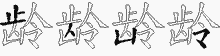 | HWBC₄ |
| 齿 |  | HWB₃ — HWBJ₄ |
| 齐 |  | YJJ₃ |
| 鼻 |  | THL₃ — THLJ₄ |
| 鼠 |  | VNU₃ — VNUN₄ |
| 鼓 | 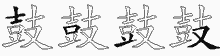 | FKUC₄ |
| 鼎 |  | HND₃ — HNDN₄ |
| 默 | 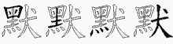 | LFOD₄ |
| 黔 |  | LFON₄ |
| 黑 |  | LFO₃ — LFOU₄ |
| 黎 |  | TQT₃ — TQTI₄ |
| 黍 |  | TWI₃ — TWIU₄ |
| 黄 |  | AMW₃ — AMWU₄ |
| 麻 |  | YSS₃ — YSSI₄ |
| 麦 |  | GTU₃ |
| 麓 | 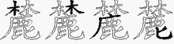 | SSYX₄ |
| 鹿 |  | YNJ₃ — YNJX₄ |
| 鹰 |  | YWWG₄ |
| 鹤 | 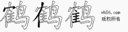 | PWY₃ — PWYG₄ |
| 鹏 |  | EEQ₃ — EEQG₄ |
| 鹊 | 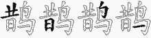 | AJQG₄ |
| 鹅 |  | TRNG₄ |
| 鹃 |  | KEQ₃ — KEQG₄ |
| 鸿 |  | IAQG₄ |
| 鸽 | 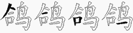 | WGKG₄ |
| 鸵 |  | QYNX₄ |
| 鸳 |  | QBQ₃ — QBQG₄ |
| 鸯 |  | MDQ₃ — MDQG₄ |
| 鸭 |  | LQY₃ — LQYG₄ |
| 鸦 |  | AHTG₄ |
| 鸥 | 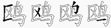 | AQQG₄ |
| 鸣 |  | KQY₃ — KQYG₄ |
| 鸡 |  | CQY₃ — CQYG₄ |
| 鸡 |  | CQY₃ — CQYG₄ |
| 鸟 |  | QYNG₄ |
| 鳞 |  | QGO₃ — QGOH₄ |
| 鳖 |  | UMIG₄ |
| 鳃 |  | QGL₃ — QGLN₄ |
| 鲸 |  | QGY₃ — QGYI₄ |
| 鲤 |  | QGJF₄ |
| 鲜 |  | QGU₃ — QGUD₄ |
| 鲍 |  | QGQ₃ — QGQN₄ |
| 鲁 |  | QGJ₃ — QGJF₄ |
| 鱼 |  | QGF₃ |
| 魔 | 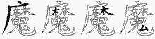 | YSSC₄ |
| 魏 |  | TVR₃ — TVRC₄ |
| 魄 |  | RRQC₄ |
| 魂 |  | FCR₃ — FCRC₄ |
| 魁 |  | RQCF₄ |
| 鬼 |  | RQC₃ — RQCI₄ |
| 鬃 |  | DEP₃ — DEPI₄ |
| 高 |  | YM₂ — YMK₃ — YMKF₄ |
| 髓 |  | MED₃ — MEDP₄ |
| 骸 |  | MEY₃ — MEYW₄ |
| 骨 |  | ME₂ — MEF₃ |
| 骤 |  | CBC₃ — CBCI₄ |
| 骡 |  | CLX₃ — CLXI₄ |
| 骚 | 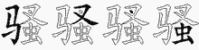 | CCYJ₄ |
| 骗 |  | CYNA₄ |
| 骑 |  | CDS₃ — CDSK₄ |
| 骏 |  | CCW₃ — CCWT₄ |
| 验 |  | CWG₃ — CWGI₄ |
| 骋 |  | CMG₃ — CMGN₄ |
| 骇 |  | CYNW₄ |
| 骆 |  | CTK₃ — CTKG₄ |
| 骄 | 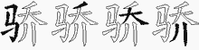 | CTDJ₄ |
| 骂 |  | KKC₃ — KKCF₄ |
| 驾 |  | LKC₃ — LKCF₄ |
| 驼 |  | CP₂ — CPX₃ — CPXN₄ |
| 驻 |  | CY₂ — CYG₃ — CYGG₄ |
| 驹 |  | CQK₃ — CQKG₄ |
| 驹 |  | CQK₃ — CQKG₄ |
| 驶 |  | CKQ₃ — CKQY₄ |
| 驴 |  | CYN₃ — CYNT₄ |
| 驳 |  | CQQ₃ — CQQY₄ |
| 驱 |  | CAQ₃ — CAQY₄ |
| 驰 |  | CBN₃ |
| 驯 |  | CKH₃ |
| 驮 |  | CDY₃ |
| 驭 |  | CCY₃ |
| 驭 |  | CCY₃ |
| 马 |  | CN₂ — CNN₃ — CNNG₄ |
| 香 |  | TJF₃ |
| 首 |  | UTH₃ — UTHF₄ |
| 馒 |  | QNJC₄ |
| 馏 |  | QNQL₄ |
| 馋 |  | QNQU₄ |
| 馈 |  | QNK₃ — QNKM₄ |
| 馆 |  | QNP₃ — QNPN₄ |
| 馅 |  | QNQV₄ |
| 馁 |  | QNE₃ — QNEV₄ |
| 饿 |  | QNT₃ — QNTT₄ |
| 饼 |  | QNU₃ — QNUA₄ |
| 饺 |  | QNUQ₄ |
| 饶 |  | QNA₃ — QNAQ₄ |
| 饵 | 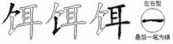 | QNBG₄ |
| 饲 | 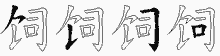 | QNNK₄ |
| 饱 |  | QNQN₄ |
| 饰 |  | QNTH₄ |
| 饯 |  | QNGT₄ |
| 饮 |  | QNQ₃ — QNQW₄ |
| 饭 |  | QNR₃ — QNRC₄ |
| 饥 |  | QNM₃ — QNMN₄ |
| 餐 |  | HQ₂ — HQC₃ — HQCE₄ |
| 食 |  | WYV₃ — WYVE₄ |
| 飞 |  | NUI₃ |
| 飘 |  | SFIQ₄ |
| 风 |  | MQ₂ — MQI₃ |
| 颧 |  | AKK₃ — AKKM₄ |
| 颤 |  | YLKM₄ |
| 颠 |  | FHWM₄ |
| 额 | 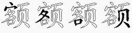 | PTKM₄ |
| 颜 | 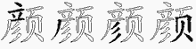 | UTEM₄ |
| 题 |  | JGHM₄ |
| 颗 |  | JSD₃ — JSDM₄ |
| 颖 |  | XTD₃ — XTDM₄ |
| 颓 | 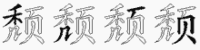 | TMDM₄ |
| 频 |  | HID₃ — HIDM₄ |
| 颐 |  | AHKM₄ |
| 颊 |  | GUWM₄ |
| 颈 |  | CAD₃ — CADM₄ |
| 颇 |  | HCD₃ — HCDM₄ |
| 领 |  | WYCM₄ |
| 颅 |  | HNDM₄ |
| 预 |  | CBD₃ — CBDM₄ |
| 颂 |  | WCD₃ — WCDM₄ |
| 颁 |  | WVD₃ — WVDM₄ |
| 顿 | 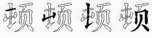 | GBNM₄ |
| 顾 |  | DB₂ — DBD₃ — DBDM₄ |
| 顽 |  | FQD₃ — FQDM₄ |
| 须 |  | ED₂ — EDM₃ — EDMY₄ |
| 顺 |  | KD₂ — KDM₃ — KDMY₄ |
| 项 |  | ADM₃ — ADMY₄ |
| 顷 |  | XD₂ — XDM₃ — XDMY₄ |
| 顶 |  | SDM₃ — SDMY₄ |
| 页 |  | DMU₃ |
| 韶 |  | UJV₃ — UJVK₄ |
| 韵 |  | UJQU₄ |
| 音 |  | UJF₃ |
| 韭 |  | DJDG₄ |
| 韩 |  | FJFH₄ |
| 韧 |  | FNHY₄ |
| 韦 |  | FNH₃ — FNHK₄ |
| 鞭 |  | AFW₃ — AFWQ₄ |
| 鞠 |  | AFQ₃ — AFQO₄ |
| 鞘 |  | AFIE₄ |
| 鞍 |  | AFP₃ — AFPV₄ |
| 鞋 | 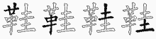 | AFFF₄ |
| 靶 |  | AFC₃ — AFCN₄ |
| 靴 |  | AFWX₄ |
| 靳 |  | AFR₃ — AFRH₄ |
| 革 |  | AF₂ — AFJ₃ |
| 面 |  | DM₂ — DMJD₄ |
| 面 |  | DM₂ — DMJD₄ |
| 靡 | 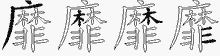 | YSSD₄ |
| 靠 | 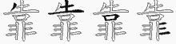 | TFKD₄ |
| 非 |  | DJD₃ — DJDD₄ |
| 靛 |  | GEP₃ — GEPH₄ |
| 静 |  | GEQ₃ — GEQH₄ |
| 靖 |  | UGE₃ — UGEG₄ |
| 青 |  | GEF₃ |
| 霹 |  | FNK₃ — FNKU₄ |
| 霸 |  | FAF₃ — FAFE₄ |
| 露 |  | FKHK₄ |
| 霞 |  | FNHC₄ |
| 霜 |  | FS₂ — FSH₃ — FSHF₄ |
| 霖 |  | FSS₃ — FSSU₄ |
| 霓 |  | FVQ₃ — FVQB₄ |
| 霍 | 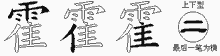 | FWYF₄ |
| 霉 |  | FTXU₄ |
| 震 |  | FDF₃ — FDFE₄ |
| 霄 |  | FIE₃ — FIEF₄ |
| 霄 |  | FIE₃ — FIEF₄ |
| 需 |  | FDM₃ — FDMJ₄ |
| 雾 |  | FTL₃ — FTLB₄ |
| 雹 |  | FQN₃ — FQNB₄ |
| 雷 |  | FLF₃ |
| 零 | 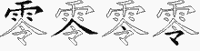 | FWYC₄ |
| 雪 |  | FV₂ — FVF₃ |
| 雨 |  | FGHY₄ |
| 雕 |  | MFKY₄ |
| 雏 |  | QVW₃ — QVWY₄ |
| 雍 |  | YXT₃ — YXTY₄ |
| 雌 |  | HXW₃ — HXWY₄ |
| 雇 | 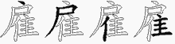 | YNWY₄ |
| 集 |  | WYS₃ — WYSU₄ |
| 雅 | 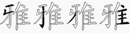 | AHTY₄ |
| 雄 |  | DCW₃ — DCWY₄ |
| 雁 |  | DWW₃ — DWWY₄ |
| 雀 |  | IWYF₄ |
| 难 |  | CW₂ — CWY₃ — CWYG₄ |
| 隶 |  | VII₃ |
| 隧 |  | BUE₃ — BUEP₄ |
| 障 |  | BUJ₃ — BUJH₄ |
| 隙 |  | BIJ₃ — BIJI₄ |
| 隔 |  | BGK₃ — BGKH₄ |
| 隐 |  | BQ₂ — BQVN₄ |
| 随 |  | BDE₃ — BDEP₄ |
| 隋 |  | BDA₃ — BDAE₄ |
| 隆 |  | BTG₃ — BTGG₄ |
| 隅 |  | BJM₃ — BJMY₄ |
| 陷 |  | BQV₃ — BQVG₄ |
| 陶 |  | BQR₃ — BQRM₄ |
| 陵 |  | BFW₃ — BFWT₄ |
| 陪 |  | BUK₃ — BUKG₄ |
| 险 |  | BWG₃ — BWGI₄ |
| 陨 |  | BKM₃ — BKMY₄ |
| 院 |  | BPF₃ — BPFQ₄ |
| 陡 |  | BFH₃ — BFHY₄ |
| 陛 |  | BX₂ — BXX₃ — BXXF₄ |
| 陕 |  | BGU₃ — BGUW₄ |
| 限 |  | BV₂ — BVE₃ — BVEY₄ |
| 降 |  | BT₂ — BTA₃ — BTAH₄ |
| 陌 |  | BDJ₃ — BDJG₄ |
| 陋 |  | BGM₃ — BGMN₄ |
| 陈 |  | BA₂ — BAI₃ — BAIY₄ |
| 陇 |  | BDX₃ — BDXN₄ |
| 陆 |  | BFM₃ — BFMH₄ |
| 际 |  | BF₂ — BFI₃ — BFIY₄ |
| 附 |  | BWF₃ — BWFY₄ |
| 陀 |  | BPX₃ — BPXN₄ |
| 阿 |  | BS₂ — BSK₃ — BSKG₄ |
| 阻 | 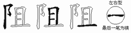 | BEGG₄ |
| 阶 |  | BWJ₃ — BWJH₄ |
| 阵 |  | BL₂ — BLH₃ |
| 阴 |  | BE₂ — BEG₃ |
| 阳 |  | BJ₂ — BJG₃ |
| 防 |  | BY₂ — BYN₃ |
| 阮 |  | BFQ₃ — BFQN₄ |
| 队 |  | BW₂ — BWY₃ |
| 阜 |  | WNNF₄ |
| 阔 |  | UIT₃ — UITD₄ |
| 阑 |  | UGLI₄ |
| 阐 |  | UUJ₃ — UUJF₄ |
| 阎 | 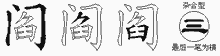 | UQVD₄ |
| 阎 |  | UQVD₄ |
| 阉 |  | UDJN₄ |
| 阅 |  | UUK₃ — UUKQ₄ |
| 阂 |  | UYN₃ — UYNW₄ |
| 阁 |  | UTK₃ — UTKD₄ |
| 阀 |  | UWA₃ — UWAE₄ |
| 闽 |  | UJI₃ |
| 闻 |  | UB₂ — UBD₃ |
| 闺 |  | UFFD₄ |
| 闹 |  | UYM₃ — UYMH₄ |
| 闸 |  | ULK₃ |
| 闷 |  | UNI₃ |
| 间 |  | UJ₂ — UJD₃ |
| 闲 |  | USI₃ |
| 闰 |  | UG₂ — UGD₃ |
| 闯 |  | UCD₃ |
| 问 |  | UKD₃ |
| 闭 |  | UFT₃ — UFTE₄ |
| 闪 |  | UW₂ — UWI₃ |
| 门 |  | UYH₃ — UYHN₄ |
| 长 |  | TA₂ — TAY₃ — TAYI₄ |
| 镶 |  | QYK₃ — QYKE₄ |
| 镰 |  | QYUO₄ |
| 镭 |  | QFL₃ — QFLG₄ |
| 镣 |  | QDU₃ — QDUI₄ |
| 镜 |  | QUJ₃ — QUJQ₄ |
| 镑 |  | QUP₃ — QUPY₄ |
| 镐 |  | QYM₃ — QYMK₄ |
| 镍 |  | QTH₃ — QTHS₄ |
| 镊 |  | QBC₃ — QBCC₄ |
| 镇 |  | QFHW₄ |
| 镁 |  | QUG₃ — QUGD₄ |
| 镀 |  | QYA₃ — QYAC₄ |
| 锻 |  | QWD₃ — QWDC₄ |
| 锹 |  | QTO₃ — QTOY₄ |
| 锰 |  | QBL₃ — QBLG₄ |
| 锯 |  | QND₃ — QNDG₄ |
| 键 |  | QVFP₄ |
| 锭 |  | QP₂ — QPG₃ — QPGH₄ |
| 锨 |  | QRQ₃ — QRQW₄ |
| 锦 |  | QRM₃ — QRMH₄ |
| 锥 |  | QWY₃ — QWYG₄ |
| 锤 | 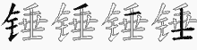 | QTGF₄ |
| 锣 |  | QLQ₃ — QLQY₄ |
| 锡 |  | QJQ₃ — QJQR₄ |
| 锚 |  | QAL₃ — QALG₄ |
| 错 |  | QAJ₃ — QAJG₄ |
| 锗 |  | QFT₃ — QFTJ₄ |
| 锑 |  | QUX₃ — QUXT₄ |
| 锐 |  | QUK₃ — QUKQ₄ |
| 锌 |  | QUH₃ |
| 锋 |  | QTD₃ — QTDH₄ |
| 锈 |  | QTEN₄ |
| 锅 |  | QKM₃ — QKMW₄ |
| 锄 |  | QEGL₄ |
| 锁 |  | QIM₃ — QIMY₄ |
| 销 |  | QIE₃ — QIEG₄ |
| 链 |  | QLP₃ — QLPY₄ |
| 铺 |  | QGE₃ — QGEY₄ |
| 铸 |  | QDT₃ — QDTF₄ |
| 银 |  | QVE₃ — QVEY₄ |
| 铲 |  | QUT₃ — QUTT₄ |
| 铱 |  | QYE₃ — QYEY₄ |
| 铰 |  | QUQ₃ — QUQY₄ |
| 铭 |  | QQK₃ — QQKG₄ |
| 铬 |  | QTK₃ — QTKG₄ |
| 铣 |  | QTFQ₄ |
| 铡 |  | QMJ₃ — QMJH₄ |
| 铝 |  | QKK₃ — QKKG₄ |
| 铜 |  | QMGK₄ |
| 铆 |  | QQT₃ — QQTB₄ |
| 铅 |  | QMK₃ — QMKG₄ |
| 铅 |  | QMK₃ — QMKG₄ |
| 铃 | 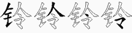 | QWYC₄ |
| 铂 |  | QRG₃ |
| 铁 |  | QR₂ — QRW₃ — QRWY₄ |
| 铀 |  | QMG₃ |
| 钾 |  | QLH₃ |
| 钻 |  | QHK₃ — QHKG₄ |
| 钵 |  | QSG₃ — QSGG₄ |
| 钳 |  | QAF₃ — QAFG₄ |
| 钱 |  | QG₂ — QGT₃ |
| 钮 |  | QNF₃ — QNFG₄ |
| 钩 |  | QQC₃ — QQCY₄ |
| 钨 |  | QQN₃ — QQNG₄ |
| 钧 | 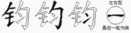 | QQUG₄ |
| 钦 |  | QQW₃ — QQWY₄ |
| 钥 |  | QEG₃ |
| 钢 |  | QMQ₃ — QMQY₄ |
| 钡 |  | QMY₃ |
| 钠 |  | QMW₃ — QMWY₄ |
| 钟 | 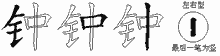 | QKHH₄ |
| 钞 |  | QIT₃ — QITT₄ |
| 钝 | 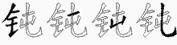 | QGBN₄ |
| 钙 |  | QGH₃ — QGHN₄ |
| 钓 |  | QQYY₄ |
| 钒 |  | QMYY₄ |
| 钎 |  | QTF₃ — QTFH₄ |
| 钉 |  | QS₂ — QSH₃ |
| 钉 |  | QS₂ — QSH₃ |
| 针 |  | QF₂ — QFH₃ |
| 鉴 |  | JTYQ₄ |
| 釜 |  | WQF₃ — WQFU₄ |
| 金 | 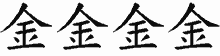 | QQQQ₄ |
| 量 |  | JG₂ — JGJ₃ — JGJF₄ |
| 野 |  | JFC₃ — JFCB₄ |
| 重 |  | TGJ₃ — TGJF₄ |
| 里 |  | JFD₃ |
| 释 |  | TOC₃ — TOCH₄ |
| 釉 |  | TOM₃ — TOMG₄ |
| 采 |  | ES₂ — ESU₃ |
| 醛 |  | SGAG₄ |
| 醚 |  | SGO₃ — SGOP₄ |
| 醒 |  | SGJ₃ — SGJG₄ |
| 醋 |  | SGA₃ — SGAJ₄ |
| 醉 |  | SGY₃ — SGYF₄ |
| 醇 |  | SGYB₄ |
| 酿 |  | SGYE₄ |
| 酸 |  | SGC₃ — SGCT₄ |
| 酷 | 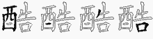 | SGTK₄ |
| 酶 | 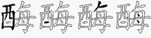 | SGTU₄ |
| 酵 | 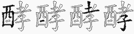 | SGFB₄ |
| 酱 |  | UQSG₄ |
| 酮 |  | SGMK₄ |
| 酬 | 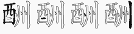 | SGYH₄ |
| 酪 |  | SGTK₄ |
| 酥 |  | SGTY₄ |
| 酣 |  | SGAF₄ |
| 酞 |  | SGDY₄ |
| 酝 |  | SGF₃ — SGFC₄ |
| 酚 |  | SGW₃ — SGWV₄ |
| 酗 | 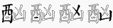 | SGQB₄ |
| 酒 | 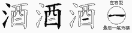 | ISGG₄ |
| 配 |  | SGN₃ — SGNN₄ |
| 酌 |  | SGQ₃ — SGQY₄ |
| 酋 |  | USGF₄ |
| 酉 |  | SGD₃ |
| 鄙 |  | KFL₃ — KFLB₄ |
| 鄂 |  | KKFB₄ |
| 都 |  | FTJB₄ |
| 郸 |  | UJFB₄ |
| 郴 |  | SSB₃ — SSBH₄ |
| 郭 |  | YBB₃ — YBBH₄ |
| 部 |  | UK₂ — UKB₃ — UKBH₄ |
| 郧 |  | KMB₃ — KMBH₄ |
| 郡 |  | VTKB₄ |
| 郑 |  | UDB₃ — UDBH₄ |
| 郎 |  | YVCB₄ |
| 郊 |  | UQB₃ — UQBH₄ |
| 郁 |  | DEB₃ — DEBH₄ |
| 邻 | 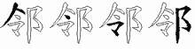 | WYCB₄ |
| 邹 |  | QVB₃ — QVBH₄ |
| 邵 |  | VKB₃ — VKBH₄ |
| 邱 |  | RGB₃ — RGBH₄ |
| 邯 |  | AFB₃ — AFBH₄ |
| 邮 |  | MB₂ — MBH₃ |
| 邪 |  | AHTB₄ |
| 邦 |  | DTB₃ — DTBH₄ |
| 那 |  | VFB₃ — VFBH₄ |
| 邢 |  | GAB₃ — GABH₄ |
| 邓 |  | CB₂ — CBH₃ |
| 邑 |  | KCB₃ |
| 邀 |  | RYTP₄ |
| 避 |  | NK₂ — NKUP₄ |
| 遵 |  | USGP₄ |
| 遮 |  | YAOP₄ |
| 遭 |  | GMAP₄ |
| 遥 |  | ER₂ — ERM₃ — ERMP₄ |
| 遣 |  | KHGP₄ |
| 遗 |  | KHGP₄ |
| 道 |  | UTHP₄ |
| 遏 |  | JQWP₄ |
| 遍 |  | YNM₃ — YNMP₄ |
| 遇 |  | JM₂ — JMHP₄ |
| 遂 |  | UEP₃ — UEPI₄ |
| 遁 |  | RFHP₄ |
| 逾 |  | WGEP₄ |
| 逼 |  | GKLP₄ |
| 逻 |  | LQP₃ — LQPI₄ |
| 逸 |  | QKQP₄ |
| 逮 |  | VIP₃ — VIPI₄ |
| 逢 |  | TDH₃ — TDHP₄ |
| 造 | 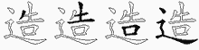 | TFKP₄ |
| 速 |  | GKIP₄ |
| 逞 |  | KGP₃ — KGPD₄ |
| 逝 |  | RRP₃ — RRPK₄ |
| 逛 |  | QTGP₄ |
| 逗 |  | GKUP₄ |
| 途 |  | WTP₃ — WTPI₄ |
| 递 |  | UXHP₄ |
| 逐 |  | EPI₃ |
| 透 |  | TEP₃ — TEPV₄ |
| 逊 |  | BIP₃ — BIPI₄ |
| 选 | 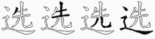 | TFQP₄ |
| 逆 |  | UBT₃ — UBTP₄ |
| 逃 |  | IQP₃ — IQPV₄ |
| 适 |  | TDP₃ — TDPD₄ |
| 送 |  | UDP₃ — UDPI₄ |
| 退 |  | VEP₃ — VEPI₄ |
| 追 | 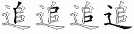 | WNNP₄ |
| 迹 |  | YOP₃ — YOPI₄ |
| 迸 |  | UAP₃ — UAPK₄ |
| 迷 |  | OP₂ — OPI₃ |
| 述 |  | SYP₃ — SYPI₄ |
| 迭 |  | RWP₃ — RWPI₄ |
| 迫 |  | RPD₃ |
| 迪 |  | MP₂ — MPD₃ |
| 迢 |  | VKP₃ — VKPD₄ |
| 迟 |  | NYP₃ — NYPI₄ |
| 连 |  | LPK₃ |
| 违 | 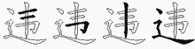 | FNHP₄ |
| 远 |  | FQP₃ — FQPV₄ |
| 进 |  | FJ₂ — FJP₃ — FJPK₄ |
| 这 |  | P₁ — YP₂ — YPI₃ |
| 还 |  | GIP₃ — GIPI₄ |
| 返 |  | RCP₃ — RCPI₄ |
| 近 |  | RP₂ — RPK₃ |
| 运 |  | FCP₃ — FCPI₄ |
| 迎 |  | QBP₃ — QBPK₄ |
| 迈 |  | DNP₃ — DNPV₄ |
| 过 |  | FP₂ — FPI₃ |
| 迅 |  | NFP₃ — NFPK₄ |
| 迄 |  | TNP₃ — TNPV₄ |
| 迂 |  | GFP₃ — GFPK₄ |
| 迁 |  | TFP₃ — TFPK₄ |
| 达 |  | DP₂ — DPI₃ |
| 辽 |  | BP₂ — BPK₃ |
| 边 |  | LP₂ — LPV₃ |
| 辱 |  | DFEF₄ |
| 辰 |  | DFE₃ — DFEI₄ |
| 辫 |  | UXU₃ — UXUH₄ |
| 辩 |  | UYU₃ — UYUH₄ |
| 辨 |  | UYT₃ — UYTU₄ |
| 辣 |  | UGK₃ — UGKI₄ |
| 辟 |  | NKU₃ — NKUH₄ |
| 辞 |  | TDUH₄ |
| 辜 |  | DUJ₃ |
| 辛 | 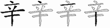 | UYGH₄ |
| 辙 |  | LYC₃ — LYCT₄ |
| 辗 |  | LNA₃ — LNAE₄ |
| 辖 | 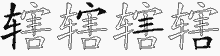 | LPDK₄ |
| 辕 |  | LFK₃ — LFKE₄ |
| 输 |  | LWG₃ — LWGJ₄ |
| 辑 |  | LKB₃ — LKBG₄ |
| 辐 |  | LGK₃ — LGKL₄ |
| 辊 |  | LJ₂ — LJX₃ — LJXX₄ |
| 辉 |  | IQPL₄ |
| 辈 |  | DJDL₄ |
| 辆 |  | LGM₃ — LGMW₄ |
| 辅 | 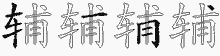 | LGEY₄ |
| 较 |  | LU₂ — LUQ₃ — LUQY₄ |
| 轿 |  | LTD₃ — LTDJ₄ |
| 载 |  | FA₂ — FAL₃ — FALK₄ |
| 轻 |  | LC₂ — LCA₃ — LCAG₄ |
| 轴 |  | LM₂ — LMG₃ |
| 轰 |  | LCC₃ — LCCU₄ |
| 软 |  | LQW₃ — LQWY₄ |
| 轮 |  | LWX₃ — LWXN₄ |
| 转 |  | LFN₃ — LFNY₄ |
| 轩 |  | LF₂ — LFH₃ |
| 轨 |  | LV₂ — LVN₃ |
| 轧 |  | LNN₃ |
| 车 |  | LG₂ — LGN₃ — LGNH₄ |
| 躺 | 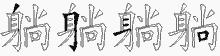 | TMDK₄ |
| 躲 |  | TMDS₄ |
| 躯 |  | TMDQ₄ |
| 躬 |  | TMDX₄ |
| 身 |  | TMD₃ — TMDT₄ |
| 躇 |  | KHAJ₄ |
| 躁 | 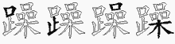 | KHKS₄ |
| 蹿 |  | KHPH₄ |
| 蹲 | 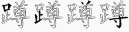 | KHUF₄ |
| 蹭 |  | KHUJ₄ |
| 蹭 |  | KHUJ₄ |
| 蹬 |  | KHWU₄ |
| 蹦 |  | KHME₄ |
| 蹋 | 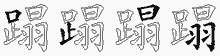 | KHJN₄ |
| 蹈 |  | KHEV₄ |
| 蹄 |  | KHUH₄ |
| 踪 |  | KHP₃ — KHPI₄ |
| 踩 |  | KHES₄ |
| 踢 |  | KHJ₃ — KHJR₄ |
| 踞 |  | KHND₄ |
| 踏 |  | KHIJ₄ |
| 踏 |  | KHIJ₄ |
| 踌 |  | KHDF₄ |
| 踊 |  | KHC₃ — KHCE₄ |
| 跺 |  | KHM₃ — KHMS₄ |
| 践 |  | KHG₃ — KHGT₄ |
| 跳 |  | KHI₃ — KHIQ₄ |
| 路 |  | KHT₃ — KHTK₄ |
| 跪 |  | KHQB₄ |
| 跨 |  | KHD₃ — KHDN₄ |
| 跟 |  | KHV₃ — KHVE₄ |
| 距 |  | KHA₃ — KHAN₄ |
| 跑 |  | KHQ₃ — KHQN₄ |
| 跌 |  | KHR₃ — KHRW₄ |
| 跋 |  | KHDC₄ |
| 跃 |  | KHTD₄ |
| 趾 |  | KHH₃ — KHHG₄ |
| 趴 |  | KHW₃ — KHWY₄ |
| 足 |  | KHU₃ |
| 趣 |  | FHB₃ — FHBC₄ |
| 趟 |  | FHI₃ — FHIK₄ |
| 趋 |  | FHQV₄ |
| 越 |  | FHA₃ — FHAT₄ |
| 超 |  | FHV₃ — FHVK₄ |
| 趁 |  | FHWE₄ |
| 起 |  | FHN₃ — FHNV₄ |
| 赶 |  | FHFK₄ |
| 赵 |  | FHQ₃ — FHQI₄ |
| 赴 |  | FHH₃ — FHHI₄ |
| 走 |  | FHU₃ |
| 赫 |  | FOF₃ — FOFO₄ |
| 赦 |  | FOT₃ — FOTY₄ |
| 赤 |  | FO₂ — FOU₃ |
| 赢 |  | YNKY₄ |
| 赡 |  | MQD₃ — MQDY₄ |
| 赠 |  | MU₂ — MUL₃ — MULJ₄ |
| 赠 |  | MU₂ — MUL₃ — MULJ₄ |
| 赞 |  | TFQM₄ |
| 赛 |  | PFJM₄ |
| 赚 |  | MUV₃ — MUVO₄ |
| 赘 |  | GQTM₄ |
| 赖 |  | GKIM₄ |
| 赔 |  | MUK₃ — MUKG₄ |
| 赐 |  | MJQ₃ — MJQR₄ |
| 赏 |  | IPKM₄ |
| 赎 |  | MFN₃ — MFND₄ |
| 赌 |  | MFTJ₄ |
| 赋 |  | MGA₃ — MGAH₄ |
| 赊 |  | MWF₃ — MWFI₄ |
| 资 |  | UQWM₄ |
| 赃 |  | MYF₃ — MYFG₄ |
| 赂 |  | MTK₃ — MTKG₄ |
| 赁 |  | WTFM₄ |
| 贿 |  | MDE₃ — MDEG₄ |
| 贾 |  | SMU₃ |
| 贼 |  | MADT₄ |
| 贼 |  | MADT₄ |
| 贺 |  | LKM₃ — LKMU₄ |
| 费 |  | XJM₃ — XJMU₄ |
| 贸 |  | QYV₃ — QYVM₄ |
| 贷 |  | WAM₃ — WAMU₄ |
| 贵 |  | KHGM₄ |
| 贴 |  | MHKG₄ |
| 贱 |  | MGT₃ |
| 贰 |  | AFM₃ — AFMI₄ |
| 贯 |  | XFM₃ — XFMU₄ |
| 贮 |  | MPG₃ — MPGG₄ |
| 贬 |  | MTP₃ — MTPY₄ |
| 贫 |  | WVM₃ — WVMU₄ |
| 贪 |  | WYNM₄ |
| 贩 |  | MR₂ — MRC₃ — MRCY₄ |
| 质 |  | RFM₃ — RFMI₄ |
| 货 |  | WXM₃ — WXMU₄ |
| 账 |  | MTA₃ — MTAY₄ |
| 败 |  | MTY₃ |
| 贤 |  | JCM₃ — JCMU₄ |
| 责 |  | GMU₃ |
| 财 |  | MF₂ — MFT₃ — MFTT₄ |
| 贡 |  | AM₂ — AMU₃ |
| 负 |  | QM₂ — QMU₃ |
| 贞 |  | HM₂ — HMU₃ |
| 贝 |  | MHNY₄ |
| 貌 |  | EERQ₄ |
| 貉 |  | EETK₄ |
| 豺 |  | EEF₃ — EEFT₄ |
| 豹 |  | EEQY₄ |
| 豫 |  | CBQ₃ — CBQE₄ |
| 豪 |  | YPEU₄ |
| 豢 |  | UDE₃ — UDEU₄ |
| 象 |  | QJE₃ — QJEU₄ |
| 豌 |  | GKUB₄ |
| 豌 |  | GKUB₄ |
| 豆 |  | GKU₃ — GKUF₄ |
| 豁 |  | PDHK₄ |
| 谷 |  | WWK₃ — WWKF₄ |
| 谴 |  | YKHP₄ |
| 谱 |  | YUO₃ — YUOJ₄ |
| 谰 |  | YUG₃ — YUGI₄ |
| 谭 |  | YSJ₃ — YSJH₄ |
| 谬 |  | YNWE₄ |
| 谩 |  | YJL₃ — YJLC₄ |
| 谨 |  | YAK₃ — YAKG₄ |
| 谦 |  | YUV₃ — YUVO₄ |
| 谤 |  | YUP₃ — YUPY₄ |
| 谣 |  | YER₃ — YERM₄ |
| 谢 |  | YTM₃ — YTMF₄ |
| 谜 |  | YOPY₄ |
| 谚 |  | YUT₃ — YUTE₄ |
| 谗 |  | YQK₃ — YQKU₄ |
| 谓 |  | YLE₃ — YLEG₄ |
| 谐 |  | YXXR₄ |
| 谎 |  | YAY₃ — YAYQ₄ |
| 谍 |  | YAN₃ — YANS₄ |
| 谋 |  | YAF₃ — YAFS₄ |
| 谊 |  | YPE₃ — YPEG₄ |
| 谈 |  | YOO₃ — YOOY₄ |
| 谆 |  | YYBG₄ |
| 谅 |  | YYI₃ — YYIY₄ |
| 调 |  | YMF₃ — YMFK₄ |
| 谁 |  | YWYG₄ |
| 课 |  | YJS₃ — YJSY₄ |
| 诽 |  | YDJ₃ — YDJD₄ |
| 读 |  | YFN₃ — YFND₄ |
| 诺 |  | YAD₃ — YADK₄ |
| 诸 |  | YFT₃ — YFTJ₄ |
| 请 |  | YGE₃ — YGEG₄ |
| 诵 |  | YCEH₄ |
| 说 |  | YU₂ — YUK₃ — YUKQ₄ |
| 诲 |  | YTX₃ — YTXU₄ |
| 诱 |  | YTE₃ — YTEN₄ |
| 误 |  | YKG₃ — YKGD₄ |
| 语 |  | YGK₃ — YGKG₄ |
| 诬 |  | YAW₃ — YAWW₄ |
| 诫 |  | YAAH₄ |
| 诧 |  | YPTA₄ |
| 详 |  | YUD₃ — YUDH₄ |
| 该 |  | YYNW₄ |
| 诣 |  | YXJ₃ — YXJG₄ |
| 询 |  | YQJ₃ — YQJG₄ |
| 诡 |  | YQD₃ — YQDB₄ |
| 诞 |  | YTHP₄ |
| 话 |  | YTD₃ — YTDG₄ |
| 诛 |  | YRI₃ — YRIY₄ |
| 诚 |  | YDN₃ — YDNT₄ |
| 诗 |  | YFF₃ — YFFY₄ |
| 试 |  | YAA₃ — YAAG₄ |
| 译 |  | YCF₃ — YCFH₄ |
| 词 |  | YNGK₄ |
| 诌 |  | YQVG₄ |
| 诊 |  | YWE₃ — YWET₄ |
| 诉 |  | YR₂ — YRY₃ — YRYY₄ |
| 诈 |  | YTH₃ — YTHF₄ |
| 识 |  | YKW₃ — YKWY₄ |
| 诅 |  | YEG₃ — YEGG₄ |
| 评 |  | YGU₃ — YGUH₄ |
| 证 |  | YGH₃ — YGHG₄ |
| 诀 |  | YNWY₄ |
| 访 |  | YYN₃ |
| 设 |  | YMC₃ — YMCY₄ |
| 讽 |  | YMQ₃ — YMQY₄ |
| 讼 |  | YWC₃ — YWCY₄ |
| 论 |  | YWX₃ — YWXN₄ |
| 讹 |  | YWXN₄ |
| 许 |  | YTF₃ — YTFH₄ |
| 讶 |  | YAH₃ — YAHT₄ |
| 讳 |  | YFNH₄ |
| 讲 |  | YFJ₃ — YFJH₄ |
| 讲 |  | YFJ₃ — YFJH₄ |
| 记 |  | YN₂ — YNN₃ |
| 讯 |  | YNF₃ — YNFH₄ |
| 议 |  | YYQ₃ — YYQY₄ |
| 训 |  | YK₂ — YKH₃ |
| 讫 |  | YTNN₄ |
| 让 |  | YH₂ — YHG₃ |
| 讨 |  | YFY₃ |
| 讥 |  | YMN₃ |
| 认 |  | YW₂ — YWY₃ |
| 讣 |  | YHY₃ |
| 订 |  | YS₂ — YSH₃ |
| 计 |  | YF₂ — YFH₃ |
| 譬 |  | NKUY₄ |
| 警 |  | AQKY₄ |
| 誓 |  | RRYF₄ |
| 誊 |  | UDYF₄ |
| 誉 |  | IWYF₄ |
| 詹 |  | QDW₃ — QDWY₄ |
| 詹 |  | QDW₃ — QDWY₄ |
| 言 |  | YYY₃ — YYYY₄ |
| 触 |  | QEJY₄ |
| 解 |  | QEV₃ — QEVH₄ |
| 角 |  | QE₂ — QEJ₃ |
| 觉 |  | IPMQ₄ |
| 览 |  | JTYQ₄ |
| 视 |  | PYM₃ — PYMQ₄ |
| 觅 |  | EMQ₃ — EMQB₄ |
| 规 |  | FWM₃ — FWMQ₄ |
| 观 |  | CM₂ — CMQ₃ — CMQN₄ |
| 见 |  | MQB₃ |
| 覆 |  | STT₃ — STTT₄ |
| 要 |  | S₁ — SV₂ — SVF₃ |
| 西 |  | SGHG₄ |
| 襟 |  | PUS₃ — PUSI₄ |
| 襄 |  | YKK₃ — YKKE₄ |
| 褪 |  | PUVP₄ |
| 褥 |  | PUDF₄ |
| 褒 |  | YWK₃ — YWKE₄ |
| 褐 |  | PUJN₄ |
| 褂 |  | PUFH₄ |
| 裹 |  | YJSE₄ |
| 裸 |  | PUJS₄ |
| 裳 |  | IPKE₄ |
| 裤 |  | PUY₃ — PUYL₄ |
| 裙 |  | PUVK₄ |
| 裕 |  | PUW₃ — PUWK₄ |
| 裔 |  | YEM₃ — YEMK₄ |
| 裔 |  | YEM₃ — YEMK₄ |
| 装 |  | UFY₃ — UFYE₄ |
| 裂 |  | GQJE₄ |
| 裁 |  | FAY₃ — FAYE₄ |
| 袭 |  | DXY₃ — DXYE₄ |
| 被 |  | PUHC₄ |
| 袜 |  | PUG₃ — PUGS₄ |
| 袖 |  | PUM₃ — PUMG₄ |
| 袍 |  | PUQ₃ — PUQN₄ |
| 袋 |  | WAYE₄ |
| 袄 |  | PUT₃ — PUTD₄ |
| 袁 |  | FKE₃ — FKEU₄ |
| 衷 |  | YKHE₄ |
| 衰 |  | YKGE₄ |
| 衬 |  | PUF₃ — PUFY₄ |
| 衫 |  | PUE₃ — PUET₄ |
| 表 |  | GE₂ — GEU₃ |
| 补 |  | PUH₃ — PUHY₄ |
| 衣 |  | YE₂ — YEU₃ |
| 衡 |  | TQDH₄ |
| 衙 |  | TGK₃ — TGKH₄ |
| 街 |  | TFFH₄ |
| 衔 |  | TQF₃ — TQFH₄ |
| 衍 |  | TIF₃ — TIFH₄ |
| 行 |  | TF₂ — TFHH₄ |
| 衅 |  | TLU₃ — TLUF₄ |
| 血 |  | TLD₃ |
| 蠢 |  | DWJJ₄ |
| 蠕 |  | JFDJ₄ |
| 蟹 |  | QEVJ₄ |
| 螺 |  | JLX₃ — JLXI₄ |
| 螟 |  | JPJ₃ — JPJU₄ |
| 融 |  | GKM₃ — GKMJ₄ |
| 蝶 |  | JAN₃ — JANS₄ |
| 蝴 |  | JDE₃ — JDEG₄ |
| 蝗 |  | JR₂ — JRG₃ — JRGG₄ |
| 蝎 |  | JJQ₃ — JJQN₄ |
| 蝉 |  | JUJF₄ |
| 蝇 |  | JK₂ — JKJ₃ — JKJN₄ |
| 蜡 |  | JAJ₃ — JAJG₄ |
| 蜜 |  | PNTJ₄ |
| 蜘 |  | JTDK₄ |
| 蜗 |  | JKM₃ — JKMW₄ |
| 蜕 |  | JUK₃ — JUKQ₄ |
| 蜒 |  | JTHP₄ |
| 蜂 |  | JTD₃ — JTDH₄ |
| 蜀 |  | LQJ₃ — LQJU₄ |
| 蛾 |  | JTR₃ — JTRT₄ |
| 蛹 |  | JCEH₄ |
| 蛰 |  | RVYJ₄ |
| 蛮 |  | YOJ₃ — YOJU₄ |
| 蛤 |  | JW₂ — JWG₃ — JWGK₄ |
| 蛛 |  | JRI₃ — JRIY₄ |
| 蛙 |  | JFF₃ — JFFG₄ |
| 蛔 |  | JLK₃ — JLKG₄ |
| 蛋 |  | NHJ₃ — NHJU₄ |
| 蛊 |  | JLF₃ |
| 蛇 |  | JPX₃ — JPXN₄ |
| 蛆 |  | JEGG₄ |
| 蛀 |  | JYG₃ — JYGG₄ |
| 蚤 |  | CYJ₃ — CYJU₄ |
| 蚜 |  | JAH₃ — JAHT₄ |
| 蚕 |  | GDJ₃ — GDJU₄ |
| 蚌 |  | JDH₃ — JDHH₄ |
| 蚊 |  | JYY₃ |
| 蚂 |  | JCG₃ |
| 蚁 |  | JYQ₃ — JYQY₄ |
| 蚀 |  | QNJ₃ — QNJY₄ |
| 虾 |  | JGHY₄ |
| 虽 |  | KJ₂ — KJU₃ |
| 虹 |  | JA₂ — JAG₃ |
| 虱 |  | NTJ₃ — NTJI₄ |
| 虫 |  | JHNY₄ |
| 虞 |  | HAK₃ — HAKD₄ |
| 虚 |  | HAO₃ — HAOG₄ |
| 虑 |  | HAN₃ — HANI₄ |
| 虐 |  | HAA₃ — HAAG₄ |
| 虏 |  | HALV₄ |
| 虎 |  | HA₂ — HAM₃ — HAMV₄ |
| 蘸 |  | ASGO₄ |
| 蘑 |  | AYS₃ — AYSD₄ |
| 藻 |  | AIK₃ — AIKS₄ |
| 藩 |  | AITL₄ |
| 藤 |  | AEU₃ — AEUI₄ |
| 藕 |  | ADIY₄ |
| 藐 |  | AEE₃ — AEEQ₄ |
| 藏 |  | ADNT₄ |
| 藉 |  | ADI₃ — ADIJ₄ |
| 藉 |  | ADI₃ — ADIJ₄ |
| 薯 |  | ALFJ₄ |
| 薪 |  | AUS₃ — AUSR₄ |
| 薛 |  | AWNU₄ |
| 薄 |  | AIG₃ — AIGF₄ |
| 蕾 |  | AFLF₄ |
| 蕴 |  | AXJ₃ — AXJL₄ |
| 蕊 |  | ANN₃ — ANNN₄ |
| 蕉 |  | AWY₃ — AWYO₄ |
| 蔽 |  | AUM₃ — AUMT₄ |
| 蔼 |  | AYJ₃ — AYJN₄ |
| 蔷 |  | AFU₃ — AFUK₄ |
| 蔬 |  | ANH₃ — ANHQ₄ |
| 蔫 |  | AGHO₄ |
| 蔡 |  | AWF₃ — AWFI₄ |
| 蔚 |  | ANF₃ — ANFF₄ |
| 蔗 |  | AYA₃ — AYAO₄ |
| 蔓 |  | AJL₃ — AJLC₄ |
| 蔑 |  | ALDT₄ |
| 蓬 |  | ATDP₄ |
| 蓟 |  | AQGJ₄ |
| 蓝 |  | AJT₃ — AJTL₄ |
| 蓖 |  | ATL₃ — ATLX₄ |
| 蓑 |  | AYK₃ — AYKE₄ |
| 蓉 |  | APW₃ — APWK₄ |
| 蓄 |  | AYX₃ — AYXL₄ |
| 蒸 |  | ABI₃ — ABIO₄ |
| 蒲 |  | AIGY₄ |
| 蒜 |  | AFI₃ — AFII₄ |
| 蒙 |  | APG₃ — APGE₄ |
| 蒋 |  | AUQ₃ — AUQF₄ |
| 蒂 |  | AUP₃ — AUPH₄ |
| 葵 |  | AWG₃ — AWGD₄ |
| 葱 |  | AQRN₄ |
| 葬 |  | AGQ₃ — AGQA₄ |
| 葫 |  | ADEF₄ |
| 董 |  | ATG₃ — ATGF₄ |
| 葡 |  | AQG₃ — AQGY₄ |
| 葛 |  | AJQ₃ — AJQN₄ |
| 著 |  | AFT₃ — AFTJ₄ |
| 落 |  | AIT₃ — AITK₄ |
| 萨 |  | ABU₃ — ABUT₄ |
| 萧 |  | AVI₃ — AVIJ₄ |
| 营 |  | APK₃ — APKK₄ |
| 萤 |  | APJ₃ — APJU₄ |
| 萝 |  | ALQ₃ — ALQU₄ |
| 萎 |  | ATV₃ — ATVF₄ |
| 萍 |  | AIGH₄ |
| 萌 |  | AJE₃ — AJEF₄ |
| 萄 |  | AQR₃ — AQRM₄ |
| 菲 |  | ADJ₃ — ADJD₄ |
| 菱 |  | AFWT₄ |
| 菩 |  | AUK₃ — AUKF₄ |
| 菠 |  | AIH₃ — AIHC₄ |
| 菜 |  | AE₂ — AES₃ — AESU₄ |
| 菏 |  | AIS₃ — AISK₄ |
| 菌 |  | ALT₃ — ALTU₄ |
| 菊 |  | AQO₃ — AQOU₄ |
| 菇 |  | AVD₃ — AVDF₄ |
| 莽 |  | ADA₃ — ADAJ₄ |
| 莹 |  | APGY₄ |
| 获 |  | AQT₃ — AQTD₄ |
| 莲 |  | ALP₃ — ALPU₄ |
| 莱 |  | AGO₃ — AGOU₄ |
| 莫 |  | AJD₃ — AJDU₄ |
| 莎 |  | AIIT₄ |
| 莉 |  | ATJ₃ — ATJJ₄ |
| 莆 |  | AGE₃ — AGEY₄ |
| 荷 |  | AWSK₄ |
| 药 |  | AX₂ — AXQ₃ — AXQY₄ |
| 荫 |  | ABE₃ — ABEF₄ |
| 荧 |  | APO₃ — APOU₄ |
| 荤 |  | APLJ₄ |
| 荣 |  | APS₃ — APSU₄ |
| 荡 |  | AIN₃ — AINR₄ |
| 荚 |  | AGUW₄ |
| 荔 |  | ALL₃ — ALLL₄ |
| 荒 |  | AYNQ₄ |
| 荐 |  | ADH₃ — ADHB₄ |
| 草 |  | AJJ₃ |
| 荆 |  | AGA₃ — AGAJ₄ |
| 茹 |  | AVK₃ — AVKF₄ |
| 茸 |  | ABF₃ |
| 茶 |  | AWS₃ — AWSU₄ |
| 茵 |  | ALD₃ — ALDU₄ |
| 茬 |  | ADHF₄ |
| 茫 |  | AIY₃ — AIYN₄ |
| 茫 |  | AIY₃ — AIYN₄ |
| 茨 |  | AUQW₄ |
| 茨 |  | AUQW₄ |
| 茧 |  | AJU₃ |
| 茎 |  | ACA₃ — ACAF₄ |
| 茅 |  | ACBT₄ |
| 茄 |  | ALKF₄ |
| 范 |  | AIB₃ — AIBB₄ |
| 茂 |  | ADN₃ — ADNT₄ |
| 茁 |  | ABM₃ — ABMJ₄ |
| 苹 |  | AGU₃ — AGUH₄ |
| 英 |  | AMD₃ — AMDU₄ |
| 苯 |  | ASG₃ — ASGF₄ |
| 苫 |  | AHK₃ — AHKF₄ |
| 苦 |  | ADF₃ |
| 若 |  | ADK₃ — ADKF₄ |
| 苟 |  | AQKF₄ |
| 苞 |  | AQN₃ — AQNB₄ |
| 苛 |  | AS₂ — ASK₃ — ASKF₄ |
| 苗 |  | ALF₃ |
| 苔 |  | ACK₃ — ACKF₄ |
| 苑 |  | AQB₃ — AQBB₄ |
| 苏 |  | ALW₃ — ALWU₄ |
| 苍 |  | AWB₃ — AWBB₄ |
| 苇 |  | AFN₃ — AFNH₄ |
| 芽 |  | AAH₃ — AAHT₄ |
| 芹 |  | ARJ₃ |
| 芳 |  | AY₂ — AYB₃ |
| 花 |  | AWX₃ — AWXB₄ |
| 芯 |  | ANU₃ |
| 芭 |  | AC₂ — ACB₃ |
| 芬 |  | AWV₃ — AWVB₄ |
| 芦 |  | AYNR₄ |
| 芥 |  | AWJ₃ — AWJJ₄ |
| 芝 |  | AP₂ — APU₃ |
| 芜 |  | AFQB₄ |
| 芒 |  | AYN₃ — AYNB₄ |
| 芍 |  | AQY₃ — AQYU₄ |
| 芋 |  | AGF₃ — AGFJ₄ |
| 节 |  | AB₂ — ABJ₃ |
| 艾 |  | AQU₃ |
| 艺 |  | ANB₃ |
| 艳 |  | DHQ₃ — DHQC₄ |
| 色 |  | QC₂ — QCB₃ |
| 艰 |  | CV₂ — CVE₃ — CVEY₄ |
| 良 |  | YV₂ — YVE₃ — YVEI₄ |
| 艘 |  | TEVC₄ |
| 艇 |  | TET₃ — TETP₄ |
| 船 |  | TEMK₄ |
| 舷 |  | TEYX₄ |
| 舶 |  | TER₃ — TERG₄ |
| 舵 |  | TEPX₄ |
| 舱 |  | TEW₃ — TEWB₄ |
| 舰 |  | TEMQ₄ |
| 般 |  | TEM₃ — TEMC₄ |
| 航 |  | TEY₃ — TEYM₄ |
| 舟 |  | TEI₃ |
| 舞 |  | RLG₃ — RLGH₄ |
| 舜 |  | EPQH₄ |
| 舔 |  | TDGN₄ |
| 舒 |  | WFKB₄ |
| 舍 |  | WFK₃ — WFKF₄ |
| 舌 |  | TDD₃ |
| 舆 |  | WFL₃ — WFLW₄ |
| 舅 |  | VL₂ — VLL₃ — VLLB₄ |
| 舀 |  | EVF₃ |
| 臼 |  | VTH₃ — VTHG₄ |
| 臻 |  | GCFT₄ |
| 致 |  | GCFT₄ |
| 至 |  | GCF₃ — GCFF₄ |
| 臭 |  | THDU₄ |
| 自 |  | THD₃ |
| 臣 |  | AHN₃ — AHNH₄ |
| 臆 |  | EUJ₃ — EUJN₄ |
| 臃 |  | EYX₃ — EYXY₄ |
| 臂 |  | NKUE₄ |
| 臀 |  | NAWE₄ |
| 膳 |  | EUDK₄ |
| 膨 |  | EFK₃ — EFKE₄ |
| 膝 |  | ESW₃ — ESWI₄ |
| 膜 |  | EAJD₄ |
| 膛 |  | EI₂ — EIP₃ — EIPF₄ |
| 膘 |  | ESF₃ — ESFI₄ |
| 膏 |  | YPK₃ — YPKE₄ |
| 膊 |  | EGEF₄ |
| 膀 |  | EUP₃ — EUPY₄ |
| 腿 |  | EVE₃ — EVEP₄ |
| 腿 |  | EVE₃ — EVEP₄ |
| 腾 |  | EUD₃ — EUDC₄ |
| 腻 |  | EAF₃ — EAFM₄ |
| 腺 |  | ERI₃ — ERIY₄ |
| 腹 |  | ETJ₃ — ETJT₄ |
| 腰 |  | ESV₃ — ESVG₄ |
| 腮 |  | ELNY₄ |
| 腥 |  | EJT₃ — EJTG₄ |
| 腕 |  | EPQ₃ — EPQB₄ |
| 腔 |  | EPW₃ — EPWA₄ |
| 腑 |  | EYW₃ — EYWF₄ |
| 腐 |  | YWFW₄ |
| 腋 |  | EYWY₄ |
| 腊 |  | EAJ₃ — EAJG₄ |
| 腆 |  | EMA₃ — EMAW₄ |
| 脾 |  | ERT₃ — ERTF₄ |
| 脸 |  | EW₂ — EWG₃ — EWGI₄ |
| 脱 |  | EUK₃ — EUKQ₄ |
| 脯 |  | EGE₃ — EGEY₄ |
| 脚 |  | EFCB₄ |
| 脓 |  | EPE₃ — EPEY₄ |
| 脑 |  | EYB₃ — EYBH₄ |
| 脐 |  | EYJ₃ — EYJH₄ |
| 脏 |  | EYF₃ — EYFG₄ |
| 脊 |  | IWE₃ — IWEF₄ |
| 脉 |  | EYNI₄ |
| 脆 |  | EQD₃ — EQDB₄ |
| 脂 |  | EX₂ — EXJ₃ — EXJG₄ |
| 能 |  | CE₂ — CEX₃ — CEXX₄ |
| 胺 |  | EPV₃ — EPVG₄ |
| 胸 |  | EQ₂ — EQQ₃ — EQQB₄ |
| 胶 |  | EU₂ — EUQ₃ — EUQY₄ |
| 胳 |  | ETK₃ — ETKG₄ |
| 胰 |  | EGX₃ — EGXW₄ |
| 胯 |  | EDF₃ — EDFN₄ |
| 胡 |  | DE₂ — DEG₃ |
| 胞 |  | EQN₃ — EQNN₄ |
| 胜 |  | ETG₃ — ETGG₄ |
| 胚 |  | EGI₃ — EGIG₄ |
| 胖 |  | EUF₃ — EUFH₄ |
| 胎 |  | ECK₃ — ECKG₄ |
| 背 |  | UXE₃ — UXEF₄ |
| 胆 |  | EJ₂ — EJG₃ — EJGG₄ |
| 胃 |  | LE₂ — LEF₃ |
| 胃 |  | LE₂ — LEF₃ |
| 胁 |  | ELW₃ — ELWY₄ |
| 胀 |  | ETA₃ — ETAY₄ |
| 肿 |  | EK₂ — EKH₃ — EKHH₄ |
| 肾 |  | JCE₃ — JCEF₄ |
| 肺 |  | EGM₃ — EGMH₄ |
| 育 |  | YCE₃ — YCEF₄ |
| 肯 |  | HE₂ — HEF₃ |
| 肮 |  | EYM₃ — EYMN₄ |
| 肪 |  | EYN₃ |
| 肩 |  | YNED₄ |
| 肥 |  | EC₂ — ECN₃ |
| 肢 |  | EFC₃ — EFCY₄ |
| 股 |  | EMC₃ — EMCY₄ |
| 肠 |  | ENR₃ — ENRT₄ |
| 肝 |  | EF₂ — EFH₃ |
| 肚 |  | EFG₃ |
| 肘 |  | EFY₃ |
| 肖 |  | IE₂ — IEF₃ |
| 肌 |  | EM₂ — EMN₃ |
| 肋 |  | EL₂ — ELN₃ |
| 肉 |  | MWW₃ — MWWI₄ |
| 肇 |  | YNTH₄ |
| 肆 |  | DV₂ — DVF₃ — DVFH₄ |
| 肄 |  | XTDH₄ |
| 肃 |  | VIJ₃ — VIJK₄ |
| 聪 |  | BUKN₄ |
| 聚 |  | BCT₃ — BCTI₄ |
| 聘 |  | BMG₃ — BMGN₄ |
| 联 |  | BU₂ — BUD₃ — BUDY₄ |
| 职 |  | BK₂ — BKW₃ — BKWY₄ |
| 聋 |  | DXB₃ — DXBF₄ |
| 聊 |  | BQT₃ — BQTB₄ |
| 聂 |  | BCC₃ — BCCU₄ |
| 耿 |  | BO₂ — BOY₃ |
| 耽 |  | BPQ₃ — BPQN₄ |
| 耻 |  | BH₂ — BHG₃ |
| 耸 |  | WWB₃ — WWBF₄ |
| 耶 |  | BBH₃ |
| 耳 |  | BGH₃ — BGHG₄ |
| 耪 |  | DIUY₄ |
| 耙 |  | DIC₃ — DICN₄ |
| 耘 |  | DIFC₄ |
| 耗 |  | DITN₄ |
| 耕 |  | DIF₃ — DIFJ₄ |
| 耐 |  | DMJF₄ |
| 耍 |  | DMJV₄ |
| 而 |  | DMJ₃ — DMJJ₄ |
| 者 |  | FTJ₃ — FTJF₄ |
| 考 |  | FTG₃ — FTGN₄ |
| 老 |  | FTX₃ — FTXB₄ |
| 耀 |  | IQNY₄ |
| 翼 |  | NLA₃ — NLAW₄ |
| 翻 |  | TOLN₄ |
| 翱 |  | RDFN₄ |
| 翰 |  | FJW₃ — FJWN₄ |
| 翠 |  | NYWF₄ |
| 翟 |  | NWYF₄ |
| 翘 |  | ATGN₄ |
| 翔 |  | UDNG₄ |
| 翌 |  | NUF₃ |
| 翅 |  | FCN₃ — FCND₄ |
| 翁 |  | WCN₃ — WCNF₄ |
| 羽 |  | NNY₃ — NNYG₄ |
| 羹 |  | UGOD₄ |
| 群 |  | VTK₃ — VTKD₄ |
| 羡 |  | UGU₃ — UGUW₄ |
| 羞 |  | UDN₃ — UDNF₄ |
| 羚 |  | UDWC₄ |
| 羔 |  | UGO₃ — UGOU₄ |
| 美 |  | UGDU₄ |
| 羌 |  | UDNB₄ |
| 羊 |  | UDJ₃ |
| 署 |  | LFTJ₄ |
| 置 |  | LFHF₄ |
| 罪 |  | LDJ₃ — LDJD₄ |
| 罩 |  | LHJ₃ — LHJJ₄ |
| 罢 |  | LFC₃ — LFCU₄ |
| 罚 |  | LY₂ — LYJ₃ — LYJJ₄ |
| 罗 |  | LQ₂ — LQU₃ |
| 罕 |  | PWF₃ — PWFJ₄ |
| 网 |  | MQQ₃ — MQQI₄ |
| 罐 |  | RMAY₄ |
| 缺 |  | RMN₃ — RMNW₄ |
| 缸 |  | RMA₃ — RMAG₄ |
| 缴 |  | XRY₃ — XRYT₄ |
| 缮 |  | XUD₃ — XUDK₄ |
| 缩 |  | XPW₃ — XPWJ₄ |
| 缨 |  | XMM₃ — XMMV₄ |
| 缠 |  | XYJ₃ — XYJF₄ |
| 缝 |  | XTDP₄ |
| 缚 |  | XGE₃ — XGEF₄ |
| 缘 |  | XXE₃ — XXEY₄ |
| 编 |  | XYNA₄ |
| 缕 |  | XOV₃ — XOVG₄ |
| 缔 |  | XUP₃ — XUPH₄ |
| 缓 |  | XEF₃ — XEFC₄ |
| 缎 |  | XWD₃ — XWDC₄ |
| 缉 |  | XKB₃ — XKBG₄ |
| 缆 |  | XJT₃ — XJTQ₄ |
| 缅 |  | XDMD₄ |
| 缄 |  | XDG₃ — XDGT₄ |
| 缀 |  | XCC₃ — XCCC₄ |
| 绿 |  | XV₂ — XVI₃ — XVIY₄ |
| 绽 |  | XPG₃ — XPGH₄ |
| 综 |  | XP₂ — XPF₃ — XPFI₄ |
| 绸 |  | XMF₃ — XMFK₄ |
| 绷 |  | XEE₃ — XEEG₄ |
| 绵 |  | XR₂ — XRM₃ — XRMH₄ |
| 维 |  | XWY₃ — XWYG₄ |
| 绳 |  | XKJN₄ |
| 绰 |  | XHJ₃ — XHJH₄ |
| 续 |  | XFN₃ — XFND₄ |
| 绪 |  | XFT₃ — XFTJ₄ |
| 绩 |  | XGM₃ — XGMY₄ |
| 继 |  | XO₂ — XON₃ — XONN₄ |
| 绦 |  | XTS₃ — XTSY₄ |
| 绥 |  | XEV₃ — XEVG₄ |
| 绣 |  | XTEN₄ |
| 绢 |  | XKE₃ — XKEG₄ |
| 统 |  | XYC₃ — XYCQ₄ |
| 绞 |  | XUQ₃ — XUQY₄ |
| 绝 |  | XQC₃ — XQCN₄ |
| 络 |  | XTK₃ — XTKG₄ |
| 绚 |  | XQJ₃ — XQJG₄ |
| 给 |  | XW₂ — XWG₃ — XWGK₄ |
| 绘 |  | XWF₃ — XWFC₄ |
| 绕 |  | XAT₃ — XATQ₄ |
| 结 |  | XF₂ — XFK₃ — XFKG₄ |
| 绒 |  | XAD₃ — XADT₄ |
| 绑 |  | XDT₃ — XDTB₄ |
| 经 |  | X₁ — XC₂ — XCA₃ — XCAG₄ |
| 绎 |  | XCF₃ — XCFH₄ |
| 绍 |  | XVK₃ — XVKG₄ |
| 绊 |  | XUF₃ — XUFH₄ |
| 终 |  | XTU₃ — XTUY₄ |
| 织 |  | XKW₃ — XKWY₄ |
| 细 |  | XL₂ — XLG₃ |
| 绅 |  | XJH₃ — XJHH₄ |
| 组 |  | XEG₃ — XEGG₄ |
| 练 |  | XAN₃ — XANW₄ |
| 线 |  | XG₂ — XGT₃ |
| 纽 |  | XNF₃ — XNFG₄ |
| 纺 |  | XY₂ — XYN₃ |
| 纹 |  | XYY₃ |
| 纸 |  | XQA₃ — XQAN₄ |
| 纷 |  | XWV₃ — XWVN₄ |
| 纶 |  | XWX₃ — XWXN₄ |
| 纶 |  | XWX₃ — XWXN₄ |
| 纵 |  | XWW₃ — XWWY₄ |
| 纳 |  | XMW₃ — XMWY₄ |
| 纲 |  | XM₂ — XMQ₃ — XMQY₄ |
| 纱 |  | XI₂ — XIT₃ — XITT₄ |
| 纯 |  | XGB₃ — XGBN₄ |
| 纬 |  | XFNH₄ |
| 纫 |  | XVY₃ — XVYY₄ |
| 纪 |  | XN₂ — XNN₃ |
| 级 |  | XE₂ — XEY₃ — XEYY₄ |
| 约 |  | XQ₂ — XQY₃ — XQYY₄ |
| 纤 |  | XTF₃ — XTFH₄ |
| 红 |  | XA₂ — XAG₃ |
| 纠 |  | XNH₃ — XNHH₄ |
| 纂 |  | THDI₄ |
| 繁 |  | TXGI₄ |
| 絮 |  | VKX₃ — VKXI₄ |
| 累 |  | LX₂ — LXI₃ — LXIU₄ |
| 紫 |  | HXX₃ — HXXI₄ |
| 紧 |  | JC₂ — JCX₃ — JCXI₄ |
| 索 |  | FPX₃ — FPXI₄ |
| 素 |  | GXI₃ — GXIU₄ |
| 紊 |  | YXIU₄ |
| 系 |  | TXI₃ — TXIU₄ |
| 糯 |  | OFD₃ — OFDJ₄ |
| 糠 |  | OYVI₄ |
| 糟 |  | OGMJ₄ |
| 糜 |  | YSSO₄ |
| 糙 |  | OTF₃ — OTFP₄ |
| 糖 |  | OYV₃ — OYVK₄ |
| 糕 |  | OUGO₄ |
| 糊 |  | ODE₃ — ODEG₄ |
| 精 |  | OGE₃ — OGEG₄ |
| 粹 |  | OYW₃ — OYWF₄ |
| 粳 |  | OGJ₃ — OGJQ₄ |
| 粱 |  | IVWO₄ |
| 粮 |  | OYV₃ — OYVE₄ |
| 粪 |  | OAWU₄ |
| 粥 |  | XOX₃ — XOXN₄ |
| 粤 |  | TLO₃ — TLON₄ |
| 粟 |  | SOU₃ |
| 粘 |  | OH₂ — OHK₃ — OHKG₄ |
| 粗 |  | OE₂ — OEG₃ — OEGG₄ |
| 粕 |  | ORG₃ |
| 粒 |  | OUG₃ |
| 粉 |  | OW₂ — OWV₃ — OWVN₄ |
| 籽 |  | OB₂ — OBG₃ |
| 类 |  | OD₂ — ODU₃ |
| 米 |  | OY₂ — OYT₃ — OYTY₄ |
| 籍 |  | TDIJ₄ |
| 簿 |  | TIG₃ — TIGF₄ |
| 簧 |  | TAMW₄ |
| 簇 |  | TYT₃ — TYTD₄ |
| 篷 |  | TTDP₄ |
| 篱 |  | TYB₃ — TYBC₄ |
| 篮 |  | TJTL₄ |
| 篡 |  | THDC₄ |
| 篙 |  | TYMK₄ |
| 篓 |  | TOV₃ — TOVF₄ |
| 篇 |  | TYNA₄ |
| 篆 |  | TXE₃ — TXEU₄ |
| 箱 |  | TSH₃ — TSHF₄ |
| 箭 |  | TUE₃ — TUEJ₄ |
| 箩 |  | TLQ₃ — TLQU₄ |
| 管 |  | TP₂ — TPN₃ — TPNN₄ |
| 算 |  | THA₃ — THAJ₄ |
| 箕 |  | TAD₃ — TADW₄ |
| 箔 |  | TIR₃ — TIRF₄ |
| 箍 |  | TRA₃ — TRAH₄ |
| 简 |  | TUJ₃ — TUJF₄ |
| 签 |  | TWGI₄ |
| 筹 |  | TDTF₄ |
| 筷 |  | TNN₃ — TNNW₄ |
| 筛 |  | TJGH₄ |
| 策 |  | TGM₃ — TGMI₄ |
| 答 |  | TW₂ — TWG₃ — TWGK₄ |
| 筒 |  | TMGK₄ |
| 筑 |  | TAM₃ — TAMY₄ |
| 筐 |  | TAG₃ — TAGF₄ |
| 筏 |  | TWA₃ — TWAR₄ |
| 筋 |  | TELB₄ |
| 等 |  | TFFU₄ |
| 笼 |  | TDX₃ — TDXB₄ |
| 笺 |  | TGR₃ |
| 第 |  | TX₂ — TXH₃ — TXHT₄ |
| 笨 |  | TSG₃ — TSGF₄ |
| 符 |  | TWF₃ — TWFU₄ |
| 笛 |  | TMF₃ |
| 笔 |  | TT₂ — TTF₃ — TTFN₄ |
| 笑 |  | TTD₃ — TTDU₄ |
| 笋 |  | TVT₃ — TVTR₄ |
| 笆 |  | TCB₃ |
| 竹 |  | TTG₃ — TTGH₄ |
| 端 |  | UMD₃ — UMDJ₄ |
| 竭 |  | UJQN₄ |
| 童 |  | UJFF₄ |
| 竣 |  | UCW₃ — UCWT₄ |
| 章 |  | UJJ₃ |
| 竟 |  | UJQ₃ — UJQB₄ |
| 竞 |  | UKQB₄ |
| 站 |  | UH₂ — UHKG₄ |
| 竖 |  | JCU₃ — JCUF₄ |
| 立 |  | UU₂ — UUU₃ — UUUU₄ |
| 窿 |  | PWB₃ — PWBG₄ |
| 窥 |  | PWFQ₄ |
| 窟 |  | PWN₃ — PWNM₄ |
| 窝 |  | PWKW₄ |
| 窜 |  | PWK₃ — PWKH₄ |
| 窘 |  | PWVK₄ |
| 窗 |  | PWT₃ — PWTQ₄ |
| 窖 |  | PWTK₄ |
| 窒 |  | PWG₃ — PWGF₄ |
| 窑 |  | PWR₃ — PWRM₄ |
| 窍 |  | PWAN₄ |
| 窄 |  | PWTF₄ |
| 窃 |  | PWAV₄ |
| 突 |  | PWD₃ — PWDU₄ |
| 穿 |  | PWAT₄ |
| 空 |  | PW₂ — PWA₃ — PWAF₄ |
| 穷 |  | PWL₃ — PWLB₄ |
| 究 |  | PWV₃ — PWVB₄ |
| 穴 |  | PWU₃ |
| 穗 |  | TGJN₄ |
| 穗 |  | TGJN₄ |
| 穆 |  | TRI₃ — TRIE₄ |
| 稿 |  | TYM₃ — TYMK₄ |
| 稽 |  | TDNJ₄ |
| 稼 |  | TPE₃ — TPEY₄ |
| 稻 |  | TEV₃ — TEVG₄ |
| 稳 |  | TQV₃ — TQVN₄ |
| 稠 |  | TMFK₄ |
| 稚 |  | TWY₃ — TWYG₄ |
| 稗 |  | TRTF₄ |
| 税 |  | TUK₃ — TUKQ₄ |
| 稍 |  | TIE₃ — TIEG₄ |
| 程 |  | TKGG₄ |
| 稀 |  | TQD₃ — TQDH₄ |
| 秽 |  | TMQ₃ — TMQY₄ |
| 移 |  | TQQ₃ — TQQY₄ |
| 移 |  | TQQ₃ — TQQY₄ |
| 秸 |  | TFKG₄ |
| 称 |  | TQ₂ — TQI₃ — TQIY₄ |
| 积 |  | TKW₃ — TKWY₄ |
| 秩 |  | TRW₃ — TRWY₄ |
| 秧 |  | TMDY₄ |
| 秦 |  | DWT₃ — DWTU₄ |
| 秤 |  | TGU₃ — TGUH₄ |
| 租 |  | TEG₃ — TEGG₄ |
| 秘 |  | TN₂ — TNT₃ — TNTT₄ |
| 秒 |  | TI₂ — TIT₃ — TITT₄ |
| 科 |  | TU₂ — TUFH₄ |
| 种 |  | TKH₃ — TKHH₄ |
| 秋 |  | TO₂ — TOY₃ |
| 秉 |  | TGV₃ — TGVI₄ |
| 秆 |  | TFH₃ |
| 秃 |  | TMB₃ |
| 私 |  | TCY₃ |
| 秀 |  | TE₂ — TEB₃ |
| 禾 |  | TTT₃ — TTTT₄ |
| 禽 |  | WYB₃ — WYBC₄ |
| 离 |  | YB₂ — YBM₃ — YBMC₄ |
| 福 |  | PYG₃ — PYGL₄ |
| 禄 |  | PYV₃ — PYVI₄ |
| 禁 |  | SSF₃ — SSFI₄ |
| 祸 |  | PYKW₄ |
| 祷 |  | PYD₃ — PYDF₄ |
| 祭 |  | WFI₃ — WFIU₄ |
| 票 |  | SFIU₄ |
| 祥 |  | PYU₃ — PYUD₄ |
| 祟 |  | BMF₃ — BMFI₄ |
| 神 |  | PYJ₃ — PYJH₄ |
| 祝 |  | PYK₃ — PYKQ₄ |
| 祖 |  | PYE₃ — PYEG₄ |
| 祈 |  | PYR₃ — PYRH₄ |
| 祈 |  | PYR₃ — PYRH₄ |
| 祁 |  | PYB₃ — PYBH₄ |
| 社 |  | PY₂ — PYF₃ — PYFG₄ |
| 礼 |  | PYNN₄ |
| 示 |  | FI₂ — FIU₃ |
| 礁 |  | DWY₃ — DWYO₄ |
| 磺 |  | DAM₃ — DAMW₄ |
| 磷 |  | DOQ₃ — DOQH₄ |
| 磨 |  | YSSD₄ |
| 磕 |  | DFC₃ — DFCL₄ |
| 磐 |  | TEMD₄ |
| 磋 |  | DUD₃ — DUDA₄ |
| 磊 |  | DDD₃ — DDDF₄ |
| 磅 |  | DUP₃ — DUPY₄ |
| 磁 |  | DU₂ — DUX₃ — DUXX₄ |
| 碾 |  | DNA₃ — DNAE₄ |
| 碴 |  | DSJ₃ — DSJG₄ |
| 碳 |  | DMD₃ — DMDO₄ |
| 碱 |  | DDG₃ — DDGT₄ |
| 碰 |  | DUO₃ — DUOG₄ |
| 碧 |  | GRD₃ — GRDF₄ |
| 碟 |  | DAN₃ — DANS₄ |
| 碘 |  | DMA₃ — DMAW₄ |
| 碗 |  | DPQ₃ — DPQB₄ |
| 碑 |  | DRT₃ — DRTF₄ |
| 碎 |  | DYW₃ — DYWF₄ |
| 碍 |  | DJG₃ — DJGF₄ |
| 碌 |  | DVI₃ — DVIY₄ |
| 碉 |  | DMF₃ — DMFK₄ |
| 硼 |  | DEE₃ — DEEG₄ |
| 确 |  | DQE₃ — DQEH₄ |
| 硬 |  | DGJ₃ — DGJQ₄ |
| 硫 |  | DYC₃ — DYCQ₄ |
| 硝 |  | DIE₃ — DIEG₄ |
| 硕 |  | DDM₃ — DDMY₄ |
| 硒 |  | DSG₃ |
| 硅 |  | DFF₃ — DFFG₄ |
| 础 |  | DBM₃ — DBMH₄ |
| 砾 |  | DQI₃ — DQIY₄ |
| 砸 |  | DAMH₄ |
| 砷 |  | DJH₃ — DJHH₄ |
| 破 |  | DHC₃ — DHCY₄ |
| 砰 |  | DGU₃ — DGUH₄ |
| 砧 |  | DHKG₄ |
| 砚 |  | DMQ₃ — DMQN₄ |
| 砖 |  | DFNY₄ |
| 研 |  | DGA₃ — DGAH₄ |
| 砒 |  | DXX₃ — DXXN₄ |
| 砒 |  | DXX₃ — DXXN₄ |
| 砍 |  | DQW₃ — DQWY₄ |
| 砌 |  | DAV₃ — DAVN₄ |
| 砂 |  | DI₂ — DIT₃ — DITT₄ |
| 码 |  | DCG₃ |
| 矿 |  | DYT₃ |
| 矾 |  | DMY₃ — DMYY₄ |
| 矽 |  | DQY₃ |
| 石 |  | DGTG₄ |
| 矮 |  | TDTV₄ |
| 短 |  | TDG₃ — TDGU₄ |
| 矫 |  | TDTJ₄ |
| 矩 |  | TDA₃ — TDAN₄ |
| 知 |  | TD₂ — TDK₃ — TDKG₄ |
| 矣 |  | CT₂ — CTD₃ — CTDU₄ |
| 矢 |  | TDU₃ |
| 矛 |  | CBT₃ — CBTR₄ |
| 矗 |  | FHFH₄ |
| 瞻 |  | HQD₃ — HQDY₄ |
| 瞳 |  | HU₂ — HUJ₃ — HUJF₄ |
| 瞬 |  | HEP₃ — HEPH₄ |
| 瞪 |  | HWG₃ — HWGU₄ |
| 瞩 |  | HNT₃ — HNTY₄ |
| 瞧 |  | HWY₃ — HWYO₄ |
| 瞥 |  | UMIH₄ |
| 瞒 |  | HAGW₄ |
| 瞎 |  | HP₂ — HPD₃ — HPDK₄ |
| 瞅 |  | HTO₃ — HTOY₄ |
| 瞄 |  | HAL₃ — HALG₄ |
| 睹 |  | HFT₃ — HFTJ₄ |
| 睬 |  | HES₃ — HESY₄ |
| 睫 |  | HGV₃ — HGVH₄ |
| 睦 |  | HF₂ — HFW₃ — HFWF₄ |
| 督 |  | HICH₄ |
| 睡 |  | HT₂ — HTG₃ — HTGF₄ |
| 睛 |  | HG₂ — HGE₃ — HGEG₄ |
| 睁 |  | HQV₃ — HQVH₄ |
| 着 |  | UDH₃ — UDHF₄ |
| 眼 |  | HV₂ — HVE₃ — HVEY₄ |
| 眺 |  | HIQ₃ — HIQN₄ |
| 眷 |  | UDHF₄ |
| 眶 |  | HAG₃ — HAGG₄ |
| 眯 |  | HO₂ — HOY₃ |
| 眩 |  | HY₂ — HYX₃ — HYXY₄ |
| 眨 |  | HTP₃ — HTPY₄ |
| 眠 |  | HNA₃ — HNAN₄ |
| 真 |  | FHW₃ — FHWU₄ |
| 看 |  | RHF₃ |
| 眉 |  | NHD₃ |
| 省 |  | ITH₃ — ITHF₄ |
| 盾 |  | RFH₃ — RFHD₄ |
| 盼 |  | HWV₃ — HWVN₄ |
| 相 |  | SH₂ — SHG₃ |
| 直 |  | FH₂ — FHF₃ |
| 盲 |  | YNH₃ — YNHF₄ |
| 盯 |  | HS₂ — HSH₃ |
| 目 |  | HHHH₄ |
| 盟 |  | JEL₃ — JELF₄ |
| 盛 |  | DNNL₄ |
| 盘 |  | TEL₃ — TELF₄ |
| 盖 |  | UGL₃ — UGLF₄ |
| 盔 |  | DOL₃ — DOLF₄ |
| 盒 |  | WGKL₄ |
| 监 |  | JTYL₄ |
| 盐 |  | FHL₃ — FHLF₄ |
| 盏 |  | GLF₃ |
| 盎 |  | MDL₃ — MDLF₄ |
| 益 |  | UWL₃ — UWLF₄ |
| 盈 |  | ECL₃ — ECLF₄ |
| 盆 |  | WVL₃ — WVLF₄ |
| 盅 |  | KHL₃ — KHLF₄ |
| 盂 |  | GFL₃ — GFLF₄ |
| 皿 |  | LHN₃ — LHNG₄ |
| 皱 |  | QVHC₄ |
| 皮 |  | HC₂ — HCI₃ |
| 皖 |  | RPF₃ — RPFQ₄ |
| 皑 |  | RMNN₄ |
| 皋 |  | RDFJ₄ |
| 皇 |  | RGF₃ |
| 皆 |  | XXR₃ — XXRF₄ |
| 的 |  | R₁ — RQY₃ — RQYY₄ |
| 皂 |  | RAB₃ |
| 百 |  | DJ₂ — DJF₃ |
| 白 |  | RRR₃ — RRRR₄ |
| 登 |  | WGKU₄ |
| 癸 |  | WGD₃ — WGDU₄ |
| 癣 |  | UQG₃ — UQGD₄ |
| 癌 |  | UKK₃ — UKKM₄ |
| 瘸 |  | ULKW₄ |
| 瘴 |  | UUJK₄ |
| 瘫 |  | UCWY₄ |
| 瘪 |  | UTHX₄ |
| 瘩 |  | UAW₃ — UAWK₄ |
| 瘦 |  | UVH₃ — UVHC₄ |
| 瘤 |  | UQYL₄ |
| 瘟 |  | UJL₃ — UJLD₄ |
| 瘁 |  | UYW₃ — UYWF₄ |
| 痹 |  | ULGJ₄ |
| 痴 |  | UTDK₄ |
| 痰 |  | UOO₃ — UOOI₄ |
| 痪 |  | UQM₃ — UQMD₄ |
| 痢 |  | UTJ₃ — UTJK₄ |
| 痞 |  | UGI₃ — UGIK₄ |
| 痛 |  | UCE₃ — UCEK₄ |
| 痘 |  | UGKU₄ |
| 痕 |  | UVE₃ — UVEI₄ |
| 痔 |  | UFFI₄ |
| 痒 |  | UUD₃ — UUDK₄ |
| 痊 |  | UWG₃ — UWGD₄ |
| 痉 |  | UCA₃ — UCAD₄ |
| 痈 |  | UEK₃ |
| 症 |  | UGH₃ — UGHD₄ |
| 病 |  | UGM₃ — UGMW₄ |
| 疾 |  | UTD₃ — UTDI₄ |
| 疽 |  | UEG₃ — UEGD₄ |
| 疼 |  | UTU₃ — UTUI₄ |
| 疹 |  | UWE₃ — UWEE₄ |
| 疵 |  | UHX₃ — UHXV₄ |
| 疲 |  | UHC₃ — UHCI₄ |
| 疯 |  | UMQ₃ — UMQI₄ |
| 疮 |  | UWB₃ — UWBV₄ |
| 疫 |  | UMC₃ — UMCI₄ |
| 疥 |  | UWJ₃ — UWJK₄ |
| 疥 |  | UWJ₃ — UWJK₄ |
| 疤 |  | UCV₃ |
| 疡 |  | UNR₃ — UNRE₄ |
| 疡 |  | UNR₃ — UNRE₄ |
| 疟 |  | UAGD₄ |
| 疚 |  | UQY₃ — UQYI₄ |
| 疙 |  | UTN₃ — UTNV₄ |
| 疗 |  | UBK₃ |
| 疑 |  | XTDH₄ |
| 疏 |  | NHY₃ — NHYQ₄ |
| 疆 |  | XFG₃ — XFGG₄ |
| 畸 |  | LDS₃ — LDSK₄ |
| 畴 |  | LDT₃ — LDTF₄ |
| 番 |  | TOL₃ — TOLF₄ |
| 畦 |  | LFF₃ — LFFG₄ |
| 畦 |  | LFF₃ — LFFG₄ |
| 略 |  | LTK₃ — LTKG₄ |
| 畜 |  | YXL₃ — YXLF₄ |
| 留 |  | QYVL₄ |
| 畔 |  | LUF₃ — LUFH₄ |
| 畏 |  | LGE₃ — LGEU₄ |
| 界 |  | LWJ₃ — LWJJ₄ |
| 畅 |  | JHNR₄ |
| 画 |  | GL₂ — GLB₃ — GLBJ₄ |
| 甸 |  | QL₂ — QLD₃ |
| 男 |  | LL₂ — LLB₃ |
| 申 |  | JHK₃ |
| 甲 |  | LHNH₄ |
| 由 |  | MH₂ — MHNG₄ |
| 田 |  | LLL₃ — LLLL₄ |
| 甭 |  | GIE₃ — GIEJ₄ |
| 甫 |  | GEH₃ — GEHY₄ |
| 甩 |  | EN₂ — ENV₃ |
| 用 |  | ET₂ — ETNH₄ |
| 甥 |  | TGLL₄ |
| 生 |  | TG₂ — TGD₃ |
| 甜 |  | TDAF₄ |
| 甚 |  | ADWN₄ |
| 甘 |  | AFD₃ |
| 甄 |  | SFGN₄ |
| 瓷 |  | UQWN₄ |
| 瓶 |  | UAG₃ — UAGN₄ |
| 瓮 |  | WCG₃ — WCGN₄ |
| 瓦 |  | GNY₃ — GNYN₄ |
| 瓤 |  | YKKY₄ |
| 瓣 |  | UR₂ — URC₃ — URCU₄ |
| 瓢 |  | SFIY₄ |
| 瓜 |  | RCY₃ — RCYI₄ |
| 璃 |  | GYB₃ — GYBC₄ |
| 瑶 |  | GER₃ — GERM₄ |
| 瑰 |  | GRQ₃ — GRQC₄ |
| 瑟 |  | GGN₃ — GGNT₄ |
| 瑞 |  | GMD₃ — GMDJ₄ |
| 瑚 |  | GDE₃ — GDEG₄ |
| 琼 |  | GYIY₄ |
| 琶 |  | GGC₃ — GGCB₄ |
| 琵 |  | GGX₃ — GGXX₄ |
| 琴 |  | GGW₃ — GGWN₄ |
| 琳 |  | GSS₃ — GSSY₄ |
| 琢 |  | GEY₃ — GEYY₄ |
| 琐 |  | GIM₃ — GIMY₄ |
| 琉 |  | GYC₃ — GYCQ₄ |
| 理 |  | GJ₂ — GJF₃ — GJFG₄ |
| 琅 |  | GYV₃ — GYVE₄ |
| 球 |  | GFI₃ — GFIY₄ |
| 班 |  | GYT₃ — GYTG₄ |
| 珠 |  | GR₂ — GRI₃ — GRIY₄ |
| 珐 |  | GFC₃ — GFCY₄ |
| 珍 |  | GW₂ — GWE₃ — GWET₄ |
| 珍 |  | GW₂ — GWE₃ — GWET₄ |
| 珊 |  | GMM₃ — GMMG₄ |
| 玻 |  | GHC₃ — GHCY₄ |
| 玲 |  | GWY₃ — GWYC₄ |
| 现 |  | GM₂ — GMQ₃ — GMQN₄ |
| 环 |  | GGI₃ — GGIY₄ |
| 玫 |  | GT₂ — GTY₃ |
| 玩 |  | GFQ₃ — GFQN₄ |
| 玛 |  | GCG₃ |
| 玖 |  | GQY₃ — GQYY₄ |
| 王 |  | GGG₃ — GGGG₄ |
| 玉 |  | GY₂ — GYI₃ |
| 率 |  | YX₂ — YXI₃ — YXIF₄ |
| 玄 |  | YXU₃ |
| 獭 |  | QTGM₄ |
| 猿 |  | QTFE₄ |
| 猾 |  | QTM₃ — QTME₄ |
| 猴 |  | QTW₃ — QTWD₄ |
| 献 |  | FMUD₄ |
| 猫 |  | QTAL₄ |
| 猪 |  | QTFJ₄ |
| 猩 |  | QTJG₄ |
| 猜 |  | QTGE₄ |
| 猛 |  | QTBL₄ |
| 猖 |  | QTJJ₄ |
| 猎 |  | QTA₃ — QTAJ₄ |
| 狼 |  | QTY₃ — QTYE₄ |
| 狸 |  | QTJF₄ |
| 狱 |  | QTYD₄ |
| 狰 |  | QTQH₄ |
| 狮 |  | QTJH₄ |
| 狭 |  | QTGW₄ |
| 独 |  | QTJ₃ — QTJY₄ |
| 狡 |  | QTU₃ — QTUQ₄ |
| 狠 |  | QTV₃ — QTVE₄ |
| 狞 |  | QTP₃ — QTPS₄ |
| 狙 |  | QTEG₄ |
| 狗 |  | QTQ₃ — QTQK₄ |
| 狐 |  | QTR₃ — QTRY₄ |
| 狈 |  | QTMY₄ |
| 狄 |  | QTOY₄ |
| 狂 |  | QTG₃ — QTGG₄ |
| 犹 |  | QTDN₄ |
| 状 |  | UDY₃ |
| 犯 |  | QTB₃ — QTBN₄ |
| 犬 |  | DGTY₄ |
| 犊 |  | TRFD₄ |
| 犁 |  | TJR₃ — TJRH₄ |
| 犀 |  | NIR₃ — NIRH₄ |
| 犀 |  | NIR₃ — NIRH₄ |
| 牺 |  | TRS₃ — TRSG₄ |
| 特 |  | TRF₃ — TRFF₄ |
| 牵 |  | DPR₃ — DPRH₄ |
| 牲 |  | TRTG₄ |
| 物 |  | TR₂ — TRQ₃ — TRQR₄ |
| 牧 |  | TRT₃ — TRTY₄ |
| 牢 |  | PRH₃ — PRHJ₄ |
| 牡 |  | TRFG₄ |
| 牟 |  | CR₂ — CRH₃ — CRHJ₄ |
| 牛 |  | RHK₃ |
| 牙 |  | AH₂ — AHT₃ — AHTE₄ |
| 牌 |  | THGF₄ |
| 版 |  | THGC₄ |
| 片 |  | THG₃ — THGN₄ |
| 爽 |  | DQQ₃ — DQQQ₄ |
| 爹 |  | WQQQ₄ |
| 爸 |  | WQC₃ — WQCB₄ |
| 爷 |  | WQB₃ — WQBJ₄ |
| 父 |  | WQU₃ |
| 爵 |  | ELV₃ — ELVF₄ |
| 爱 |  | EP₂ — EPD₃ — EPDC₄ |
| 爬 |  | RHYC₄ |
| 爪 |  | RHYI₄ |
| 爆 |  | OJA₃ — OJAI₄ |
| 燥 |  | OKK₃ — OKKS₄ |
| 燕 |  | AU₂ — AUKO₄ |
| 燎 |  | ODUI₄ |
| 燃 |  | OQDO₄ |
| 熬 |  | GQTO₄ |
| 熟 |  | YBV₃ — YBVO₄ |
| 熙 |  | AHKO₄ |
| 熔 |  | OPW₃ — OPWK₄ |
| 熏 |  | TGL₃ — TGLO₄ |
| 熊 |  | CEXO₄ |
| 熄 |  | OTHN₄ |
| 熄 |  | OTHN₄ |
| 煽 |  | OYNN₄ |
| 煮 |  | FTJO₄ |
| 照 |  | JVKO₄ |
| 煤 |  | OA₂ — OAF₃ — OAFS₄ |
| 煞 |  | QVT₃ — QVTO₄ |
| 煎 |  | UEJO₄ |
| 煌 |  | OR₂ — ORGG₄ |
| 然 |  | QD₂ — QDO₃ — QDOU₄ |
| 焰 |  | OQV₃ — OQVG₄ |
| 焦 |  | WYO₃ — WYOU₄ |
| 焚 |  | SSO₃ — SSOU₄ |
| 焙 |  | OUK₃ — OUKG₄ |
| 焕 |  | OQM₃ — OQMD₄ |
| 焊 |  | OJF₃ — OJFH₄ |
| 焉 |  | GHG₃ — GHGO₄ |
| 烽 |  | OT₂ — OTD₃ — OTDH₄ |
| 烹 |  | YBO₃ — YBOU₄ |
| 烷 |  | OPF₃ — OPFQ₄ |
| 烯 |  | OQD₃ — OQDH₄ |
| 热 |  | RVYO₄ |
| 烬 |  | ONY₃ — ONYU₄ |
| 烫 |  | INRO₄ |
| 烩 |  | OWF₃ — OWFC₄ |
| 烧 |  | OAT₃ — OATQ₄ |
| 烦 |  | ODM₃ — ODMY₄ |
| 烤 |  | OFT₃ — OFTN₄ |
| 烟 |  | OL₂ — OLD₃ — OLDY₄ |
| 烛 |  | OJ₂ — OJY₃ |
| 烙 |  | OTK₃ — OTKG₄ |
| 烘 |  | OAW₃ — OAWY₄ |
| 烈 |  | GQJO₄ |
| 烃 |  | OC₂ — OCA₃ — OCAG₄ |
| 烂 |  | OUFG₄ |
| 烁 |  | OQI₃ — OQIY₄ |
| 炽 |  | OK₂ — OKW₃ — OKWY₄ |
| 炼 |  | OANW₄ |
| 点 |  | HKO₃ — HKOU₄ |
| 炸 |  | OTH₃ — OTHF₄ |
| 炳 |  | OGM₃ — OGMW₄ |
| 炯 |  | OMK₃ — OMKG₄ |
| 炮 |  | OQ₂ — OQN₃ — OQNN₄ |
| 炭 |  | MDO₃ — MDOU₄ |
| 炬 |  | OAN₃ — OANG₄ |
| 炙 |  | QO₂ — QOU₃ |
| 炕 |  | OYM₃ — OYMN₄ |
| 炒 |  | OI₂ — OIT₃ — OITT₄ |
| 炎 |  | OO₂ — OOU₃ |
| 炊 |  | OQW₃ — OQWY₄ |
| 炉 |  | OYN₃ — OYNT₄ |
| 灿 |  | OM₂ — OMH₃ |
| 灾 |  | PO₂ — POU₃ |
| 灼 |  | OQY₃ — OQYY₄ |
| 灸 |  | QYO₃ — QYOU₄ |
| 灶 |  | OF₂ — OFG₃ |
| 灵 |  | VO₂ — VOU₃ |
| 灰 |  | DO₂ — DOU₃ |
| 灯 |  | OS₂ — OSH₃ |
| 灭 |  | GOI₃ |
| 火 |  | OOO₃ — OOOO₄ |
| 灌 |  | IAK₃ — IAKY₄ |
| 瀑 |  | IJA₃ — IJAI₄ |
| 濒 |  | IHIM₄ |
| 激 |  | IRY₃ — IRYT₄ |
| 澳 |  | ITM₃ — ITMD₄ |
| 澡 |  | IK₂ — IKK₃ — IKKS₄ |
| 澜 |  | IUGI₄ |
| 澎 |  | IFKE₄ |
| 澈 |  | IYCT₄ |
| 澄 |  | IWGU₄ |
| 潮 |  | IFJ₃ — IFJE₄ |
| 潭 |  | ISJ₃ — ISJH₄ |
| 潦 |  | IDUI₄ |
| 潞 |  | IKHK₄ |
| 潜 |  | IFW₃ — IFWJ₄ |
| 潘 |  | ITOL₄ |
| 潍 |  | IXW₃ — IXWY₄ |
| 漾 |  | IUGI₄ |
| 漳 |  | IUJ₃ — IUJH₄ |
| 漱 |  | IGKW₄ |
| 漫 |  | IJLC₄ |
| 漠 |  | IAJ₃ — IAJD₄ |
| 演 |  | IPG₃ — IPGW₄ |
| 漓 |  | IYBC₄ |
| 漏 |  | INFY₄ |
| 漆 |  | ISW₃ — ISWI₄ |
| 漂 |  | ISF₃ — ISFI₄ |
| 滴 |  | IUM₃ — IUMD₄ |
| 滩 |  | ICW₃ — ICWY₄ |
| 滨 |  | IPR₃ — IPRW₄ |
| 滦 |  | IYOS₄ |
| 滥 |  | IJT₃ — IJTL₄ |
| 滤 |  | IHA₃ — IHAN₄ |
| 满 |  | IAGW₄ |
| 滞 |  | IGK₃ — IGKH₄ |
| 滚 |  | IUC₃ — IUCE₄ |
| 滔 |  | IEV₃ — IEVG₄ |
| 滓 |  | IPU₃ — IPUH₄ |
| 滑 |  | IME₃ — IMEG₄ |
| 滋 |  | IUX₃ — IUXX₄ |
| 滇 |  | IFHW₄ |
| 滁 |  | IBW₃ — IBWT₄ |
| 溺 |  | IXU₃ — IXUU₄ |
| 溶 |  | IPWK₄ |
| 溯 |  | IUB₃ — IUBE₄ |
| 溪 |  | IEX₃ — IEXD₄ |
| 溢 |  | IUW₃ — IUWL₄ |
| 溜 |  | IQYL₄ |
| 源 |  | IDR₃ — IDRI₄ |
| 溉 |  | IVC₃ — IVCQ₄ |
| 溅 |  | IMGT₄ |
| 溃 |  | IKH₃ — IKHM₄ |
| 湿 |  | IJO₃ — IJOG₄ |
| 湾 |  | IYO₃ — IYOX₄ |
| 湛 |  | IAD₃ — IADN₄ |
| 湘 |  | ISHG₄ |
| 湖 |  | IDE₃ — IDEG₄ |
| 湍 |  | IMD₃ — IMDJ₄ |
| 湃 |  | IRD₃ — IRDF₄ |
| 渺 |  | IHIT₄ |
| 游 |  | IYTB₄ |
| 渴 |  | IJQ₃ — IJQN₄ |
| 港 |  | IAWN₄ |
| 渭 |  | ILE₃ — ILEG₄ |
| 温 |  | IJL₃ — IJLG₄ |
| 渤 |  | IFP₃ — IFPL₄ |
| 渣 |  | ISJG₄ |
| 渡 |  | IYA₃ — IYAC₄ |
| 渠 |  | IANS₄ |
| 渝 |  | IWGJ₄ |
| 渗 |  | ICD₃ — ICDE₄ |
| 渔 |  | IQGG₄ |
| 渐 |  | IL₂ — ILR₃ — ILRH₄ |
| 渍 |  | IGM₃ — IGMY₄ |
| 渊 |  | ITO₃ — ITOH₄ |
| 清 |  | IGE₃ — IGEG₄ |
| 添 |  | IGD₃ — IGDN₄ |
| 淹 |  | IDJ₃ — IDJN₄ |
| 混 |  | IJX₃ — IJXX₄ |
| 淳 |  | IYB₃ — IYBG₄ |
| 深 |  | IPW₃ — IPWS₄ |
| 淮 |  | IWY₃ — IWYG₄ |
| 淬 |  | IYWF₄ |
| 淫 |  | IET₃ — IETF₄ |
| 淤 |  | IYWU₄ |
| 淡 |  | IO₂ — IOO₃ — IOOY₄ |
| 淘 |  | IQR₃ — IQRM₄ |
| 淖 |  | IHJ₃ — IHJH₄ |
| 淑 |  | IHIC₄ |
| 淌 |  | IIM₃ — IIMK₄ |
| 淋 |  | ISS₃ — ISSY₄ |
| 淆 |  | IQD₃ — IQDE₄ |
| 淄 |  | IVL₃ — IVLG₄ |
| 淀 |  | IPGH₄ |
| 涸 |  | ILD₃ — ILDG₄ |
| 涵 |  | IBI₃ — IBIB₄ |
| 液 |  | IYW₃ — IYWY₄ |
| 涯 |  | IDF₃ — IDFF₄ |
| 涪 |  | IUK₃ — IUKG₄ |
| 涩 |  | IVY₃ — IVYH₄ |
| 涨 |  | IX₂ — IXT₃ — IXTY₄ |
| 涧 |  | IUJG₄ |
| 润 |  | IUGG₄ |
| 涤 |  | ITS₃ — ITSY₄ |
| 涣 |  | IQM₃ — IQMD₄ |
| 涡 |  | IKM₃ — IKMW₄ |
| 涟 |  | ILP₃ — ILPY₄ |
| 涝 |  | IAP₃ — IAPL₄ |
| 涛 |  | IDT₃ — IDTF₄ |
| 涕 |  | IUXT₄ |
| 涎 |  | ITHP₄ |
| 涌 |  | ICE₃ — ICEH₄ |
| 涉 |  | IHI₃ — IHIT₄ |
| 消 |  | IIE₃ — IIEG₄ |
| 消 |  | IIE₃ — IIEG₄ |
| 涅 |  | IJFG₄ |
| 涂 |  | IWT₃ — IWTY₄ |
| 浸 |  | IVP₃ — IVPC₄ |
| 海 |  | ITX₃ — ITXU₄ |
| 浴 |  | IWW₃ — IWWK₄ |
| 浮 |  | IEB₃ — IEBG₄ |
| 浪 |  | IYV₃ — IYVE₄ |
| 浦 |  | IGEY₄ |
| 浚 |  | ICWT₄ |
| 浙 |  | IRR₃ — IRRH₄ |
| 浓 |  | IPE₃ — IPEY₄ |
| 浑 |  | IPL₃ — IPLH₄ |
| 济 |  | IYJ₃ — IYJH₄ |
| 测 |  | IMJ₃ — IMJH₄ |
| 浊 |  | IJ₂ — IJY₃ |
| 浇 |  | IAT₃ — IATQ₄ |
| 浆 |  | UQI₃ — UQIU₄ |
| 浅 |  | IGT₃ |
| 流 |  | IYC₃ — IYCQ₄ |
| 派 |  | IRE₃ — IREY₄ |
| 洽 |  | IWG₃ — IWGK₄ |
| 洼 |  | IFFG₄ |
| 活 |  | ITD₃ — ITDG₄ |
| 洲 |  | IYT₃ — IYTH₄ |
| 洱 |  | IBG₃ |
| 洪 |  | IAW₃ — IAWY₄ |
| 津 |  | IVFH₄ |
| 洞 |  | IMGK₄ |
| 洛 |  | ITK₃ — ITKG₄ |
| 洗 |  | ITF₃ — ITFQ₄ |
| 洒 |  | IS₂ — ISG₃ |
| 洋 |  | IU₂ — IUD₃ — IUDH₄ |
| 洁 |  | IFK₃ — IFKG₄ |
| 泽 |  | ICF₃ — ICFH₄ |
| 泼 |  | INTY₄ |
| 泻 |  | IPGG₄ |
| 泵 |  | DIU₃ |
| 泳 |  | IYNI₄ |
| 泰 |  | DWIU₄ |
| 泪 |  | IHG₃ |
| 注 |  | IY₂ — IYG₃ — IYGG₄ |
| 泥 |  | INX₃ — INXN₄ |
| 泣 |  | IUG₃ |
| 泡 |  | IQN₃ — IQNN₄ |
| 泞 |  | IPS₃ — IPSH₄ |
| 泛 |  | ITP₃ — ITPY₄ |
| 法 |  | IF₂ — IFC₃ — IFCY₄ |
| 泌 |  | INT₃ — INTT₄ |
| 泊 |  | IR₂ — IRG₃ |
| 泉 |  | RIU₃ |
| 泅 |  | ILW₃ — ILWY₄ |
| 泄 |  | IANN₄ |
| 沿 |  | IMK₃ — IMKG₄ |
| 沾 |  | IHK₃ — IHKG₄ |
| 沽 |  | IDG₃ |
| 沼 |  | IVK₃ — IVKG₄ |
| 治 |  | ICK₃ — ICKG₄ |
| 油 |  | IMG₃ |
| 沸 |  | IXJ₃ — IXJH₄ |
| 河 |  | ISK₃ — ISKG₄ |
| 沮 |  | IEG₃ — IEGG₄ |
| 沫 |  | IGS₃ — IGSY₄ |
| 沪 |  | IYN₃ — IYNT₄ |
| 沧 |  | IWB₃ — IWBN₄ |
| 沦 |  | IWX₃ — IWXN₄ |
| 沥 |  | IDL₃ — IDLN₄ |
| 沤 |  | IAQ₃ — IAQY₄ |
| 没 |  | IM₂ — IMC₃ — IMCY₄ |
| 沟 |  | IQC₃ — IQCY₄ |
| 沛 |  | IGMH₄ |
| 沙 |  | IIT₃ — IITT₄ |
| 沏 |  | IAV₃ — IAVN₄ |
| 沉 |  | IPM₃ — IPMN₄ |
| 沈 |  | IPQ₃ — IPQN₄ |
| 沃 |  | ITDY₄ |
| 沂 |  | IRH₃ |
| 沁 |  | IN₂ — INY₃ |
| 汾 |  | IWV₃ — IWVN₄ |
| 汽 |  | IRN₃ — IRNN₄ |
| 汹 |  | IQBH₄ |
| 汲 |  | IEY₃ — IEYY₄ |
| 汰 |  | IDY₃ — IDYY₄ |
| 汪 |  | IG₂ — IGG₃ |
| 汤 |  | INR₃ — INRT₄ |
| 污 |  | IFN₃ — IFNN₄ |
| 池 |  | IB₂ — IBN₃ |
| 江 |  | IA₂ — IAG₃ |
| 汞 |  | AIU₃ |
| 汝 |  | IVG₃ |
| 汛 |  | INF₃ — INFH₄ |
| 汗 |  | IFH₃ |
| 汕 |  | IMH₃ |
| 汐 |  | IQY₃ |
| 汉 |  | IC₂ — ICY₃ |
| 汇 |  | IAN₃ |
| 求 |  | FIY₃ — FIYI₄ |
| 汁 |  | IFH₃ |
| 汀 |  | ISH₃ |
| 永 |  | YNI₃ — YNII₄ |
| 水 |  | II₂ — III₃ — IIII₄ |
| 氰 |  | RNGE₄ |
| 氯 |  | RNV₃ — RNVI₄ |
| 氮 |  | RNO₃ — RNOO₄ |
| 氧 |  | RNU₃ — RNUD₄ |
| 氦 |  | RNYW₄ |
| 氢 |  | RNC₃ — RNCA₄ |
| 氟 |  | RNX₃ — RNXJ₄ |
| 氛 |  | RNW₃ — RNWV₄ |
| 氖 |  | RNE₃ — RNEB₄ |
| 气 |  | RNB₃ |
| 氓 |  | YNNA₄ |
| 民 |  | N₁ — NA₂ — NAV₃ |
| 氏 |  | QA₂ — QAV₃ |
| 毯 |  | TFNO₄ |
| 毫 |  | YPT₃ — YPTN₄ |
| 毡 |  | TFNK₄ |
| 毛 |  | TFN₃ — TFNV₄ |
| 毙 |  | XXGX₄ |
| 毗 |  | LXX₃ — LXXN₄ |
| 毖 |  | XXNT₄ |
| 毕 |  | XXF₃ — XXFJ₄ |
| 比 |  | XX₂ — XXN₃ |
| 毒 |  | GXGU₄ |
| 每 |  | TXG₃ — TXGU₄ |
| 母 |  | XGU₃ — XGUI₄ |
| 毋 |  | XDE₃ |
| 毅 |  | UEM₃ — UEMC₄ |
| 毁 |  | VA₂ — VAM₃ — VAMC₄ |
| 殷 |  | RVN₃ — RVNC₄ |
| 段 |  | WDM₃ — WDMC₄ |
| 殴 |  | AQM₃ — AQMC₄ |
| 殖 |  | GQF₃ — GQFH₄ |
| 残 |  | GQG₃ — GQGT₄ |
| 殊 |  | GQR₃ — GQRI₄ |
| 殉 |  | GQQ₃ — GQQJ₄ |
| 殆 |  | GQC₃ — GQCK₄ |
| 殃 |  | GQM₃ — GQMD₄ |
| 歼 |  | GQT₃ — GQTF₄ |
| 死 |  | GQX₃ — GQXB₄ |
| 歹 |  | GQI₃ |
| 歪 |  | GIG₃ — GIGH₄ |
| 歧 |  | HFC₃ — HFCY₄ |
| 武 |  | GAH₃ — GAHD₄ |
| 步 |  | HI₂ — HIR₃ |
| 此 |  | HX₂ — HXN₃ |
| 正 |  | GHD₃ |
| 止 |  | HH₂ — HHH₃ — HHHG₄ |
| 歌 |  | SKSW₄ |
| 歉 |  | UVOW₄ |
| 歇 |  | JQW₃ — JQWW₄ |
| 款 |  | FFI₃ — FFIW₄ |
| 欺 |  | ADWW₄ |
| 欲 |  | WWKW₄ |
| 欧 |  | AQQ₃ — AQQW₄ |
| 欣 |  | RQW₃ — RQWY₄ |
| 欢 |  | CQW₃ — CQWY₄ |
| 次 |  | UQW₃ — UQWY₄ |
| 欠 |  | QW₂ — QWU₃ |
| 檬 |  | SAP₃ — SAPE₄ |
| 檄 |  | SRY₃ — SRYT₄ |
| 檀 |  | SYL₃ — SYLG₄ |
| 橱 |  | SDGF₄ |
| 橡 |  | SQJ₃ — SQJE₄ |
| 橙 |  | SWGU₄ |
| 橇 |  | STF₃ — STFN₄ |
| 樱 |  | SMMV₄ |
| 横 |  | SAM₃ — SAMW₄ |
| 模 |  | SAJ₃ — SAJD₄ |
| 樟 |  | SUJ₃ — SUJH₄ |
| 樊 |  | SQQD₄ |
| 槽 |  | SGMJ₄ |
| 槛 |  | SJT₃ — SJTL₄ |
| 槐 |  | SRQ₃ — SRQC₄ |
| 榷 |  | SPWY₄ |
| 榴 |  | SQY₃ — SQYL₄ |
| 榨 |  | SPW₃ — SPWF₄ |
| 榜 |  | SUP₃ — SUPY₄ |
| 榔 |  | SYV₃ — SYVB₄ |
| 榆 |  | SWGJ₄ |
| 概 |  | SVC₃ — SVCQ₄ |
| 楼 |  | SOV₃ — SOVG₄ |
| 楷 |  | SX₂ — SXX₃ — SXXR₄ |
| 楞 |  | SL₂ — SLY₃ — SLYN₄ |
| 楔 |  | SDH₃ — SDHD₄ |
| 椿 |  | SDWJ₄ |
| 椽 |  | SXE₃ — SXEY₄ |
| 椰 |  | SBB₃ — SBBH₄ |
| 椭 |  | SBD₃ — SBDE₄ |
| 椒 |  | SHI₃ — SHIC₄ |
| 椎 |  | SWY₃ — SWYG₄ |
| 植 |  | SFHG₄ |
| 椅 |  | SDS₃ — SDSK₄ |
| 棺 |  | SPN₃ — SPNN₄ |
| 棵 |  | SJS₃ — SJSY₄ |
| 森 |  | SSS₃ — SSSU₄ |
| 棠 |  | IPKS₄ |
| 棚 |  | SEE₃ — SEEG₄ |
| 棘 |  | GMII₄ |
| 棕 |  | SP₂ — SPF₃ — SPFI₄ |
| 棒 |  | SDW₃ — SDWH₄ |
| 棍 |  | SJX₃ — SJXX₄ |
| 棋 |  | SAD₃ — SADW₄ |
| 棉 |  | SRM₃ — SRMH₄ |
| 检 |  | SW₂ — SWGI₄ |
| 梳 |  | SYC₃ — SYCQ₄ |
| 械 |  | SA₂ — SAA₃ — SAAH₄ |
| 械 |  | SA₂ — SAA₃ — SAAH₄ |
| 梯 |  | SUX₃ — SUXT₄ |
| 梭 |  | SCW₃ — SCWT₄ |
| 梨 |  | TJS₃ — TJSU₄ |
| 梧 |  | SGK₃ — SGKG₄ |
| 梦 |  | SSQ₃ — SSQU₄ |
| 梦 |  | SSQ₃ — SSQU₄ |
| 梢 |  | SIE₃ — SIEG₄ |
| 梗 |  | SGJQ₄ |
| 梆 |  | SDT₃ — SDTB₄ |
| 梅 |  | STX₃ — STXU₄ |
| 梁 |  | IVW₃ — IVWS₄ |
| 桶 |  | SCE₃ — SCEH₄ |
| 桩 |  | SYF₃ — SYFG₄ |
| 桨 |  | UQS₃ — UQSU₄ |
| 桥 |  | STD₃ — STDJ₄ |
| 档 |  | SI₂ — SIV₃ — SIVG₄ |
| 桔 |  | SFK₃ — SFKG₄ |
| 桓 |  | SGJG₄ |
| 桑 |  | CCCS₄ |
| 桐 |  | SMGK₄ |
| 桌 |  | HJS₃ — HJSU₄ |
| 案 |  | PVS₃ — PVSU₄ |
| 框 |  | SAGG₄ |
| 桅 |  | SQD₃ — SQDB₄ |
| 桃 |  | SIQ₃ — SIQN₄ |
| 桂 |  | SFF₃ — SFFG₄ |
| 栽 |  | FAS₃ — FASI₄ |
| 格 |  | ST₂ — STK₃ — STKG₄ |
| 根 |  | SVE₃ — SVEY₄ |
| 核 |  | SYNW₄ |
| 样 |  | SU₂ — SUD₃ — SUDH₄ |
| 株 |  | SRI₃ — SRIY₄ |
| 校 |  | SUQ₃ — SUQY₄ |
| 栗 |  | SSU₃ |
| 栖 |  | SSG₃ |
| 栓 |  | SWG₃ — SWGG₄ |
| 树 |  | SCF₃ — SCFY₄ |
| 树 |  | SCF₃ — SCFY₄ |
| 栏 |  | SUF₃ — SUFG₄ |
| 栋 |  | SAI₃ — SAIY₄ |
| 栈 |  | SGT₃ |
| 标 |  | SFI₃ — SFIY₄ |
| 栅 |  | SMM₃ — SMMG₄ |
| 柿 |  | SYMH₄ |
| 柴 |  | HXS₃ — HXSU₄ |
| 柳 |  | SQT₃ — SQTB₄ |
| 柱 |  | SYG₃ — SYGG₄ |
| 柯 |  | SSK₃ — SSKG₄ |
| 柬 |  | GLI₃ — GLII₄ |
| 查 |  | SJ₂ — SJG₃ — SJGF₄ |
| 柠 |  | SPS₃ — SPSH₄ |
| 柞 |  | STH₃ — STHF₄ |
| 柜 |  | SAN₃ — SANG₄ |
| 柔 |  | CBTS₄ |
| 染 |  | IVS₃ — IVSU₄ |
| 柒 |  | IAS₃ — IASU₄ |
| 柑 |  | SAF₃ — SAFG₄ |
| 某 |  | AFS₃ — AFSU₄ |
| 柏 |  | SRG₃ |
| 柄 |  | SGM₃ — SGMW₄ |
| 枷 |  | SLK₃ — SLKG₄ |
| 枯 |  | SD₂ — SDG₃ |
| 枫 |  | SMQ₃ — SMQY₄ |
| 枪 |  | SWB₃ — SWBN₄ |
| 枣 |  | GMIU₄ |
| 枢 |  | SAQ₃ — SAQY₄ |
| 枝 |  | SFC₃ — SFCY₄ |
| 果 |  | JS₂ — JSI₃ |
| 枚 |  | STY₃ |
| 林 |  | SS₂ — SSY₃ |
| 枕 |  | SPQ₃ — SPQN₄ |
| 析 |  | SR₂ — SRH₃ |
| 枉 |  | SGG₃ |
| 构 |  | SQ₂ — SQC₃ — SQCY₄ |
| 极 |  | SE₂ — SEY₃ — SEYY₄ |
| 板 |  | SRC₃ — SRCY₄ |
| 松 |  | SWC₃ — SWCY₄ |
| 杰 |  | SO₂ — SOU₃ |
| 杯 |  | SGI₃ — SGIY₄ |
| 杭 |  | SYM₃ — SYMN₄ |
| 杨 |  | SN₂ — SNR₃ — SNRT₄ |
| 来 |  | GO₂ — GOI₃ |
| 条 |  | TS₂ — TSU₃ |
| 杠 |  | SAG₃ |
| 束 |  | GKI₃ — GKII₄ |
| 杜 |  | SFG₃ |
| 杖 |  | SDY₃ — SDYY₄ |
| 村 |  | SF₂ — SFY₃ |
| 材 |  | SFT₃ — SFTT₄ |
| 杏 |  | SKF₃ |
| 李 |  | SB₂ — SBF₃ |
| 杉 |  | SET₃ |
| 杆 |  | SFH₃ |
| 权 |  | SC₂ — SCY₃ |
| 杂 |  | VS₂ — VSU₃ |
| 杀 |  | QSU₃ |
| 朽 |  | SGNN₄ |
| 机 |  | SM₂ — SMN₃ |
| 朵 |  | MS₂ — MSU₃ |
| 朴 |  | SHY₃ |
| 朱 |  | RI₂ — RII₃ |
| 术 |  | SY₂ — SYI₃ |
| 札 |  | SNN₃ |
| 本 |  | SG₂ — SGD₃ |
| 末 |  | GS₂ — GSI₃ |
| 未 |  | FII₃ |
| 木 |  | SSSS₄ |
| 期 |  | ADWE₄ |
| 朝 |  | FJE₃ — FJEG₄ |
| 望 |  | YNEG₄ |
| 朗 |  | YVC₃ — YVCE₄ |
| 朔 |  | UBTE₄ |
| 服 |  | EB₂ — EBC₃ — EBCY₄ |
| 朋 |  | EE₂ — EEG₃ |
| 有 |  | E₁ — DEF₃ |
| 月 |  | EEE₃ — EEEE₄ |
| 最 |  | JB₂ — JBC₃ — JBCU₄ |
| 替 |  | FWF₃ — FWFJ₄ |
| 曾 |  | UL₂ — ULJ₃ — ULJF₄ |
| 曼 |  | JLC₃ — JLCU₄ |
| 曹 |  | GMA₃ — GMAJ₄ |
| 曳 |  | JXE₃ |
| 曲 |  | MA₂ — MAD₃ |
| 曰 |  | JHNG₄ |
| 曝 |  | JJA₃ — JJAI₄ |
| 曙 |  | JL₂ — JLFJ₄ |
| 暴 |  | JAW₃ — JAWI₄ |
| 暮 |  | AJDJ₄ |
| 暮 |  | AJDJ₄ |
| 暗 |  | JU₂ — JUJ₃ — JUJG₄ |
| 暖 |  | JEF₃ — JEFC₄ |
| 暑 |  | JFT₃ — JFTJ₄ |
| 暇 |  | JNH₃ — JNHC₄ |
| 暂 |  | LRJ₃ — LRJF₄ |
| 晾 |  | JYIY₄ |
| 智 |  | TDKJ₄ |
| 晶 |  | JJJ₃ — JJJF₄ |
| 晴 |  | JGE₃ — JGEG₄ |
| 晰 |  | JSR₃ — JSRH₄ |
| 景 |  | JY₂ — JYI₃ — JYIU₄ |
| 普 |  | UO₂ — UOG₃ — UOGJ₄ |
| 晨 |  | JD₂ — JDF₃ — JDFE₄ |
| 晦 |  | JTX₃ — JTXU₄ |
| 晤 |  | JGK₃ — JGKG₄ |
| 晚 |  | JQ₂ — JQK₃ — JQKQ₄ |
| 晕 |  | JP₂ — JPL₃ — JPLJ₄ |
| 晓 |  | JAT₃ — JATQ₄ |
| 晒 |  | JSG₃ |
| 晒 |  | JSG₃ |
| 晌 |  | JTM₃ — JTMK₄ |
| 晋 |  | GOGJ₄ |
| 晃 |  | JI₂ — JIQ₃ — JIQB₄ |
| 显 |  | JO₂ — JOG₃ — JOGF₄ |
| 昼 |  | NYJ₃ — NYJG₄ |
| 是 |  | J₁ — JGH₃ — JGHU₄ |
| 昭 |  | JVK₃ — JVKG₄ |
| 昨 |  | JT₂ — JTH₃ — JTHF₄ |
| 昧 |  | JFI₃ — JFIY₄ |
| 春 |  | DW₂ — DWJ₃ — DWJF₄ |
| 映 |  | JMD₃ — JMDY₄ |
| 星 |  | JTG₃ — JTGF₄ |
| 昔 |  | AJF₃ |
| 易 |  | JQR₃ — JQRR₄ |
| 昏 |  | QAJF₄ |
| 明 |  | JE₂ — JEG₃ |
| 昌 |  | JJ₂ — JJF₃ |
| 昆 |  | JX₂ — JXX₃ — JXXB₄ |
| 昂 |  | JQB₃ — JQBJ₄ |
| 旺 |  | JGG₃ |
| 旷 |  | JYT₃ |
| 时 |  | JF₂ — JFY₃ |
| 旱 |  | JFJ₃ |
| 旭 |  | VJ₂ — VJD₃ |
| 旬 |  | QJ₂ — QJD₃ |
| 早 |  | JH₂ — JHN₃ — JHNH₄ |
| 旨 |  | XJ₂ — XJF₃ |
| 旧 |  | HJ₂ — HJG₃ |
| 旦 |  | JGF₃ |
| 日 |  | JJJJ₄ |
| 既 |  | VCA₃ — VCAQ₄ |
| 无 |  | FQ₂ — FQV₃ |
| 旗 |  | YTA₃ — YTAW₄ |
| 族 |  | YTT₃ — YTTD₄ |
| 旋 |  | YTN₃ — YTNH₄ |
| 旅 |  | YTEY₄ |
| 旁 |  | UPY₃ — UPYB₄ |
| 施 |  | YTB₃ — YTBN₄ |
| 施 |  | YTB₃ — YTBN₄ |
| 方 |  | YY₂ — YYGN₄ |
| 新 |  | USR₃ — USRH₄ |
| 斯 |  | ADWR₄ |
| 断 |  | ON₂ — ONR₃ — ONRH₄ |
| 斩 |  | LR₂ — LRH₃ |
| 斧 |  | WQR₃ — WQRJ₄ |
| 斥 |  | RYI₃ |
| 斤 |  | RTT₃ — RTTH₄ |
| 斡 |  | FJWF₄ |
| 斟 |  | ADWF₄ |
| 斜 |  | WTUF₄ |
| 料 |  | OU₂ — OUF₃ — OUFH₄ |
| 斗 |  | UFK₃ |
| 斑 |  | GYG₃ — GYGG₄ |
| 斌 |  | YGA₃ — YGAH₄ |
| 斋 |  | YDM₃ — YDMJ₄ |
| 文 |  | YYGY₄ |
| 敷 |  | GEHT₄ |
| 整 |  | GKIH₄ |
| 敲 |  | YMKC₄ |
| 数 |  | OVT₃ — OVTY₄ |
| 敬 |  | AQK₃ — AQKT₄ |
| 敦 |  | YBT₃ — YBTY₄ |
| 散 |  | AET₃ — AETY₄ |
| 敢 |  | NB₂ — NBT₃ — NBTY₄ |
| 敞 |  | IMKT₄ |
| 敝 |  | UMI₃ — UMIT₄ |
| 敛 |  | WGIT₄ |
| 教 |  | FTBT₄ |
| 敖 |  | GQTY₄ |
| 救 |  | FIYT₄ |
| 敏 |  | TXGT₄ |
| 敌 |  | TDT₃ — TDTY₄ |
| 效 |  | UQT₃ — UQTY₄ |
| 故 |  | DTY₃ |
| 政 |  | GHT₃ — GHTY₄ |
| 放 |  | YT₂ — YTY₃ |
| 攻 |  | AT₂ — ATY₃ |
| 改 |  | NTY₃ |
| 收 |  | NH₂ — NHT₃ — NHTY₄ |
| 支 |  | FC₂ — FCU₃ |
| 攫 |  | RHH₃ — RHHC₄ |
| 攘 |  | RYK₃ — RYKE₄ |
| 攒 |  | RTFM₄ |
| 攀 |  | SQQ₃ — SQQR₄ |
| 擦 |  | RPWI₄ |
| 擞 |  | ROVT₄ |
| 擒 |  | RWYC₄ |
| 擎 |  | AQKR₄ |
| 操 |  | RKK₃ — RKKS₄ |
| 擅 |  | RYL₃ — RYLG₄ |
| 擂 |  | RFL₃ — RFLG₄ |
| 撼 |  | RDGN₄ |
| 撵 |  | RFWL₄ |
| 撰 |  | RNNW₄ |
| 撮 |  | RJB₃ — RJBC₄ |
| 播 |  | RTOL₄ |
| 撬 |  | RTFN₄ |
| 撩 |  | RDU₃ — RDUI₄ |
| 撤 |  | RYC₃ — RYCT₄ |
| 撞 |  | RUJ₃ — RUJF₄ |
| 撕 |  | RAD₃ — RADR₄ |
| 撒 |  | RAE₃ — RAET₄ |
| 撑 |  | RIP₃ — RIPR₄ |
| 撇 |  | RUMT₄ |
| 撅 |  | RDUW₄ |
| 撂 |  | RLT₃ — RLTK₄ |
| 摹 |  | AJDR₄ |
| 摸 |  | RAJD₄ |
| 摩 |  | YSSR₄ |
| 摧 |  | RMW₃ — RMWY₄ |
| 摘 |  | RUM₃ — RUMD₄ |
| 摔 |  | RYX₃ — RYXF₄ |
| 摊 |  | RCW₃ — RCWY₄ |
| 摈 |  | RPR₃ — RPRW₄ |
| 摇 |  | RER₃ — RERM₄ |
| 摄 |  | RBCC₄ |
| 搽 |  | RAWS₄ |
| 携 |  | RWYE₄ |
| 搭 |  | RAWK₄ |
| 搬 |  | RTE₃ — RTEC₄ |
| 搪 |  | RYV₃ — RYVK₄ |
| 搞 |  | RYM₃ — RYMK₄ |
| 搜 |  | RVH₃ — RVHC₄ |
| 搔 |  | RCYJ₄ |
| 搓 |  | RUD₃ — RUDA₄ |
| 搐 |  | RYXL₄ |
| 搏 |  | RGEF₄ |
| 搅 |  | RIPQ₄ |
| 搂 |  | RO₂ — ROV₃ — ROVG₄ |
| 搁 |  | RUT₃ — RUTK₄ |
| 搀 |  | RQKU₄ |
| 揽 |  | RJT₃ — RJTQ₄ |
| 援 |  | REF₃ — REFC₄ |
| 揭 |  | RJQ₃ — RJQN₄ |
| 揪 |  | RTO₃ — RTOY₄ |
| 揩 |  | RXXR₄ |
| 揣 |  | RMD₃ — RMDJ₄ |
| 握 |  | RNG₃ — RNGF₄ |
| 揖 |  | RKB₃ — RKBG₄ |
| 插 |  | RTF₃ — RTFV₄ |
| 提 |  | RJ₂ — RJGH₄ |
| 描 |  | RAL₃ — RALG₄ |
| 揍 |  | RDWD₄ |
| 揉 |  | RCBS₄ |
| 掺 |  | RCD₃ — RCDE₄ |
| 掸 |  | RUJF₄ |
| 掷 |  | RUDB₄ |
| 掳 |  | RHA₃ — RHAL₄ |
| 措 |  | RAJ₃ — RAJG₄ |
| 掩 |  | RDJN₄ |
| 掩 |  | RDJN₄ |
| 推 |  | RWYG₄ |
| 控 |  | RPW₃ — RPWA₄ |
| 接 |  | RUV₃ — RUVG₄ |
| 掣 |  | RMHR₄ |
| 探 |  | RPWS₄ |
| 掠 |  | RYIY₄ |
| 掘 |  | RNBM₄ |
| 掖 |  | RYW₃ — RYWY₄ |
| 排 |  | RDJ₃ — RDJD₄ |
| 掐 |  | RQV₃ — RQVG₄ |
| 掏 |  | RQR₃ — RQRM₄ |
| 掌 |  | IPKR₄ |
| 掉 |  | RHJ₃ — RHJH₄ |
| 授 |  | REP₃ — REPC₄ |
| 掇 |  | RCC₃ — RCCC₄ |
| 掂 |  | RYH₃ — RYHK₄ |
| 掀 |  | RRQ₃ — RRQW₄ |
| 捻 |  | RWYN₄ |
| 捷 |  | RGV₃ — RGVH₄ |
| 捶 |  | RTGF₄ |
| 据 |  | RND₃ — RNDG₄ |
| 捧 |  | RDW₃ — RDWH₄ |
| 捣 |  | RQYM₄ |
| 捡 |  | RWGI₄ |
| 损 |  | RKM₃ — RKMY₄ |
| 捞 |  | RAP₃ — RAPL₄ |
| 捕 |  | RGE₃ — RGEY₄ |
| 捐 |  | RKE₃ — RKEG₄ |
| 捏 |  | RJFG₄ |
| 捎 |  | RIE₃ — RIEG₄ |
| 捍 |  | RJF₃ — RJFH₄ |
| 捌 |  | RKLJ₄ |
| 捉 |  | RKH₃ — RKHY₄ |
| 捆 |  | RLS₃ — RLSY₄ |
| 捂 |  | RGKG₄ |
| 挽 |  | RQKQ₄ |
| 振 |  | RDF₃ — RDFE₄ |
| 挫 |  | RWW₃ — RWWF₄ |
| 挪 |  | RVF₃ — RVFB₄ |
| 挨 |  | RCT₃ — RCTD₄ |
| 挥 |  | RPL₃ — RPLH₄ |
| 挤 |  | RYJ₃ — RYJH₄ |
| 挣 |  | RQVH₄ |
| 挡 |  | RIV₃ — RIVG₄ |
| 挠 |  | RATQ₄ |
| 挟 |  | RGU₃ — RGUW₄ |
| 挞 |  | RDP₃ — RDPY₄ |
| 挝 |  | RFP₃ — RFPY₄ |
| 挛 |  | YOR₃ — YORJ₄ |
| 挚 |  | RVYR₄ |
| 挖 |  | RPWN₄ |
| 挑 |  | RIQ₃ — RIQN₄ |
| 挎 |  | RDFN₄ |
| 指 |  | RXJ₃ — RXJG₄ |
| 挂 |  | RFFG₄ |
| 持 |  | RF₂ — RFF₃ — RFFY₄ |
| 拿 |  | WGKR₄ |
| 拾 |  | RWGK₄ |
| 拽 |  | RJX₃ — RJXT₄ |
| 拼 |  | RUA₃ — RUAH₄ |
| 拷 |  | RFT₃ — RFTN₄ |
| 拴 |  | RWG₃ — RWGG₄ |
| 拳 |  | UDR₃ — UDRJ₄ |
| 拱 |  | RAW₃ — RAWY₄ |
| 拯 |  | RBI₃ — RBIG₄ |
| 拭 |  | RAA₃ — RAAG₄ |
| 括 |  | RTD₃ — RTDG₄ |
| 择 |  | RCF₃ — RCFH₄ |
| 拨 |  | RNT₃ — RNTY₄ |
| 拧 |  | RPS₃ — RPSH₄ |
| 拦 |  | RUF₃ — RUFG₄ |
| 拥 |  | REH₃ |
| 拣 |  | RANW₄ |
| 拢 |  | RDX₃ — RDXN₄ |
| 拟 |  | RNY₃ — RNYW₄ |
| 拜 |  | RDFH₄ |
| 招 |  | RVK₃ — RVKG₄ |
| 拙 |  | RBM₃ — RBMH₄ |
| 拘 |  | RQK₃ — RQKG₄ |
| 拖 |  | RTB₃ — RTBN₄ |
| 拔 |  | RDC₃ — RDCY₄ |
| 拓 |  | RD₂ — RDG₃ |
| 拒 |  | RAN₃ — RANG₄ |
| 拐 |  | RKL₃ — RKLN₄ |
| 拎 |  | RWYC₄ |
| 拍 |  | RRG₃ |
| 拌 |  | RUFH₄ |
| 拉 |  | RU₂ — RUG₃ |
| 拈 |  | RHKG₄ |
| 拇 |  | RXG₃ — RXGU₄ |
| 拆 |  | RRY₃ — RRYY₄ |
| 担 |  | RJG₃ — RJGG₄ |
| 拄 |  | RYG₃ — RYGG₄ |
| 拂 |  | RXJH₄ |
| 抿 |  | RNA₃ — RNAN₄ |
| 抽 |  | RM₂ — RMG₃ |
| 押 |  | RL₂ — RLH₃ |
| 抹 |  | RGS₃ — RGSY₄ |
| 抱 |  | RQN₃ — RQNN₄ |
| 抬 |  | RCK₃ — RCKG₄ |
| 披 |  | RHC₃ — RHCY₄ |
| 抨 |  | RGUH₄ |
| 报 |  | RB₂ — RBC₃ — RBCY₄ |
| 护 |  | RYN₃ — RYNT₄ |
| 抢 |  | RWB₃ — RWBN₄ |
| 抡 |  | RWX₃ — RWXN₄ |
| 抠 |  | RAQ₃ — RAQY₄ |
| 抛 |  | RVL₃ — RVLN₄ |
| 抚 |  | RFQ₃ — RFQN₄ |
| 折 |  | RR₂ — RRH₃ |
| 抗 |  | RYMN₄ |
| 抖 |  | RUFH₄ |
| 投 |  | RMC₃ — RMCY₄ |
| 抓 |  | RRHY₄ |
| 抒 |  | RCB₃ — RCBH₄ |
| 抑 |  | RQB₃ — RQBH₄ |
| 把 |  | RCN₃ |
| 抉 |  | RNWY₄ |
| 抄 |  | RIT₃ — RITT₄ |
| 技 |  | RFC₃ — RFCY₄ |
| 承 |  | BD₂ — BDI₃ — BDII₄ |
| 找 |  | RA₂ — RAT₃ |
| 扼 |  | RDB₃ — RDBN₄ |
| 批 |  | RX₂ — RXX₃ — RXXN₄ |
| 扶 |  | RFW₃ — RFWY₄ |
| 扳 |  | RRC₃ — RRCY₄ |
| 扰 |  | RDN₃ — RDNN₄ |
| 扯 |  | RHG₃ |
| 扮 |  | RWV₃ — RWVN₄ |
| 扭 |  | RNF₃ — RNFG₄ |
| 扬 |  | RNR₃ — RNRT₄ |
| 扫 |  | RV₂ — RVG₃ |
| 扩 |  | RY₂ — RYT₃ |
| 执 |  | RVY₃ — RVYY₄ |
| 扦 |  | RTFH₄ |
| 扣 |  | RK₂ — RKG₃ |
| 扛 |  | RAG₃ |
| 托 |  | RTA₃ — RTAN₄ |
| 扔 |  | RE₂ — REN₃ |
| 打 |  | RS₂ — RSH₃ |
| 扒 |  | RWY₃ |
| 扑 |  | RHY₃ |
| 扎 |  | RNN₃ |
| 才 |  | FT₂ — FTE₃ |
| 手 |  | RT₂ — RTG₃ — RTGH₄ |
| 扇 |  | YNND₄ |
| 扁 |  | YNMA₄ |
| 所 |  | RN₂ — RNRH₄ |
| 房 |  | YNY₃ — YNYV₄ |
| 户 |  | YNE₃ |
| 戴 |  | FALW₄ |
| 戳 |  | NWYA₄ |
| 戮 |  | NWE₃ — NWEA₄ |
| 截 |  | FAW₃ — FAWY₄ |
| 戚 |  | DHI₃ — DHIT₄ |
| 战 |  | HKA₃ — HKAT₄ |
| 或 |  | AK₂ — AKG₃ — AKGD₄ |
| 戒 |  | AAK₃ |
| 我 |  | Q₁ — TRN₃ — TRNT₄ |
| 成 |  | DN₂ — DNN₃ — DNNT₄ |
| 戏 |  | CA₂ — CAT₃ |
| 戎 |  | ADE₃ |
| 戍 |  | DYNT₄ |
| 戌 |  | DGN₃ — DGNT₄ |
| 戊 |  | DNY₃ — DNYT₄ |
| 戈 |  | AGNT₄ |
| 懦 |  | NFDJ₄ |
| 懒 |  | NGKM₄ |
| 懊 |  | NTM₃ — NTMD₄ |
| 懈 |  | NQ₂ — NQE₃ — NQEH₄ |
| 懂 |  | NAT₃ — NATF₄ |
| 憾 |  | NDGN₄ |
| 憨 |  | NBTN₄ |
| 憎 |  | NUL₃ — NULJ₄ |
| 憋 |  | UMIN₄ |
| 慷 |  | NYV₃ — NYVI₄ |
| 慰 |  | NFI₃ — NFIN₄ |
| 慨 |  | NVC₃ — NVCQ₄ |
| 慧 |  | DHD₃ — DHDN₄ |
| 慢 |  | NJ₂ — NJL₃ — NJLC₄ |
| 慕 |  | AJDN₄ |
| 慑 |  | NBC₃ — NBCC₄ |
| 慎 |  | NFH₃ — NFHW₄ |
| 慌 |  | NAY₃ — NAYQ₄ |
| 慈 |  | UXXN₄ |
| 愿 |  | DRIN₄ |
| 愧 |  | NRQ₃ — NRQC₄ |
| 愤 |  | NFA₃ — NFAM₄ |
| 感 |  | DGKN₄ |
| 愚 |  | JMHN₄ |
| 意 |  | UJN₃ — UJNU₄ |
| 愉 |  | NW₂ — NWG₃ — NWGJ₄ |
| 愈 |  | WGEN₄ |
| 愁 |  | TONU₄ |
| 惺 |  | NJT₃ — NJTG₄ |
| 惹 |  | ADKN₄ |
| 惶 |  | NRGG₄ |
| 想 |  | SHN₃ — SHNU₄ |
| 惰 |  | NDA₃ — NDAE₄ |
| 惯 |  | NXF₃ — NXFM₄ |
| 惮 |  | NUJ₃ — NUJF₄ |
| 惭 |  | NL₂ — NLR₃ — NLRH₄ |
| 惫 |  | TLN₃ — TLNU₄ |
| 惩 |  | TGHN₄ |
| 惨 |  | NCD₃ — NCDE₄ |
| 惧 |  | NHW₃ — NHWY₄ |
| 惦 |  | NYH₃ — NYHK₄ |
| 惠 |  | GJH₃ — GJHN₄ |
| 惟 |  | NWY₃ — NWYG₄ |
| 惜 |  | NAJG₄ |
| 惕 |  | NJQ₃ — NJQR₄ |
| 惑 |  | AKGN₄ |
| 惋 |  | NPQB₄ |
| 惊 |  | NYIY₄ |
| 情 |  | NGE₃ — NGEG₄ |
| 悼 |  | NHJH₄ |
| 悸 |  | NTB₃ — NTBG₄ |
| 悲 |  | DJDN₄ |
| 悯 |  | NUY₃ — NUYY₄ |
| 悬 |  | EGCN₄ |
| 您 |  | WQIN₄ |
| 悦 |  | NUK₃ — NUKQ₄ |
| 患 |  | KKHN₄ |
| 悠 |  | WHTN₄ |
| 悟 |  | NGKG₄ |
| 悔 |  | NTX₃ — NTXU₄ |
| 悍 |  | NJF₃ — NJFH₄ |
| 悉 |  | TON₃ — TONU₄ |
| 悄 |  | NI₂ — NIE₃ — NIEG₄ |
| 恿 |  | CEN₃ — CENU₄ |
| 恼 |  | NYB₃ — NYBH₄ |
| 恶 |  | GOGN₄ |
| 恳 |  | VENU₄ |
| 息 |  | THN₃ — THNU₄ |
| 恭 |  | AWNU₄ |
| 恬 |  | NTD₃ — NTDG₄ |
| 恫 |  | NMG₃ — NMGK₄ |
| 恩 |  | LDN₃ — LDNU₄ |
| 恨 |  | NV₂ — NVE₃ — NVEY₄ |
| 恤 |  | NTL₃ — NTLG₄ |
| 恢 |  | NDO₃ — NDOY₄ |
| 恕 |  | VKN₃ — VKNU₄ |
| 恒 |  | NGJ₃ — NGJG₄ |
| 恐 |  | AMYN₄ |
| 恍 |  | NIQ₃ — NIQN₄ |
| 恋 |  | YON₃ — YONU₄ |
| 恃 |  | NFF₃ — NFFY₄ |
| 总 |  | UKN₃ — UKNU₄ |
| 怯 |  | NFCY₄ |
| 怪 |  | NC₂ — NCF₃ — NCFG₄ |
| 怨 |  | QBN₃ — QBNU₄ |
| 性 |  | NTG₃ — NTGG₄ |
| 急 |  | QVN₃ — QVNU₄ |
| 怠 |  | CKN₃ — CKNU₄ |
| 思 |  | LN₂ — LNU₃ |
| 怜 |  | NWYC₄ |
| 怖 |  | NDM₃ — NDMH₄ |
| 怕 |  | NR₂ — NRG₃ |
| 怔 |  | NGH₃ — NGHG₄ |
| 怒 |  | VCN₃ — VCNU₄ |
| 怎 |  | THFN₄ |
| 怂 |  | WWN₃ — WWNU₄ |
| 态 |  | DYN₃ — DYNU₄ |
| 怀 |  | NG₂ — NGI₃ — NGIY₄ |
| 忿 |  | WVNU₄ |
| 忽 |  | QRN₃ — QRNU₄ |
| 忻 |  | NRH₃ |
| 念 |  | WYNN₄ |
| 忱 |  | NP₂ — NPQ₃ — NPQN₄ |
| 快 |  | NNW₃ — NNWY₄ |
| 忧 |  | NDN₃ — NDNN₄ |
| 忠 |  | KHN₃ — KHNU₄ |
| 忙 |  | NYNN₄ |
| 忘 |  | YNNU₄ |
| 志 |  | FN₂ — FNU₃ |
| 忍 |  | VYNU₄ |
| 忌 |  | NNU₃ |
| 忆 |  | NN₂ — NNN₃ |
| 必 |  | NT₂ — NTE₃ |
| 心 |  | NY₂ — NYN₃ — NYNY₄ |
| 徽 |  | TMGT₄ |
| 德 |  | TFL₃ — TFLN₄ |
| 微 |  | TMG₃ — TMGT₄ |
| 循 |  | TRFH₄ |
| 御 |  | TRH₃ — TRHB₄ |
| 徘 |  | TDJD₄ |
| 得 |  | TJ₂ — TJG₃ — TJGF₄ |
| 徒 |  | TFHY₄ |
| 徐 |  | TWT₃ — TWTY₄ |
| 律 |  | TVFH₄ |
| 徊 |  | TLK₃ — TLKG₄ |
| 很 |  | TVE₃ — TVEY₄ |
| 待 |  | TFFY₄ |
| 径 |  | TCA₃ — TCAG₄ |
| 征 |  | TGH₃ — TGHG₄ |
| 往 |  | TYG₃ — TYGG₄ |
| 彼 |  | THC₃ — THCY₄ |
| 彻 |  | TAVN₄ |
| 役 |  | TMC₃ — TMCY₄ |
| 影 |  | JYIE₄ |
| 彰 |  | UJE₃ — UJET₄ |
| 彭 |  | FKUE₄ |
| 彬 |  | SSE₃ — SSET₄ |
| 彪 |  | HAME₄ |
| 彩 |  | ESE₃ — ESET₄ |
| 彦 |  | UTER₄ |
| 彤 |  | MYE₃ — MYET₄ |
| 形 |  | GAE₃ — GAET₄ |
| 彝 |  | XGO₃ — XGOA₄ |
| 录 |  | VI₂ — VIU₃ |
| 当 |  | IV₂ — IVF₃ |
| 归 |  | JV₂ — JVG₃ |
| 强 |  | XK₂ — XKJ₃ — XKJY₄ |
| 弹 |  | XUJ₃ — XUJF₄ |
| 弱 |  | XU₂ — XUX₃ — XUXU₄ |
| 弯 |  | YOX₃ — YOXB₄ |
| 弧 |  | XRC₃ — XRCY₄ |
| 弦 |  | XYX₃ — XYXY₄ |
| 弥 |  | XQI₃ — XQIY₄ |
| 张 |  | XT₂ — XTA₃ — XTAY₄ |
| 弟 |  | UXH₃ — UXHT₄ |
| 弛 |  | XB₂ — XBN₃ |
| 弘 |  | XCY₃ |
| 弗 |  | XJK₃ |
| 引 |  | XH₂ — XHH₃ |
| 弓 |  | XNG₃ — XNGN₄ |
| 式 |  | AA₂ — AAD₃ |
| 弊 |  | UMIA₄ |
| 弄 |  | GAJ₃ |
| 弃 |  | YCA₃ — YCAJ₄ |
| 异 |  | NAJ₃ |
| 开 |  | GA₂ — GAK₃ |
| 建 |  | VFHP₄ |
| 廷 |  | TFPD₄ |
| 延 |  | THP₃ — THPD₄ |
| 廖 |  | YNW₃ — YNWE₄ |
| 廓 |  | YYB₃ — YYBB₄ |
| 廊 |  | YYV₃ — YYVB₄ |
| 廉 |  | YUVO₄ |
| 庸 |  | YVEH₄ |
| 康 |  | YVI₃ — YVII₄ |
| 庶 |  | YAO₃ — YAOI₄ |
| 庶 |  | YAO₃ — YAOI₄ |
| 庭 |  | YTFP₄ |
| 座 |  | YWW₃ — YWWF₄ |
| 度 |  | YA₂ — YAC₃ — YACI₄ |
| 废 |  | YNTY₄ |
| 庞 |  | YDX₃ — YDXV₄ |
| 府 |  | YWF₃ — YWFI₄ |
| 庚 |  | YVW₃ — YVWI₄ |
| 庙 |  | YMD₃ |
| 店 |  | YHK₃ — YHKD₄ |
| 底 |  | YQA₃ — YQAY₄ |
| 应 |  | YID₃ |
| 库 |  | YLK₃ |
| 庐 |  | YYNE₄ |
| 序 |  | YCB₃ — YCBK₄ |
| 床 |  | YSI₃ |
| 庇 |  | YXX₃ — YXXV₄ |
| 庆 |  | YD₂ — YDI₃ |
| 庄 |  | YFD₃ |
| 广 |  | YYGT₄ |
| 幽 |  | XXM₃ — XXMK₄ |
| 幼 |  | XLN₃ |
| 幻 |  | XNN₃ |
| 幸 |  | FUF₃ — FUFJ₄ |
| 并 |  | UA₂ — UAJ₃ |
| 年 |  | RH₂ — RHFK₄ |
| 平 |  | GU₂ — GUH₃ — GUHK₄ |
| 干 |  | FGGH₄ |
| 幢 |  | MHU₃ — MHUF₄ |
| 幕 |  | AJDH₄ |
| 幌 |  | MHJQ₄ |
| 幅 |  | MHG₃ — MHGL₄ |
| 幂 |  | PJD₃ — PJDH₄ |
| 帽 |  | MHJ₃ — MHJH₄ |
| 常 |  | IPKH₄ |
| 帮 |  | DT₂ — DTBH₄ |
| 席 |  | YAM₃ — YAMH₄ |
| 帧 |  | MHHM₄ |
| 帧 |  | MHHM₄ |
| 带 |  | GKP₃ — GKPH₄ |
| 帝 |  | UP₂ — UPM₃ — UPMH₄ |
| 帜 |  | MHKW₄ |
| 帛 |  | RMH₃ — RMHJ₄ |
| 帚 |  | VPM₃ — VPMH₄ |
| 帘 |  | PWM₃ — PWMH₄ |
| 帖 |  | MHH₃ — MHHK₄ |
| 帕 |  | MHR₃ — MHRG₄ |
| 帐 |  | MHT₃ — MHTY₄ |
| 希 |  | QDM₃ — QDMH₄ |
| 师 |  | JGM₃ — JGMH₄ |
| 帆 |  | MHM₃ — MHMY₄ |
| 帅 |  | JMH₃ — JMHH₄ |
| 布 |  | DMH₃ — DMHJ₄ |
| 市 |  | YMHJ₄ |
| 币 |  | TMH₃ — TMHK₄ |
| 巾 |  | MHK₃ |
| 巷 |  | AWN₃ — AWNB₄ |
| 巴 |  | CNH₃ — CNHN₄ |
| 巳 |  | NNGN₄ |
| 已 |  | NNNN₄ |
| 己 |  | NNG₃ — NNGN₄ |
| 差 |  | UDA₃ — UDAF₄ |
| 巫 |  | AWW₃ — AWWI₄ |
| 巩 |  | AMY₃ — AMYY₄ |
| 巨 |  | AND₃ |
| 巧 |  | AGNN₄ |
| 左 |  | DA₂ — DAF₃ |
| 工 |  | A₁ — AAA₃ — AAAA₄ |
| 巢 |  | VJS₃ — VJSU₄ |
| 巡 |  | VP₂ — VPV₃ |
| 州 |  | YTYH₄ |
| 川 |  | KTHH₄ |
| 巍 |  | MTV₃ — MTVC₄ |
| 嵌 |  | MAF₃ — MAFW₄ |
| 崭 |  | ML₂ — MLR₃ — MLRJ₄ |
| 崩 |  | MEE₃ — MEEF₄ |
| 崖 |  | MDFF₄ |
| 崔 |  | MWY₃ — MWYF₄ |
| 崎 |  | MDS₃ — MDSK₄ |
| 崇 |  | MPF₃ — MPFI₄ |
| 峻 |  | MCW₃ — MCWT₄ |
| 峰 |  | MTD₃ — MTDH₄ |
| 峭 |  | MI₂ — MIE₃ — MIEG₄ |
| 峪 |  | MWWK₄ |
| 峨 |  | MTR₃ — MTRT₄ |
| 峦 |  | YOM₃ — YOMJ₄ |
| 峡 |  | MGU₃ — MGUW₄ |
| 峙 |  | MFF₃ — MFFY₄ |
| 岿 |  | MJV₃ — MJVF₄ |
| 岸 |  | MDFJ₄ |
| 岳 |  | RGM₃ — RGMJ₄ |
| 岭 |  | MWYC₄ |
| 岩 |  | MDF₃ |
| 岛 |  | QYNM₄ |
| 岔 |  | WVMJ₄ |
| 岂 |  | MN₂ — MNB₃ |
| 岁 |  | MQU₃ |
| 屿 |  | MGN₃ — MGNG₄ |
| 屹 |  | MTNN₄ |
| 山 |  | MMM₃ — MMMM₄ |
| 山 |  | MMM₃ — MMMM₄ |
| 屯 |  | GB₂ — GBN₃ — GBNV₄ |
| 履 |  | NTT₃ — NTTT₄ |
| 屡 |  | NO₂ — NOV₃ — NOVD₄ |
| 屠 |  | NFT₃ — NFTJ₄ |
| 属 |  | NTK₃ — NTKY₄ |
| 展 |  | NAE₃ — NAEI₄ |
| 屑 |  | NIED₄ |
| 屏 |  | NUA₃ — NUAK₄ |
| 屎 |  | NOI₃ |
| 屋 |  | NGC₃ — NGCF₄ |
| 届 |  | NM₂ — NMD₃ |
| 屉 |  | NAN₃ — NANV₄ |
| 屈 |  | NBM₃ — NBMK₄ |
| 居 |  | ND₂ — NDD₃ |
| 层 |  | NFC₃ — NFCI₄ |
| 屁 |  | NXX₃ — NXXV₄ |
| 局 |  | NNK₃ — NNKD₄ |
| 尿 |  | NII₃ |
| 尾 |  | NTF₃ — NTFN₄ |
| 尽 |  | NYU₃ — NYUU₄ |
| 尼 |  | NX₂ — NXV₃ |
| 尺 |  | NYI₃ |
| 尹 |  | VTE₃ |
| 尸 |  | NNGT₄ |
| 就 |  | YI₂ — YIDN₄ |
| 尧 |  | ATGQ₄ |
| 尤 |  | DNV₃ |
| 尝 |  | IPF₃ — IPFC₄ |
| 尚 |  | IMKF₄ |
| 尘 |  | IFF₃ |
| 尖 |  | ID₂ — IDU₃ |
| 尔 |  | QIU₃ |
| 少 |  | IT₂ — ITR₃ |
| 小 |  | IH₂ — IHT₃ — IHTY₄ |
| 尊 |  | USG₃ — USGF₄ |
| 尉 |  | NFIF₄ |
| 将 |  | UQF₃ — UQFY₄ |
| 射 |  | TMDF₄ |
| 封 |  | FFFY₄ |
| 封 |  | FFFY₄ |
| 寿 |  | DTF₃ — DTFU₄ |
| 导 |  | NF₂ — NFU₃ |
| 寻 |  | VF₂ — VFU₃ |
| 寺 |  | FF₂ — FFU₃ |
| 对 |  | CF₂ — CFY₃ |
| 寸 |  | FGHY₄ |
| 寨 |  | PFJS₄ |
| 寥 |  | PNW₃ — PNWE₄ |
| 寡 |  | PDE₃ — PDEV₄ |
| 察 |  | PWFI₄ |
| 寞 |  | PAJ₃ — PAJD₄ |
| 寝 |  | PUVC₄ |
| 寝 |  | PUVC₄ |
| 寓 |  | PJM₃ — PJMY₄ |
| 寒 |  | PFJ₃ — PFJU₄ |
| 寐 |  | PNHI₄ |
| 富 |  | PGK₃ — PGKL₄ |
| 寇 |  | PFQC₄ |
| 密 |  | PNT₃ — PNTM₄ |
| 寅 |  | PGM₃ — PGMW₄ |
| 寄 |  | PDS₃ — PDSK₄ |
| 寂 |  | PH₂ — PHI₃ — PHIC₄ |
| 宿 |  | PWDJ₄ |
| 宾 |  | PR₂ — PRG₃ — PRGW₄ |
| 宽 |  | PA₂ — PAM₃ — PAMQ₄ |
| 容 |  | PWW₃ — PWWK₄ |
| 家 |  | PE₂ — PEU₃ |
| 宵 |  | PI₂ — PIE₃ — PIEF₄ |
| 宴 |  | PJV₃ — PJVF₄ |
| 害 |  | PD₂ — PDH₃ — PDHK₄ |
| 宰 |  | PUJ₃ |
| 宫 |  | PK₂ — PKK₃ — PKKF₄ |
| 宪 |  | PTF₃ — PTFQ₄ |
| 宦 |  | PAH₃ — PAHH₄ |
| 室 |  | PGC₃ — PGCF₄ |
| 宣 |  | PGJ₃ — PGJG₄ |
| 客 |  | PT₂ — PTK₃ — PTKF₄ |
| 审 |  | PJ₂ — PJH₃ — PJHJ₄ |
| 宠 |  | PDX₃ — PDXB₄ |
| 实 |  | PU₂ — PUD₃ — PUDU₄ |
| 宝 |  | PGY₃ — PGYU₄ |
| 宜 |  | PEG₃ — PEGF₄ |
| 宛 |  | PQ₂ — PQB₃ — PQBB₄ |
| 定 |  | PG₂ — PGH₃ — PGHU₄ |
| 宙 |  | PM₂ — PMF₃ |
| 官 |  | PN₂ — PNH₃ — PNHN₄ |
| 宗 |  | PFI₃ — PFIU₄ |
| 宏 |  | PDC₃ — PDCU₄ |
| 完 |  | PFQ₃ — PFQB₄ |
| 宋 |  | PSU₃ |
| 安 |  | PV₂ — PVF₃ |
| 守 |  | PF₂ — PFU₃ |
| 宇 |  | PGF₃ — PGFJ₄ |
| 宅 |  | PTA₃ — PTAB₄ |
| 它 |  | PX₂ — PXB₃ |
| 宁 |  | PS₂ — PSJ₃ |
| 孽 |  | AWNB₄ |
| 孺 |  | BFD₃ — BFDJ₄ |
| 孺 |  | BFD₃ — BFDJ₄ |
| 孵 |  | QYTB₄ |
| 孰 |  | YBVY₄ |
| 孪 |  | YOB₃ — YOBF₄ |
| 孩 |  | BYNW₄ |
| 学 |  | IP₂ — IPB₃ — IPBF₄ |
| 孤 |  | BR₂ — BRC₃ — BRCY₄ |
| 季 |  | TB₂ — TBF₃ |
| 孟 |  | BLF₃ |
| 孝 |  | FTB₃ — FTBF₄ |
| 孜 |  | BTY₃ |
| 孙 |  | BI₂ — BIY₃ |
| 存 |  | DHB₃ — DHBD₄ |
| 字 |  | PB₂ — PBF₃ |
| 孕 |  | EBF₃ |
| 孔 |  | BNN₃ |
| 子 |  | BB₂ — BBB₃ — BBBB₄ |
| 嫩 |  | VGK₃ — VGKT₄ |
| 嫡 |  | VUM₃ — VUMD₄ |
| 嫌 |  | VU₂ — VUV₃ — VUVO₄ |
| 嫉 |  | VUT₃ — VUTD₄ |
| 嫂 |  | VVH₃ — VVHC₄ |
| 嫁 |  | VPE₃ — VPEY₄ |
| 媳 |  | VTHN₄ |
| 媚 |  | VNH₃ — VNHG₄ |
| 媒 |  | VAF₃ — VAFS₄ |
| 婿 |  | VNHE₄ |
| 婶 |  | VPJ₃ — VPJH₄ |
| 婴 |  | MMV₃ — MMVF₄ |
| 婪 |  | SSV₃ — SSVF₄ |
| 婚 |  | VQ₂ — VQA₃ — VQAJ₄ |
| 婉 |  | VPQ₃ — VPQB₄ |
| 婆 |  | IHCV₄ |
| 娶 |  | BCV₃ — BCVF₄ |
| 娱 |  | VKGD₄ |
| 娩 |  | VQK₃ — VQKQ₄ |
| 娥 |  | VTR₃ — VTRT₄ |
| 娠 |  | VDF₃ — VDFE₄ |
| 娟 |  | VKE₃ — VKEG₄ |
| 娜 |  | VVF₃ — VVFB₄ |
| 娘 |  | VYV₃ — VYVE₄ |
| 娇 |  | VTDJ₄ |
| 娄 |  | OV₂ — OVF₃ |
| 娃 |  | VFF₃ — VFFG₄ |
| 威 |  | DGV₃ — DGVT₄ |
| 姿 |  | UQWV₄ |
| 姻 |  | VLD₃ — VLDY₄ |
| 姬 |  | VAH₃ — VAHH₄ |
| 姨 |  | VG₂ — VGX₃ — VGXW₄ |
| 姥 |  | VFT₃ — VFTX₄ |
| 姜 |  | UGV₃ — UGVF₄ |
| 姚 |  | VIQ₃ — VIQN₄ |
| 委 |  | TV₂ — TVF₃ |
| 姓 |  | VTG₃ — VTGG₄ |
| 姑 |  | VD₂ — VDG₃ |
| 姐 |  | VEG₃ — VEGG₄ |
| 始 |  | VCK₃ — VCKG₄ |
| 姆 |  | VX₂ — VXG₃ — VXGU₄ |
| 妻 |  | GV₂ — GVH₃ — GVHV₄ |
| 妹 |  | VFI₃ — VFIY₄ |
| 妮 |  | VNX₃ — VNXN₄ |
| 妨 |  | VY₂ — VYN₃ |
| 妥 |  | EV₂ — EVF₃ |
| 妙 |  | VIT₃ — VITT₄ |
| 妖 |  | VTD₃ — VTDY₄ |
| 妒 |  | VYNT₄ |
| 妊 |  | VTF₃ — VTFG₄ |
| 妈 |  | VC₂ — VCG₃ |
| 妆 |  | UV₂ — UVG₃ |
| 妄 |  | YNVF₄ |
| 如 |  | VK₂ — VKG₃ |
| 好 |  | VB₂ — VBG₃ |
| 她 |  | VBN₃ |
| 奸 |  | VFH₃ |
| 奶 |  | VE₂ — VEN₃ |
| 奴 |  | VCY₃ |
| 女 |  | VVV₃ — VVVV₄ |
| 奥 |  | TMO₃ — TMOD₄ |
| 奢 |  | DFT₃ — DFTJ₄ |
| 奠 |  | USGD₄ |
| 套 |  | DDU₃ |
| 套 |  | DDU₃ |
| 奖 |  | UQD₃ — UQDU₄ |
| 奔 |  | DFA₃ — DFAJ₄ |
| 契 |  | DHV₃ — DHVD₄ |
| 奏 |  | DWG₃ — DWGD₄ |
| 奎 |  | DFFF₄ |
| 奋 |  | DLF₃ |
| 奉 |  | DWF₃ — DWFH₄ |
| 奈 |  | DFI₃ — DFIU₄ |
| 奇 |  | DSKF₄ |
| 奄 |  | DJN₃ — DJNB₄ |
| 夺 |  | DF₂ — DFU₃ |
| 夹 |  | GUW₃ — GUWI₄ |
| 夸 |  | DFN₃ — DFNB₄ |
| 夷 |  | GXW₃ — GXWI₄ |
| 头 |  | UDI₃ |
| 失 |  | RW₂ — RWI₃ |
| 夯 |  | DLB₃ |
| 央 |  | MD₂ — MDI₃ |
| 夫 |  | FW₂ — FWI₃ |
| 太 |  | DY₂ — DYI₃ |
| 天 |  | GD₂ — GDI₃ |
| 够 |  | QKQQ₄ |
| 夜 |  | YWT₃ — YWTY₄ |
| 多 |  | QQ₂ — QQU₃ |
| 外 |  | QH₂ — QHY₃ |
| 夕 |  | QTNY₄ |
| 夏 |  | DHT₃ — DHTU₄ |
| 复 |  | TJT₃ — TJTU₄ |
| 备 |  | TLF₃ |
| 处 |  | TH₂ — THI₃ |
| 壹 |  | FPG₃ — FPGU₄ |
| 壶 |  | FPO₃ — FPOG₄ |
| 壳 |  | FPM₃ — FPMB₄ |
| 声 |  | FNR₃ |
| 壮 |  | UFG₃ |
| 壬 |  | TFD₃ |
| 壬 |  | TFD₃ |
| 士 |  | FGHG₄ |
| 壤 |  | FYK₃ — FYKE₄ |
| 壕 |  | FYP₃ — FYPE₄ |
| 壁 |  | NKUF₄ |
| 墩 |  | FYB₃ — FYBT₄ |
| 墨 |  | LFOF₄ |
| 墟 |  | FHAG₄ |
| 墟 |  | FHAG₄ |
| 增 |  | FU₂ — FUL₃ — FULJ₄ |
| 墙 |  | FFUK₄ |
| 墓 |  | AJDF₄ |
| 墒 |  | FUM₃ — FUMK₄ |
| 墅 |  | JFCF₄ |
| 境 |  | FUJ₃ — FUJQ₄ |
| 填 |  | FFH₃ — FFHW₄ |
| 塞 |  | PFJF₄ |
| 塘 |  | FYV₃ — FYVK₄ |
| 塔 |  | FAWK₄ |
| 塑 |  | UBTF₄ |
| 塌 |  | FJN₃ — FJNG₄ |
| 堵 |  | FFT₃ — FFTJ₄ |
| 堰 |  | FAJV₄ |
| 堪 |  | FAD₃ — FADN₄ |
| 堤 |  | FJGH₄ |
| 堡 |  | WKSF₄ |
| 堕 |  | BDEF₄ |
| 堑 |  | LRF₃ — LRFF₄ |
| 堆 |  | FWY₃ — FWYG₄ |
| 堂 |  | IPKF₄ |
| 基 |  | AD₂ — ADWF₄ |
| 培 |  | FUK₃ — FUKG₄ |
| 埠 |  | FWN₃ — FWNF₄ |
| 域 |  | FAKG₄ |
| 埔 |  | FGEY₄ |
| 城 |  | FD₂ — FDN₃ — FDNT₄ |
| 埋 |  | FJF₃ — FJFG₄ |
| 埃 |  | FCT₃ — FCTD₄ |
| 埂 |  | FGJ₃ — FGJQ₄ |
| 垮 |  | FDFN₄ |
| 垫 |  | RVYF₄ |
| 垦 |  | VEF₃ — VEFF₄ |
| 垣 |  | FGJG₄ |
| 垢 |  | FR₂ — FRG₃ — FRGK₄ |
| 垛 |  | FMS₃ — FMSY₄ |
| 垒 |  | CCCF₄ |
| 型 |  | GAJF₄ |
| 垄 |  | DXF₃ — DXFF₄ |
| 垃 |  | FUG₃ |
| 垂 |  | TGA₃ — TGAF₄ |
| 坷 |  | FSK₃ — FSKG₄ |
| 坯 |  | FGIG₄ |
| 坪 |  | FGU₃ — FGUH₄ |
| 坦 |  | FJG₃ — FJGG₄ |
| 坤 |  | FJHH₄ |
| 坡 |  | FHC₃ — FHCY₄ |
| 坠 |  | BWFF₄ |
| 坟 |  | FY₂ — FYY₃ |
| 坞 |  | FQNG₄ |
| 坝 |  | FMY₃ |
| 坛 |  | FFC₃ — FFCY₄ |
| 坚 |  | JCF₃ — JCFF₄ |
| 块 |  | FNW₃ — FNWY₄ |
| 坑 |  | FYM₃ — FYMN₄ |
| 坐 |  | WWF₃ — WWFF₄ |
| 坏 |  | FGI₃ — FGIY₄ |
| 坎 |  | FQW₃ — FQWY₄ |
| 坍 |  | FMYG₄ |
| 坊 |  | FYN₃ |
| 均 |  | FQU₃ — FQUG₄ |
| 址 |  | FHG₃ |
| 圾 |  | FE₂ — FEY₃ — FEYY₄ |
| 场 |  | FNRT₄ |
| 地 |  | F₁ — FB₂ — FBN₃ |
| 在 |  | D₁ — DHF₃ — DHFD₄ |
| 圣 |  | CFF₃ |
| 土 |  | FFFF₄ |
| 圈 |  | LUD₃ — LUDB₄ |
| 圆 |  | LKMI₄ |
| 圃 |  | LGEY₄ |
| 图 |  | LTU₃ — LTUI₄ |
| 固 |  | LDD₃ |
| 围 |  | LFNH₄ |
| 囱 |  | TLQI₄ |
| 困 |  | LS₂ — LSI₃ |
| 园 |  | LFQ₃ — LFQV₄ |
| 囤 |  | LGB₃ — LGBN₄ |
| 团 |  | LFT₃ — LFTE₄ |
| 因 |  | LD₂ — LDI₃ |
| 回 |  | LKD₃ |
| 四 |  | LH₂ — LHNG₄ |
| 囚 |  | LWI₃ |
| 囊 |  | GKH₃ — GKHE₄ |
| 嚼 |  | KEL₃ — KELF₄ |
| 嚷 |  | KYK₃ — KYKE₄ |
| 嚣 |  | KKDK₄ |
| 嚏 |  | KFPH₄ |
| 嚎 |  | KYP₃ — KYPE₄ |
| 噶 |  | KAJ₃ — KAJN₄ |
| 噬 |  | KTA₃ — KTAW₄ |
| 噪 |  | KKKS₄ |
| 器 |  | KKD₃ — KKDK₄ |
| 噎 |  | KFP₃ — KFPU₄ |
| 嘿 |  | KLF₃ — KLFO₄ |
| 嘻 |  | KFK₃ — KFKK₄ |
| 嘶 |  | KAD₃ — KADR₄ |
| 嘴 |  | KHX₃ — KHXE₄ |
| 嘲 |  | KFJ₃ — KFJE₄ |
| 嘱 |  | KNT₃ — KNTY₄ |
| 嘛 |  | KY₂ — KYS₃ — KYSS₄ |
| 嘘 |  | KHAG₄ |
| 嘎 |  | KDH₃ — KDHA₄ |
| 嘉 |  | FKUK₄ |
| 嗽 |  | KGKW₄ |
| 嗣 |  | KMA₃ — KMAK₄ |
| 嗡 |  | KWC₃ — KWCN₄ |
| 嗜 |  | KFTJ₄ |
| 嗓 |  | KCC₃ — KCCS₄ |
| 嗅 |  | KTHD₄ |
| 喻 |  | KWGJ₄ |
| 喷 |  | KFA₃ — KFAM₄ |
| 喳 |  | KSJ₃ — KSJG₄ |
| 喧 |  | KP₂ — KPG₃ — KPGG₄ |
| 喝 |  | KJQ₃ — KJQN₄ |
| 喜 |  | FKU₃ — FKUK₄ |
| 喘 |  | KMD₃ — KMDJ₄ |
| 喉 |  | KWN₃ — KWND₄ |
| 喇 |  | KGK₃ — KGKJ₄ |
| 善 |  | UDUK₄ |
| 喂 |  | KLGE₄ |
| 喀 |  | KPT₃ — KPTK₄ |
| 啼 |  | KU₂ — KUP₃ — KUPH₄ |
| 啸 |  | KVI₃ — KVIJ₄ |
| 啮 |  | KHWB₄ |
| 啪 |  | KRR₃ — KRRG₄ |
| 啦 |  | KRU₃ — KRUG₄ |
| 啥 |  | KWFK₄ |
| 啤 |  | KRT₃ — KRTF₄ |
| 啡 |  | KDJ₃ — KDJD₄ |
| 啊 |  | KB₂ — KBS₃ — KBSK₄ |
| 商 |  | UM₂ — UMW₃ — UMWK₄ |
| 啄 |  | KEYY₄ |
| 啄 |  | KEYY₄ |
| 啃 |  | KHE₃ — KHEG₄ |
| 唾 |  | KTG₃ — KTGF₄ |
| 唱 |  | KJJ₃ — KJJG₄ |
| 唯 |  | KWYG₄ |
| 唬 |  | KHAM₄ |
| 唤 |  | KQM₃ — KQMD₄ |
| 唐 |  | YVH₃ — YVHK₄ |
| 唉 |  | KCT₃ — KCTD₄ |
| 唇 |  | DFEK₄ |
| 唆 |  | KCW₃ — KCWT₄ |
| 唁 |  | KYG₃ |
| 哼 |  | KYB₃ — KYBH₄ |
| 哺 |  | KGE₃ — KGEY₄ |
| 哲 |  | RRK₃ — RRKF₄ |
| 哮 |  | KFT₃ — KFTB₄ |
| 哭 |  | KKDU₄ |
| 哪 |  | KV₂ — KVF₃ — KVFB₄ |
| 哩 |  | KJF₃ — KJFG₄ |
| 哨 |  | KIE₃ — KIEG₄ |
| 哦 |  | KTR₃ — KTRT₄ |
| 哥 |  | SKS₃ — SKSK₄ |
| 哟 |  | KX₂ — KXQ₃ — KXQY₄ |
| 哗 |  | KWX₃ — KWXF₄ |
| 哑 |  | KGO₃ — KGOG₄ |
| 哎 |  | KAQ₃ — KAQY₄ |
| 响 |  | KTM₃ — KTMK₄ |
| 哉 |  | FAK₃ — FAKD₄ |
| 哈 |  | KWG₃ — KWGK₄ |
| 哇 |  | KFF₃ — KFFG₄ |
| 哆 |  | KQQ₃ — KQQY₄ |
| 哄 |  | KAW₃ — KAWY₄ |
| 品 |  | KKK₃ — KKKF₄ |
| 哀 |  | YEU₃ |
| 咽 |  | KLD₃ — KLDY₄ |
| 咸 |  | DGK₃ — DGKT₄ |
| 咳 |  | KYNW₄ |
| 咱 |  | KTH₃ — KTHG₄ |
| 咯 |  | KTK₃ — KTKG₄ |
| 咬 |  | KUQ₃ — KUQY₄ |
| 咨 |  | UQWK₄ |
| 咙 |  | KDX₃ — KDXN₄ |
| 咖 |  | KLK₃ — KLKG₄ |
| 咕 |  | KDG₃ |
| 咒 |  | KKM₃ — KKMB₄ |
| 咐 |  | KWF₃ — KWFY₄ |
| 咏 |  | KYN₃ — KYNI₄ |
| 咎 |  | THK₃ — THKF₄ |
| 和 |  | T₁ — TKG₃ |
| 咋 |  | KTHF₄ |
| 咆 |  | KQN₃ — KQNN₄ |
| 咀 |  | KEG₃ — KEGG₄ |
| 命 |  | WGKB₄ |
| 呼 |  | KT₂ — KTU₃ — KTUH₄ |
| 呻 |  | KJH₃ — KJHH₄ |
| 呸 |  | KGI₃ — KGIG₄ |
| 味 |  | KFI₃ — KFIY₄ |
| 周 |  | MFK₃ — MFKD₄ |
| 呢 |  | KNX₃ — KNXN₄ |
| 呜 |  | KQNG₄ |
| 呛 |  | KWB₃ — KWBN₄ |
| 员 |  | KM₂ — KMU₃ |
| 呕 |  | KAQY₄ |
| 呐 |  | KMW₃ — KMWY₄ |
| 告 |  | TFKF₄ |
| 呈 |  | KG₂ — KGF₃ |
| 呆 |  | KS₂ — KSU₃ |
| 呀 |  | KA₂ — KAH₃ — KAHT₄ |
| 吾 |  | GKF₃ |
| 吼 |  | KBN₃ — KBNN₄ |
| 吻 |  | KQR₃ — KQRT₄ |
| 吹 |  | KQW₃ — KQWY₄ |
| 吸 |  | KE₂ — KEY₃ — KEYY₄ |
| 吵 |  | KI₂ — KIT₃ — KITT₄ |
| 吴 |  | KGD₃ — KGDU₄ |
| 吱 |  | KFC₃ — KFCY₄ |
| 启 |  | YNK₃ — YNKD₄ |
| 吮 |  | KCQ₃ — KCQN₄ |
| 吭 |  | KYM₃ — KYMN₄ |
| 听 |  | KR₂ — KRH₃ |
| 含 |  | WYNK₄ |
| 吩 |  | KWV₃ — KWVN₄ |
| 吨 |  | KGB₃ — KGBN₄ |
| 吧 |  | KC₂ — KCN₃ |
| 否 |  | GIK₃ — GIKF₄ |
| 吠 |  | KDY₃ |
| 吟 |  | KWYN₄ |
| 吞 |  | GDK₃ — GDKF₄ |
| 吝 |  | YKF₃ |
| 君 |  | VTKD₄ |
| 吗 |  | KCG₃ |
| 吕 |  | KK₂ — KKF₃ |
| 吓 |  | KGH₃ — KGHY₄ |
| 向 |  | TM₂ — TMK₃ — TMKD₄ |
| 吐 |  | KFG₃ |
| 吏 |  | GKQ₃ — GKQI₄ |
| 后 |  | RG₂ — RGK₃ — RGKD₄ |
| 名 |  | QK₂ — QKF₃ |
| 同 |  | M₁ — MG₂ — MGK₃ — MGKD₄ |
| 吊 |  | KMH₃ — KMHJ₄ |
| 吉 |  | FK₂ — FKF₃ |
| 合 |  | WGK₃ — WGKF₄ |
| 各 |  | TK₂ — TKF₃ |
| 吃 |  | KTN₃ — KTNN₄ |
| 吁 |  | KGFH₄ |
| 叼 |  | KNG₃ — KNGG₄ |
| 叹 |  | KCY₃ |
| 司 |  | NGK₃ — NGKD₄ |
| 号 |  | KGN₃ — KGNB₄ |
| 叶 |  | KF₂ — KFH₃ |
| 右 |  | DK₂ — DKF₃ |
| 史 |  | KQ₂ — KQI₃ |
| 台 |  | CK₂ — CKF₃ |
| 可 |  | SK₂ — SKD₃ |
| 叮 |  | KSH₃ |
| 叭 |  | KWY₃ |
| 召 |  | VKF₃ |
| 叫 |  | KN₂ — KNH₃ — KNHH₄ |
| 只 |  | KW₂ — KWU₃ |
| 另 |  | KL₂ — KLB₃ |
| 句 |  | QKD₃ |
| 古 |  | DGH₃ — DGHG₄ |
| 口 |  | KKKK₄ |
| 叠 |  | CCCG₄ |
| 叛 |  | UDRC₄ |
| 叙 |  | WTC₃ — WTCY₄ |
| 变 |  | YO₂ — YOC₃ — YOCU₄ |
| 受 |  | EPC₃ — EPCU₄ |
| 取 |  | BC₂ — BCY₃ |
| 叔 |  | HIC₃ — HICY₄ |
| 发 |  | V₁ — NTC₃ — NTCY₄ |
| 反 |  | RC₂ — RCI₃ |
| 双 |  | CC₂ — CCY₃ |
| 友 |  | DC₂ — DCU₃ |
| 及 |  | EY₂ — EYI₃ |
| 叉 |  | CYI₃ |
| 又 |  | CCC₃ — CCCC₄ |
| 参 |  | CD₂ — CDE₃ — CDER₄ |
| 叁 |  | CDD₃ — CDDF₄ |
| 县 |  | EGC₃ — EGCU₄ |
| 去 |  | FCU₃ |
| 厩 |  | DVC₃ — DVCQ₄ |
| 厨 |  | DGKF₄ |
| 厦 |  | DDH₃ — DDHT₄ |
| 厢 |  | DSH₃ — DSHD₄ |
| 原 |  | DR₂ — DRI₃ — DRII₄ |
| 厚 |  | DJB₃ — DJBD₄ |
| 厘 |  | DJFD₄ |
| 厕 |  | DMJK₄ |
| 厌 |  | DDI₃ |
| 压 |  | DFY₃ — DFYI₄ |
| 厉 |  | DDN₃ — DDNV₄ |
| 历 |  | DL₂ — DLV₃ |
| 历 |  | DL₂ — DLV₃ |
| 厅 |  | DS₂ — DSK₃ |
| 厄 |  | DBV₃ |
| 厂 |  | DGT₃ |
| 卿 |  | QTVB₄ |
| 卸 |  | RHB₃ — RHBH₄ |
| 卷 |  | UDBB₄ |
| 卵 |  | QYT₃ — QYTY₄ |
| 却 |  | FCB₃ — FCBH₄ |
| 即 |  | VCB₃ — VCBH₄ |
| 危 |  | QDB₃ — QDBB₄ |
| 印 |  | QGB₃ — QGBH₄ |
| 卯 |  | QTBH₄ |
| 卫 |  | BG₂ — BGD₃ |
| 卧 |  | AHNH₄ |
| 卧 |  | AHNH₄ |
| 卤 |  | HL₂ — HLQ₃ — HLQI₄ |
| 卢 |  | HN₂ — HNE₃ |
| 卡 |  | HHU₃ |
| 占 |  | HK₂ — HKF₃ |
| 卞 |  | YHU₃ |
| 卜 |  | HHY₃ |
| 南 |  | FM₂ — FMU₃ — FMUF₄ |
| 卖 |  | FNUD₄ |
| 单 |  | UJFJ₄ |
| 卓 |  | HJJ₃ |
| 卒 |  | YWWF₄ |
| 卑 |  | RTFJ₄ |
| 协 |  | FL₂ — FLW₃ — FLWY₄ |
| 华 |  | WXF₃ — WXFJ₄ |
| 半 |  | UF₂ — UFK₃ |
| 卉 |  | FAJ₃ |
| 升 |  | TAK₃ |
| 千 |  | TFK₃ |
| 十 |  | FGH₃ |
| 匿 |  | AADK₄ |
| 医 |  | ATD₃ — ATDI₄ |
| 区 |  | AQ₂ — AQI₃ |
| 匹 |  | AQV₃ |
| 匪 |  | ADJD₄ |
| 匣 |  | ALK₃ |
| 匡 |  | AGD₃ |
| 匠 |  | AR₂ — ARK₃ |
| 匝 |  | AMH₃ — AMHK₄ |
| 匙 |  | JGHX₄ |
| 北 |  | UX₂ — UXN₃ |
| 化 |  | WX₂ — WXN₃ |
| 匈 |  | QQB₃ — QQBK₄ |
| 匆 |  | QRY₃ — QRYI₄ |
| 包 |  | QN₂ — QNV₃ |
| 匀 |  | QU₂ — QUD₃ |
| 勿 |  | QRE₃ |
| 勾 |  | QCI₃ |
| 勺 |  | QYI₃ |
| 勤 |  | AKGL₄ |
| 募 |  | AJDL₄ |
| 勘 |  | ADWL₄ |
| 勒 |  | AFL₃ — AFLN₄ |
| 勋 |  | KML₃ — KMLN₄ |
| 勉 |  | QKQL₄ |
| 勇 |  | CEL₃ — CELB₄ |
| 勃 |  | FPB₃ — FPBL₄ |
| 势 |  | RVYL₄ |
| 劳 |  | APL₃ — APLB₄ |
| 劲 |  | CAL₃ — CALN₄ |
| 励 |  | DDNL₄ |
| 劫 |  | FCLN₄ |
| 努 |  | VCL₃ — VCLB₄ |
| 助 |  | EGL₃ — EGLN₄ |
| 动 |  | FCL₃ — FCLN₄ |
| 劣 |  | ITL₃ — ITLB₄ |
| 务 |  | TL₂ — TLB₃ |
| 加 |  | LK₂ — LKG₃ |
| 功 |  | AL₂ — ALN₃ |
| 办 |  | LW₂ — LWI₃ |
| 劝 |  | CL₂ — CLN₃ |
| 力 |  | LT₂ — LTN₃ |
| 劈 |  | NKUV₄ |
| 剿 |  | VJSJ₄ |
| 割 |  | PDHJ₄ |
| 副 |  | GKL₃ — GKLJ₄ |
| 剪 |  | UEJV₄ |
| 剩 |  | TUXJ₄ |
| 剧 |  | NDJ₃ — NDJH₄ |
| 剥 |  | VIJH₄ |
| 剖 |  | UKJ₃ — UKJH₄ |
| 剔 |  | JQRJ₄ |
| 剑 |  | WGI₃ — WGIJ₄ |
| 剐 |  | KMWJ₄ |
| 前 |  | UE₂ — UEJ₃ — UEJJ₄ |
| 削 |  | IEJ₃ — IEJH₄ |
| 剃 |  | UXHJ₄ |
| 剂 |  | YJJH₄ |
| 剂 |  | YJJH₄ |
| 剁 |  | MSJ₃ — MSJH₄ |
| 刽 |  | WFCJ₄ |
| 刻 |  | YNT₃ — YNTJ₄ |
| 刺 |  | GMI₃ — GMIJ₄ |
| 刹 |  | QSJ₃ — QSJH₄ |
| 券 |  | UDV₃ — UDVB₄ |
| 刷 |  | NMH₃ — NMHJ₄ |
| 制 |  | RMHJ₄ |
| 到 |  | GC₂ — GCFJ₄ |
| 刮 |  | TDJH₄ |
| 别 |  | KLJ₃ — KLJH₄ |
| 利 |  | TJH₃ |
| 刨 |  | QNJH₄ |
| 判 |  | UDJH₄ |
| 删 |  | MMGJ₄ |
| 初 |  | PUV₃ — PUVN₄ |
| 创 |  | WBJ₃ — WBJH₄ |
| 刚 |  | MQJ₃ — MQJH₄ |
| 则 |  | MJ₂ — MJH₃ |
| 刘 |  | YJ₂ — YJH₃ |
| 列 |  | GQ₂ — GQJ₃ — GQJH₄ |
| 划 |  | AJ₂ — AJH₃ |
| 刑 |  | GAJH₄ |
| 刊 |  | FJH₃ |
| 切 |  | AV₂ — AVN₃ |
| 分 |  | WV₂ — WVB₃ |
| 刃 |  | VYI₃ |
| 刁 |  | NGD₃ |
| 刀 |  | VN₂ — VNT₃ |
| 凿 |  | OGU₃ — OGUB₄ |
| 函 |  | BIB₃ — BIBK₄ |
| 击 |  | FMK₃ |
| 出 |  | BM₂ — BMK₃ |
| 凹 |  | MMGD₄ |
| 凸 |  | HGM₃ — HGMG₄ |
| 凶 |  | QB₂ — QBK₃ |
| 凳 |  | WGKM₄ |
| 凰 |  | MRG₃ — MRGD₄ |
| 凯 |  | MNM₃ — MNMN₄ |
| 凭 |  | WTFM₄ |
| 凤 |  | MC₂ — MCI₃ |
| 凡 |  | MY₂ — MYI₃ |
| 几 |  | MT₂ — MTN₃ |
| 凝 |  | UXT₃ — UXTH₄ |
| 凛 |  | UYL₃ — UYLI₄ |
| 凑 |  | UDW₃ — UDWD₄ |
| 减 |  | UDG₃ — UDGT₄ |
| 减 |  | UDG₃ — UDGT₄ |
| 凌 |  | UFW₃ — UFWT₄ |
| 凋 |  | UMF₃ — UMFK₄ |
| 凉 |  | UYIY₄ |
| 准 |  | UWY₃ — UWYG₄ |
| 凄 |  | UGVV₄ |
| 净 |  | UQV₃ — UQVH₄ |
| 冻 |  | UAI₃ — UAIY₄ |
| 冷 |  | UWYC₄ |
| 冶 |  | UCK₃ — UCKG₄ |
| 况 |  | UKQ₃ — UKQN₄ |
| 决 |  | UN₂ — UNW₃ — UNWY₄ |
| 冲 |  | UKH₃ — UKHH₄ |
| 冰 |  | UI₂ — UIY₃ |
| 冯 |  | UC₂ — UCG₃ |
| 冬 |  | TUU₃ |
| 冤 |  | PQK₃ — PQKY₄ |
| 冠 |  | PFQF₄ |
| 农 |  | PEI₃ |
| 军 |  | PL₂ — PLJ₃ |
| 写 |  | PGN₃ — PGNG₄ |
| 冗 |  | PMB₃ |
| 冕 |  | JQKQ₄ |
| 冒 |  | JHF₃ |
| 再 |  | GMF₃ — GMFD₄ |
| 册 |  | MM₂ — MMGD₄ |
| 冉 |  | MFD₃ |
| 冈 |  | MQI₃ |
| 内 |  | MW₂ — MWI₃ |
| 冀 |  | UXL₃ — UXLW₄ |
| 兽 |  | ULG₃ — ULGK₄ |
| 兼 |  | UVO₃ — UVOU₄ |
| 养 |  | UDYJ₄ |
| 兹 |  | UXX₃ — UXXU₄ |
| 典 |  | MAW₃ — MAWU₄ |
| 具 |  | HW₂ — HWU₃ |
| 其 |  | ADW₃ — ADWU₄ |
| 兵 |  | RGW₃ — RGWU₄ |
| 兴 |  | IW₂ — IWU₃ |
| 关 |  | UD₂ — UDU₃ |
| 共 |  | AW₂ — AWU₃ |
| 兰 |  | UFF₃ |
| 六 |  | UY₂ — UYGY₄ |
| 公 |  | WC₂ — WCU₃ |
| 八 |  | WTY₃ |
| 全 |  | WG₂ — WGF₃ |
| 入 |  | TY₂ — TYI₃ |
| 兢 |  | DQD₃ — DQDQ₄ |
| 兜 |  | QRNQ₄ |
| 党 |  | IPK₃ — IPKQ₄ |
| 兔 |  | QKQY₄ |
| 兑 |  | UKQB₄ |
| 免 |  | QKQ₃ — QKQB₄ |
| 克 |  | DQ₂ — DQB₃ |
| 光 |  | IQ₂ — IQB₃ |
| 先 |  | TFQ₃ — TFQB₄ |
| 兆 |  | IQV₃ |
| 充 |  | YC₂ — YCQ₃ — YCQB₄ |
| 兄 |  | KQB₃ |
| 元 |  | FQB₃ |
| 允 |  | CQ₂ — CQB₃ |
| 儿 |  | QT₂ — QTN₃ |
| 儡 |  | WLL₃ — WLLL₄ |
| 儒 |  | WFD₃ — WFDJ₄ |
| 僻 |  | WNK₃ — WNKU₄ |
| 僵 |  | WGL₃ — WGLG₄ |
| 僳 |  | WSO₃ — WSOY₄ |
| 僧 |  | WUL₃ — WULJ₄ |
| 僚 |  | WDU₃ — WDUI₄ |
| 像 |  | WQJ₃ — WQJE₄ |
| 傻 |  | WTLT₄ |
| 傲 |  | WGQT₄ |
| 催 |  | WMW₃ — WMWY₄ |
| 储 |  | WYF₃ — WYFJ₄ |
| 傣 |  | WDW₃ — WDWI₄ |
| 傅 |  | WGE₃ — WGEF₄ |
| 傀 |  | WRQ₃ — WRQC₄ |
| 偿 |  | WI₂ — WIP₃ — WIPC₄ |
| 偷 |  | WWGJ₄ |
| 偶 |  | WJM₃ — WJMY₄ |
| 健 |  | WVF₃ — WVFP₄ |
| 停 |  | WYP₃ — WYPS₄ |
| 做 |  | WDT₃ — WDTY₄ |
| 偏 |  | WYNA₄ |
| 假 |  | WNH₃ — WNHC₄ |
| 倾 |  | WXD₃ — WXDM₄ |
| 值 |  | WFHG₄ |
| 债 |  | WGMY₄ |
| 倪 |  | WVQ₃ — WVQN₄ |
| 倦 |  | WUD₃ — WUDB₄ |
| 倡 |  | WJJG₄ |
| 借 |  | WAJ₃ — WAJG₄ |
| 倚 |  | WDS₃ — WDSK₄ |
| 候 |  | WHN₃ — WHND₄ |
| 倘 |  | WIM₃ — WIMK₄ |
| 倔 |  | WNB₃ — WNBM₄ |
| 倒 |  | WGC₃ — WGCJ₄ |
| 倍 |  | WUK₃ — WUKG₄ |
| 俺 |  | WDJN₄ |
| 俱 |  | WHW₃ — WHWY₄ |
| 俯 |  | WYW₃ — WYWF₄ |
| 修 |  | WHT₃ — WHTE₄ |
| 俭 |  | WWGI₄ |
| 俩 |  | WGM₃ — WGMW₄ |
| 信 |  | WY₂ — WYG₃ |
| 俞 |  | WGEJ₄ |
| 保 |  | WK₂ — WKS₃ — WKSY₄ |
| 俘 |  | WEB₃ — WEBG₄ |
| 俗 |  | WWWK₄ |
| 俐 |  | WTJ₃ — WTJH₄ |
| 俏 |  | WIE₃ — WIEG₄ |
| 俊 |  | WCW₃ — WCWT₄ |
| 促 |  | WKH₃ — WKHY₄ |
| 便 |  | WGJ₃ — WGJQ₄ |
| 侵 |  | WVP₃ — WVPC₄ |
| 侯 |  | WNT₃ — WNTD₄ |
| 侮 |  | WTX₃ — WTXU₄ |
| 侩 |  | WWFC₄ |
| 侨 |  | WTD₃ — WTDJ₄ |
| 侧 |  | WMJ₃ — WMJH₄ |
| 侦 |  | WHM₃ — WHMY₄ |
| 侥 |  | WATQ₄ |
| 侣 |  | WKK₃ — WKKG₄ |
| 侠 |  | WGU₃ — WGUW₄ |
| 依 |  | WYE₃ — WYEY₄ |
| 供 |  | WAW₃ — WAWY₄ |
| 侗 |  | WMGK₄ |
| 侍 |  | WFF₃ — WFFY₄ |
| 例 |  | WGQ₃ — WGQJ₄ |
| 侈 |  | WQQ₃ — WQQY₄ |
| 侄 |  | WGCF₄ |
| 使 |  | WGKQ₄ |
| 佳 |  | WFFG₄ |
| 佰 |  | WDJ₃ — WDJG₄ |
| 佯 |  | WUDH₄ |
| 佬 |  | WFT₃ — WFTX₄ |
| 佩 |  | WMG₃ — WMGH₄ |
| 佣 |  | WEH₃ |
| 佣 |  | WEH₃ |
| 你 |  | WQ₂ — WQI₃ — WQIY₄ |
| 作 |  | WT₂ — WTHF₄ |
| 佛 |  | WXJ₃ — WXJH₄ |
| 余 |  | WTU₃ |
| 何 |  | WSK₃ — WSKG₄ |
| 体 |  | WSG₃ — WSGG₄ |
| 佑 |  | WDK₃ — WDKG₄ |
| 佐 |  | WDA₃ — WDAG₄ |
| 住 |  | WYGG₄ |
| 低 |  | WQA₃ — WQAY₄ |
| 位 |  | WUG₃ |
| 但 |  | WJG₃ — WJGG₄ |
| 佃 |  | WL₂ — WLG₃ |
| 似 |  | WNY₃ — WNYW₄ |
| 伺 |  | WNG₃ — WNGK₄ |
| 伸 |  | WJH₃ — WJHH₄ |
| 伶 |  | WWYC₄ |
| 伴 |  | WUF₃ — WUFH₄ |
| 估 |  | WD₂ — WDG₃ |
| 伯 |  | WR₂ — WRG₃ |
| 伪 |  | WYL₃ — WYLY₄ |
| 伦 |  | WWX₃ — WWXN₄ |
| 伤 |  | WTL₃ — WTLN₄ |
| 传 |  | WFNY₄ |
| 伟 |  | WFN₃ — WFNH₄ |
| 伞 |  | WUH₃ — WUHJ₄ |
| 会 |  | WF₂ — WFC₃ — WFCU₄ |
| 伙 |  | WO₂ — WOY₃ |
| 优 |  | WDN₃ — WDNN₄ |
| 众 |  | WWW₃ — WWWU₄ |
| 休 |  | WS₂ — WSY₃ |
| 伐 |  | WAT₃ |
| 伏 |  | WDY₃ |
| 伎 |  | WFCY₄ |
| 伍 |  | WGG₃ |
| 伊 |  | WVT₃ — WVTT₄ |
| 企 |  | WHF₃ |
| 仿 |  | WYN₃ |
| 份 |  | WWV₃ — WWVN₄ |
| 任 |  | WTF₃ — WTFG₄ |
| 价 |  | WWJ₃ — WWJH₄ |
| 件 |  | WRH₃ — WRHH₄ |
| 仲 |  | WKHH₄ |
| 仰 |  | WQBH₄ |
| 们 |  | WU₂ — WUN₃ |
| 仪 |  | WYQ₃ — WYQY₄ |
| 以 |  | C₁ — NYW₃ — NYWY₄ |
| 令 |  | WYC₃ — WYCU₄ |
| 代 |  | WA₂ — WAY₃ |
| 仟 |  | WTFH₄ |
| 仙 |  | WM₂ — WMH₃ |
| 付 |  | WFY₃ |
| 仗 |  | WDYY₄ |
| 他 |  | WB₂ — WBN₃ |
| 仕 |  | WFG₃ |
| 仔 |  | WBG₃ |
| 仓 |  | WBB₃ |
| 仑 |  | WXB₃ |
| 从 |  | WW₂ — WWY₃ |
| 仍 |  | WE₂ — WEN₃ |
| 介 |  | WJ₂ — WJJ₃ |
| 今 |  | WYNB₄ |
| 仇 |  | WVN₃ |
| 仆 |  | WHY₃ |
| 仅 |  | WCY₃ |
| 仁 |  | WFG₃ |
| 什 |  | WFH₃ |
| 亿 |  | WN₂ — WNN₃ |
| 人 |  | W₁ — WWWW₄ |
| 亲 |  | US₂ — USU₃ |
| 亮 |  | YPM₃ — YPMB₄ |
| 亭 |  | YPS₃ — YPSJ₄ |
| 京 |  | YIU₃ |
| 享 |  | YBF₃ |
| 亩 |  | YLF₃ |
| 亨 |  | YBJ₃ |
| 产 |  | U₁ — UT₂ — UTE₃ |
| 亦 |  | YOU₃ |
| 亥 |  | YNTW₄ |
| 交 |  | UQ₂ — UQU₃ |
| 亢 |  | YMB₃ |
| 亡 |  | YNV₃ |
| 些 |  | HXF₃ — HXFF₄ |
| 亚 |  | GOG₃ — GOGD₄ |
| 井 |  | FJK₃ |
| 五 |  | GG₂ — GGH₃ — GGHG₄ |
| 互 |  | GX₂ — GXG₃ — GXGD₄ |
| 云 |  | FCU₃ |
| 亏 |  | FNV₃ |
| 于 |  | GF₂ — GFK₃ |
| 二 |  | FG₂ — FGG₃ |
| 事 |  | GK₂ — GKV₃ — GKVH₄ |
| 争 |  | QV₂ — QVH₃ — QVHJ₄ |
| 予 |  | CBJ₃ |
| 了 |  | B₁ — BNH₃ |
| 乾 |  | FJT₃ — FJTN₄ |
| 乳 |  | EBN₃ — EBNN₄ |
| 乱 |  | TDN₃ — TDNN₄ |
| 买 |  | NUDU₄ |
| 书 |  | NNH₃ — NNHY₄ |
| 乡 |  | XTE₃ |
| 习 |  | NU₂ — NUD₃ |
| 也 |  | BN₂ — BNHN₄ |
| 乞 |  | TNB₃ |
| 九 |  | VT₂ — VTN₃ |
| 乙 |  | NNL₃ — NNLL₄ |
| 乘 |  | TUX₃ — TUXV₄ |
| 乖 |  | TFU₃ — TFUX₄ |
| 乔 |  | TDJ₃ — TDJJ₄ |
| 乓 |  | RGY₃ — RGYU₄ |
| 乒 |  | RGT₃ — RGTR₄ |
| 乐 |  | QI₂ — QII₃ |
| 乍 |  | THF₃ — THFD₄ |
| 乌 |  | QNG₃ — QNGD₄ |
| 之 |  | PP₂ — PPP₃ — PPPP₄ |
| 义 |  | YQ₂ — YQI₃ |
| 么 |  | TC₂ — TCU₃ |
| 久 |  | QY₂ — QYI₃ |
| 乃 |  | ETN₃ |
| 举 |  | IWF₃ — IWFH₄ |
| 丽 |  | GMY₃ — GMYY₄ |
| 主 |  | Y₁ — YG₂ — YGD₃ |
| 为 |  | O₁ — YL₂ — YLY₃ — YLYI₄ |
| 丹 |  | MYD₃ |
| 丸 |  | VYI₃ |
| 临 |  | JTY₃ — JTYJ₄ |
| 串 |  | KKH₃ — KKHK₄ |
| 丰 |  | DH₂ — DHK₃ |
| 中 |  | K₁ — KH₂ — KHK₃ |
| 丫 |  | UHK₃ |
| 个 |  | WH₂ — WHJ₃ |
| 丧 |  | FUE₃ — FUEU₄ |
| 严 |  | GOD₃ — GODR₄ |
| 两 |  | GMWW₄ |
| 丢 |  | TFC₃ — TFCU₄ |
| 丝 |  | XXG₃ — XXGF₄ |
| 东 |  | AI₂ — AII₃ |
| 丛 |  | WWG₃ — WWGF₄ |
| 业 |  | OG₂ — OGD₃ |
| 丙 |  | GMW₃ — GMWI₄ |
| 丘 |  | RGD₃ |
| 世 |  | AN₂ — ANV₃ |
| 且 |  | EG₂ — EGD₃ |
| 专 |  | FNY₃ — FNYI₄ |
| 丑 |  | NFD₃ |
| 与 |  | GN₂ — GNG₃ — GNGD₄ |
| 不 |  | I₁ — GI₂ — GII₃ |
| 下 |  | GH₂ — GHI₃ |
| 上 |  | H₁ — HHG₃ — HHGG₄ |
| 三 |  | DG₂ — DGG₃ — DGGG₄ |
| 丈 |  | DYI₃ |
| 万 |  | DNV₃ |
| 七 |  | AG₂ — AGN₃ |
| 丁 |  | SGH₃ |
| 一 |  | G₁ — GGL₃ — GGLL₄ |
