# 五笔拆字 98 版
| 字 | 图解 | 字根输入 |
| --- | --- | --- |
| 龚 |  | DXYW₄ |
| 龙 |  | DX₂ — DXY₃ — DXYI₄ |
| 龋 |  | HWBY₄ |
| 龄 |  | HWBC₄ |
| 齿 |  | HWB₃ — HWBJ₄ |
| 齐 |  | YJJ₃ |
| 鼻 |  | THL₃ — THLJ₄ |
| 鼠 |  | ENU₃ — ENUN₄ |
| 鼓 |  | FKUC₄ |
| 鼎 |  | HND₃ — HNDN₄ |
| 默 |  | LFOL₄ |
| 黔 |  | LFON₄ |
| 黑 |  | LFO₃ — LFOU₄ |
| 黎 |  | TQT₃ — TQTI₄ |
| 黍 |  | TWI₃ — TWIU₄ |
| 黄 |  | AMW₃ — AMWU₄ |
| 麻 |  | OSS₃ — OSSI₄ |
| 麦 |  | GT₂ — GTU₃ |
| 麓 |  | SSOX₄ |
| 鹿 |  | OX₂ — OXXV₄ |
| 鹰 |  | OWWG₄ |
| 鹤 |  | PWY₃ — PWYG₄ |
| 鹏 |  | EEQ₃ — EEQG₄ |
| 鹊 |  | AJQG₄ |
| 鹅 |  | TRAG₄ |
| 鹃 |  | KEQ₃ — KEQG₄ |
| 鸿 |  | IAQ₃ — IAQG₄ |
| 鸽 |  | WGKG₄ |
| 鸵 |  | QGP₃ — QGPX₄ |
| 鸳 |  | QBQ₃ — QBQG₄ |
| 鸯 |  | MDQ₃ — MDQG₄ |
| 鸭 |  | LQG₃ — LQGG₄ |
| 鸦 |  | GNHG₄ |
| 鸥 |  | ARQG₄ |
| 鸣 |  | KQG₃ — KQGG₄ |
| 鸡 |  | CQG₃ — CQGG₄ |
| 鸟 |  | QGD₃ |
| 鳞 |  | QGO₃ — QGOG₄ |
| 鳃 |  | QGL₃ — QGLN₄ |
| 鲸 |  | QGY₃ — QGYI₄ |
| 鲤 |  | QGJL₄ |
| 鲜 |  | QGU₃ — QGUH₄ |
| 鲍 |  | QGQ₃ — QGQN₄ |
| 鲁 |  | QGJ₃ — QGJF₄ |
| 魔 |  | OSSC₄ |
| 魏 |  | TVR₃ — TVRC₄ |
| 魄 |  | RRQC₄ |
| 魂 |  | FCR₃ — FCRC₄ |
| 魁 |  | RQCF₄ |
| 鬼 |  | RQC₃ — RQCI₄ |
| 鬃 |  | DEP₃ — DEPI₄ |
| 高 |  | YMK₃ — YMKF₄ |
| 髓 |  | MED₃ — MEDP₄ |
| 骸 |  | MEY₃ — MEYW₄ |
| 骨 |  | ME₂ — MEF₃ |
| 骤 |  | CGB₃ — CGBI₄ |
| 骡 |  | CGL₃ — CGLI₄ |
| 骚 |  | CGCJ₄ |
| 骗 |  | CGYA₄ |
| 骑 |  | CGDK₄ |
| 骏 |  | CGCT₄ |
| 验 |  | CGW₃ — CGWG₄ |
| 骋 |  | CGM₃ — CGMN₄ |
| 骇 |  | CGYW₄ |
| 骆 |  | CGTK₄ |
| 骄 |  | CGT₃ — CGTJ₄ |
| 骂 |  | KKC₃ — KKCG₄ |
| 驾 |  | EKC₃ — EKCG₄ |
| 驼 |  | CGP₃ — CGPX₄ |
| 驻 |  | CGYG₄ |
| 驹 |  | CGQ₃ — CGQK₄ |
| 驶 |  | CGKR₄ |
| 驴 |  | CGY₃ — CGYN₄ |
| 驳 |  | CGR₃ — CGRR₄ |
| 驱 |  | CGA₃ — CGAR₄ |
| 驰 |  | CGBN₄ |
| 驯 |  | CGK₃ — CGKH₄ |
| 驮 |  | CGDY₄ |
| 驭 |  | CGC₃ — CGCY₄ |
| 马 |  | CG₂ — CGD₃ |
| 香 |  | TJF₃ |
| 首 |  | UTH₃ — UTHF₄ |
| 馒 |  | QNJC₄ |
| 馏 |  | QNQL₄ |
| 馋 |  | QNQU₄ |
| 馈 |  | QNK₃ — QNKM₄ |
| 馆 |  | QNP₃ — QNPN₄ |
| 馅 |  | QNQE₄ |
| 馁 |  | QNE₃ — QNEV₄ |
| 饿 |  | QNTY₄ |
| 饼 |  | QNU₃ — QNUA₄ |
| 饺 |  | QNUR₄ |
| 饶 |  | QNA₃ — QNAQ₄ |
| 饵 |  | QNBG₄ |
| 饲 |  | QNNL₄ |
| 饱 |  | QNQN₄ |
| 饰 |  | QNT₃ — QNTH₄ |
| 饯 |  | QNG₃ — QNGA₄ |
| 饮 |  | QNQ₃ — QNQW₄ |
| 饭 |  | QNR₃ — QNRC₄ |
| 饥 |  | QNW₃ — QNWN₄ |
| 餐 |  | HQ₂ — HQC₃ — HQCV₄ |
| 食 |  | WYV₃ — WYVU₄ |
| 飞 |  | NUI₃ — NTYI₄ |
| 飘 |  | SFIR₄ |
| 风 |  | WR₂ — WRI₃ |
| 颧 |  | AKK₃ — AKKM₄ |
| 颤 |  | YLK₃ — YLKM₄ |
| 颠 |  | FHWM₄ |
| 颜 |  | YUDM₄ |
| 题 |  | JGH₃ — JGHM₄ |
| 颗 |  | JSD₃ — JSDM₄ |
| 颗 |  | JSD₃ — JSDM₄ |
| 颖 |  | XTDM₄ |
| 颓 |  | TWD₃ — TWDM₄ |
| 频 |  | HHD₃ — HHDM₄ |
| 颐 |  | AHK₃ — AHKM₄ |
| 颊 |  | GUWM₄ |
| 颈 |  | CAD₃ — CADM₄ |
| 颇 |  | BDM₃ — BDMY₄ |
| 领 |  | WYCM₄ |
| 颅 |  | HNDM₄ |
| 预 |  | CNHM₄ |
| 颂 |  | WCD₃ — WCDM₄ |
| 颁 |  | WVD₃ — WVDM₄ |
| 顿 |  | GBNM₄ |
| 顾 |  | DBD₃ — DBDM₄ |
| 顽 |  | FQD₃ — FQDM₄ |
| 须 |  | ED₂ — EDM₃ — EDMY₄ |
| 须 |  | ED₂ — EDM₃ — EDMY₄ |
| 顺 |  | KD₂ — KDM₃ — KDMY₄ |
| 项 |  | ADM₃ — ADMY₄ |
| 顷 |  | XD₂ — XDM₃ — XDMY₄ |
| 顶 |  | SD₂ — SDM₃ — SDMY₄ |
| 页 |  | DMU₃ |
| 韶 |  | UJV₃ — UJVK₄ |
| 韵 |  | UJQU₄ |
| 音 |  | UJF₃ |
| 韭 |  | DJDG₄ |
| 韩 |  | FJFH₄ |
| 韧 |  | FNHY₄ |
| 韦 |  | FNH₃ — FNHK₄ |
| 鞭 |  | AFW₃ — AFWR₄ |
| 鞠 |  | AFQO₄ |
| 鞘 |  | AFIE₄ |
| 鞍 |  | AFP₃ — AFPV₄ |
| 鞋 |  | AFFL₄ |
| 靶 |  | AFC₃ — AFCN₄ |
| 靴 |  | AFWX₄ |
| 靳 |  | AFR₃ — AFRH₄ |
| 革 |  | AF₂ — AFJ₃ — AKFJ₄ |
| 面 |  | DL₂ — DLJ₃ — DLJF₄ |
| 靡 | 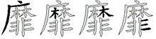 | OSSD₄ |
| 靠 | 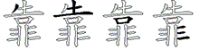 | TFKD₄ |
| 非 | 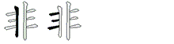 | HD₂ — HDHD₄ |
| 靛 |  | GEPH₄ |
| 静 |  | GEQ₃ — GEQH₄ |
| 靖 |  | UGE₃ — UGEG₄ |
| 青 |  | GEF₃ |
| 霹 |  | FNK₃ — FNKU₄ |
| 霸 |  | FAF₃ — FAFE₄ |
| 露 |  | FKHK₄ |
| 霞 |  | FNHC₄ |
| 霜 |  | FSH₃ — FSHF₄ |
| 霖 |  | FSS₃ — FSSU₄ |
| 霓 |  | FEQ₃ — FEQB₄ |
| 霍 | 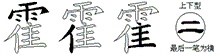 | FWYF₄ |
| 霉 |  | FTXU₄ |
| 震 |  | FDF₃ — FDFE₄ |
| 霄 |  | FIE₃ — FIEF₄ |
| 需 |  | FDM₃ — FDMJ₄ |
| 雾 |  | FTER₄ |
| 雹 |  | FQN₃ — FQNB₄ |
| 雷 |  | FL₂ — FLF₃ |
| 零 |  | FW₂ — FWYC₄ |
| 雪 |  | FV₂ — FVF₃ |
| 雨 |  | FGHY₄ |
| 雕 |  | MFKY₄ |
| 雏 |  | QVW₃ — QVWY₄ |
| 雍 |  | YXT₃ — YXTY₄ |
| 雌 |  | HXW₃ — HXWY₄ |
| 雇 |  | YNW₃ — YNWY₄ |
| 集 |  | WYS₃ — WYSU₄ |
| 雅 |  | GNHY₄ |
| 雄 |  | DCW₃ — DCWY₄ |
| 雁 |  | DWW₃ — DWWY₄ |
| 雀 |  | IWYF₄ |
| 难 |  | CW₂ — CWY₃ — CWYG₄ |
| 隶 |  | VII₃ |
| 隧 |  | BUE₃ — BUEP₄ |
| 障 |  | BUJ₃ — BUJH₄ |
| 隙 |  | BIJ₃ — BIJI₄ |
| 隘 |  | BUW₃ — BUWL₄ |
| 隔 |  | BGK₃ — BGKH₄ |
| 隐 |  | BQV₃ — BQVN₄ |
| 随 |  | BDE₃ — BDEP₄ |
| 隋 |  | BDA₃ — BDAE₄ |
| 隆 |  | BTG₃ — BTGG₄ |
| 隅 |  | BJM₃ — BJMY₄ |
| 陷 |  | BQE₃ — BQEG₄ |
| 陶 |  | BQ₂ — BQTB₄ |
| 陵 |  | BFW₃ — BFWT₄ |
| 陪 |  | BUK₃ — BUKG₄ |
| 险 |  | BWGI₄ |
| 陨 |  | BKM₃ — BKMY₄ |
| 除 |  | BWG₃ — BWGS₄ |
| 院 |  | BPF₃ — BPFQ₄ |
| 陡 |  | BFH₃ — BFHY₄ |
| 陛 |  | BX₂ — BXX₃ — BXXF₄ |
| 陕 |  | BGU₃ — BGUD₄ |
| 限 |  | BV₂ — BVY₃ |
| 降 |  | BT₂ — BTGH₄ |
| 陌 |  | BDJ₃ — BDJG₄ |
| 陋 |  | BGM₃ — BGMN₄ |
| 陈 |  | BA₂ — BAI₃ — BAIY₄ |
| 陇 |  | BDX₃ — BDXY₄ |
| 陆 |  | BGB₃ — BGBH₄ |
| 际 |  | BF₂ — BFI₃ — BFIY₄ |
| 附 |  | BWF₃ — BWFY₄ |
| 陀 |  | BPX₃ — BPXN₄ |
| 阿 |  | BS₂ — BSK₃ — BSKG₄ |
| 阻 |  | BEGG₄ |
| 阶 |  | BWJ₃ — BWJH₄ |
| 阵 |  | BL₂ — BLH₃ |
| 阴 |  | BE₂ — BEG₃ |
| 阳 |  | BJ₂ — BJG₃ |
| 防 |  | BYN₃ |
| 阮 |  | BFQ₃ — BFQN₄ |
| 队 |  | BW₂ — BWY₃ |
| 阜 |  | TNF₃ — TNFJ₄ |
| 阔 |  | UIT₃ — UITD₄ |
| 阑 |  | USL₃ — USLD₄ |
| 阐 |  | UUJ₃ — UUJF₄ |
| 阎 |  | UQE₃ — UQED₄ |
| 阉 |  | UDJ₃ — UDJN₄ |
| 阅 |  | UUKQ₄ |
| 阂 |  | UYN₃ — UYNW₄ |
| 阁 |  | UTK₃ — UTKD₄ |
| 阀 |  | UWA₃ — UWAI₄ |
| 闽 |  | UJI₃ |
| 闻 |  | UBD₃ |
| 闺 |  | UFF₃ — UFFD₄ |
| 闹 |  | UYM₃ — UYMH₄ |
| 闸 |  | UL₂ — ULK₃ |
| 闷 |  | UN₂ — UNI₃ |
| 间 |  | UJ₂ — UJD₃ |
| 闲 |  | USI₃ |
| 闰 |  | UGD₃ |
| 闯 |  | UCGD₄ |
| 问 |  | UK₂ — UKD₃ |
| 闭 |  | UFT₃ — UFTE₄ |
| 闪 |  | UW₂ — UWI₃ |
| 门 |  | UYH₃ — UYHN₄ |
| 长 |  | TA₂ — TAY₃ — TAYI₄ |
| 镶 |  | QYK₃ — QYKE₄ |
| 镰 |  | QOUW₄ |
| 镭 |  | QFL₃ — QFLG₄ |
| 镣 |  | QDU₃ — QDUI₄ |
| 镜 |  | QUJ₃ — QUJQ₄ |
| 镑 |  | QYU₃ — QYUY₄ |
| 镐 |  | QYM₃ — QYMK₄ |
| 镍 |  | QTHS₄ |
| 镊 |  | QBC₃ — QBCC₄ |
| 镇 |  | QFHW₄ |
| 镁 |  | QUG₃ — QUGD₄ |
| 镀 |  | QOA₃ — QOAC₄ |
| 锻 |  | QTH₃ — QTHC₄ |
| 锹 |  | QTOL₄ |
| 锰 |  | QBL₃ — QBLG₄ |
| 锯 |  | QND₃ — QNDG₄ |
| 键 |  | QVGP₄ |
| 锭 |  | QP₂ — QPG₃ — QPGH₄ |
| 锨 |  | QRQ₃ — QRQW₄ |
| 锦 |  | QRM₃ — QRMH₄ |
| 锥 |  | QWY₃ — QWYG₄ |
| 锤 |  | QTGL₄ |
| 锣 |  | QLQ₃ — QLQY₄ |
| 锡 |  | QJQ₃ — QJQR₄ |
| 锚 |  | QAL₃ — QALG₄ |
| 错 |  | QAJ₃ — QAJG₄ |
| 锗 |  | QFT₃ — QFTJ₄ |
| 锑 |  | QUX₃ — QUXT₄ |
| 锐 |  | QUK₃ — QUKQ₄ |
| 锌 |  | QUH₃ |
| 锋 |  | QTD₃ — QTDH₄ |
| 锈 |  | QTBT₄ |
| 锅 |  | QKM₃ — QKMW₄ |
| 锄 |  | QEGE₄ |
| 锁 |  | QIM₃ — QIMY₄ |
| 销 |  | QIE₃ — QIEG₄ |
| 链 |  | QLP₃ — QLPY₄ |
| 铺 |  | QSY₃ |
| 铸 |  | QDT₃ — QDTF₄ |
| 银 |  | QVY₃ |
| 铲 |  | QUT₃ — QUTT₄ |
| 铱 |  | QYE₃ — QYEY₄ |
| 铰 |  | QUR₃ — QURY₄ |
| 铭 |  | QQK₃ — QQKG₄ |
| 铬 |  | QTK₃ — QTKG₄ |
| 铣 |  | QTFQ₄ |
| 铡 |  | QMJ₃ — QMJH₄ |
| 铝 |  | QKK₃ — QKKG₄ |
| 铜 |  | QMGK₄ |
| 铆 |  | QQT₃ — QQTB₄ |
| 铅 |  | QWK₃ — QWKG₄ |
| 铃 |  | QWYC₄ |
| 铂 |  | QRG₃ |
| 铁 |  | QTG₃ — QTGY₄ |
| 铀 |  | QMG₃ |
| 钾 |  | QLH₃ |
| 钻 |  | QHK₃ — QHKG₄ |
| 钵 |  | QSG₃ — QSGG₄ |
| 钳 |  | QFG₃ |
| 钱 |  | QG₂ — QGA₃ — QGAY₄ |
| 钮 |  | QNH₃ — QNHG₄ |
| 钩 |  | QQC₃ — QQCY₄ |
| 钨 |  | QTLL₄ |
| 钧 |  | QQUG₄ |
| 钦 |  | QQW₃ — QQWY₄ |
| 钥 |  | QEG₃ |
| 钢 |  | QMR₃ — QMRY₄ |
| 钡 |  | QMY₃ |
| 钠 |  | QMW₃ — QMWY₄ |
| 钟 |  | QKHH₄ |
| 钞 |  | QIT₃ — QITT₄ |
| 钝 |  | QGBN₄ |
| 钙 |  | QGHL₄ |
| 钓 |  | QQY₃ — QQYY₄ |
| 钒 |  | QWYY₄ |
| 钎 |  | QTFL₄ |
| 钉 |  | QS₂ — QSH₃ |
| 针 |  | QF₂ — QFH₃ |
| 鉴 |  | JT₂ — JTYQ₄ |
| 釜 |  | WRF₃ — WRFU₄ |
| 金 |  | QQQ₃ — QQQQ₄ |
| 量 |  | JG₂ — JGJ₃ — JGJF₄ |
| 野 |  | JFC₃ — JFCH₄ |
| 重 | 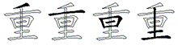 | TGJF₄ |
| 里 |  | JFD₃ |
| 释 |  | TOC₃ — TOCG₄ |
| 釉 |  | TOM₃ — TOMG₄ |
| 采 |  | ES₂ — ESU₃ |
| 醛 |  | SGAG₄ |
| 醚 |  | SGO₃ — SGOP₄ |
| 醒 |  | SGJ₃ — SGJG₄ |
| 醋 |  | SGAJ₄ |
| 醉 |  | SGYF₄ |
| 醇 |  | SGYB₄ |
| 酿 |  | SGYV₄ |
| 酸 |  | SGC₃ — SGCT₄ |
| 酷 |  | SGT₃ — SGTK₄ |
| 酷 |  | SGT₃ — SGTK₄ |
| 酶 |  | SGTX₄ |
| 酵 |  | SGFB₄ |
| 酱 |  | UQSG₄ |
| 酮 |  | SGMK₄ |
| 酬 |  | SGY₃ — SGYH₄ |
| 酪 |  | SGTK₄ |
| 酥 |  | SGTY₄ |
| 酣 |  | SGF₃ — SGFG₄ |
| 酞 |  | SGDY₄ |
| 酝 | 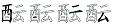 | SGFC₄ |
| 酚 |  | SGW₃ — SGWV₄ |
| 酗 |  | SGR₃ — SGRB₄ |
| 酒 |  | ISGG₄ |
| 配 |  | SGN₃ — SGNN₄ |
| 酌 |  | SGQ₃ — SGQY₄ |
| 酋 |  | ULLL₄ |
| 酉 |  | SGD₃ |
| 鄙 |  | KFL₃ — KFLB₄ |
| 鄂 |  | KKFB₄ |
| 都 |  | FTJB₄ |
| 郸 |  | UJFB₄ |
| 郴 |  | SSB₃ — SSBH₄ |
| 郭 |  | YBB₃ — YBBH₄ |
| 部 |  | UKB₃ — UKBH₄ |
| 郧 |  | KMB₃ — KMBH₄ |
| 郡 |  | VTKB₄ |
| 郝 |  | FOB₃ — FOBH₄ |
| 郑 |  | UDB₃ — UDBH₄ |
| 郎 |  | YVB₃ — YVBH₄ |
| 郊 |  | URB₃ — URBH₄ |
| 郁 |  | DEB₃ — DEBH₄ |
| 邻 |  | WYCB₄ |
| 邹 |  | QVB₃ — QVBH₄ |
| 邵 |  | VKB₃ — VKBH₄ |
| 邱 |  | RBH₃ |
| 邯 |  | FBH₃ |
| 邮 |  | MB₂ — MBH₃ |
| 邪 |  | GNHB₄ |
| 邦 |  | DTB₃ — DTBH₄ |
| 那 |  | NG₂ — NGB₃ — NGBH₄ |
| 邢 |  | GAB₃ — GABH₄ |
| 邓 |  | CB₂ — CBH₃ |
| 邑 |  | KCB₃ |
| 邀 |  | RYT₃ — RYTP₄ |
| 避 |  | NK₂ — NKUP₄ |
| 遵 |  | USGL₄ |
| 遮 |  | OAOP₄ |
| 遭 |  | GMA₃ — GMAP₄ |
| 遥 |  | ETF₃ — ETFP₄ |
| 遣 |  | KHLL₄ |
| 遗 | 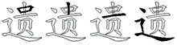 | KHGL₄ |
| 道 |  | UT₂ — UTHP₄ |
| 遏 |  | JQW₃ — JQWP₄ |
| 遍 |  | YNM₃ — YNMP₄ |
| 遇 |  | JM₂ — JMHP₄ |
| 遂 |  | UEP₃ — UEPI₄ |
| 遁 |  | RFHP₄ |
| 逾 |  | WGEP₄ |
| 逼 |  | GKLP₄ |
| 逻 |  | LQP₃ — LQPI₄ |
| 逻 |  | LQP₃ — LQPI₄ |
| 逸 |  | QKQP₄ |
| 逮 |  | VIP₃ — VIPI₄ |
| 逢 |  | TDH₃ — TDHP₄ |
| 造 |  | TFKP₄ |
| 速 |  | SKP₃ — SKPD₄ |
| 逞 |  | KGP₃ — KGPD₄ |
| 逝 |  | RRP₃ — RRPK₄ |
| 逛 |  | QTGP₄ |
| 通 |  | CEP₃ — CEPK₄ |
| 逗 |  | GKUP₄ |
| 途 |  | WTPI₄ |
| 递 |  | UXHP₄ |
| 逐 |  | GEP₃ — GEPI₄ |
| 透 |  | TBP₃ — TBPE₄ |
| 逊 |  | BIP₃ — BIPI₄ |
| 选 |  | TFQP₄ |
| 逆 |  | UBTP₄ |
| 逃 |  | QIP₃ — QIPI₄ |
| 适 |  | TDP₃ — TDPD₄ |
| 送 |  | UDP₃ — UDPI₄ |
| 退 |  | VP₂ — VPI₃ |
| 追 |  | TNP₃ — TNPD₄ |
| 迹 |  | YOP₃ — YOPI₄ |
| 迸 |  | UAP₃ — UAPK₄ |
| 迷 |  | OP₂ — OPI₃ |
| 述 |  | SYP₃ — SYPI₄ |
| 迭 |  | TGP₃ — TGPI₄ |
| 迫 |  | RPD₃ |
| 迪 |  | MP₂ — MPD₃ |
| 迢 |  | VKP₃ — VKPD₄ |
| 迟 |  | NYP₃ — NYPI₄ |
| 连 |  | LP₂ — LPK₃ |
| 违 | 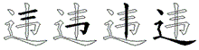 | FNHP₄ |
| 远 |  | FQP₃ — FQPV₄ |
| 进 |  | FJP₃ — FJPK₄ |
| 这 |  | P₁ — YPI₃ |
| 还 |  | DH₂ — DHP₃ — DHPI₄ |
| 返 |  | RCP₃ — RCPI₄ |
| 近 |  | RP₂ — RPK₃ |
| 运 |  | FCP₃ — FCPI₄ |
| 迎 |  | QB₂ — QBP₃ — QBPK₄ |
| 迈 |  | GQP₃ — GQPE₄ |
| 过 |  | FP₂ — FPI₃ |
| 迅 |  | NFP₃ — NFPK₄ |
| 迄 |  | TNPV₄ |
| 迂 |  | GFP₃ — GFPK₄ |
| 迁 |  | TFP₃ — TFPK₄ |
| 达 |  | DP₂ — DPI₃ |
| 辽 |  | BP₂ — BPK₃ |
| 边 |  | EP₂ — EPE₃ |
| 辱 |  | DFEF₄ |
| 辰 |  | DFE₃ — DFEI₄ |
| 辫 |  | UXU₃ — UXUH₄ |
| 辩 |  | UYU₃ — UYUH₄ |
| 辨 |  | UUUH₄ |
| 辣 |  | UGKI₄ |
| 辟 |  | NKUH₄ |
| 辞 |  | TDUH₄ |
| 辜 |  | DU₂ — DUJ₃ |
| 辛 |  | UYGL₄ |
| 辙 |  | LYC₃ — LYCT₄ |
| 辗 |  | LNA₃ — LNAE₄ |
| 辖 |  | LPD₃ — LPDK₄ |
| 辕 |  | LFK₃ — LFKE₄ |
| 输 |  | LWG₃ — LWGJ₄ |
| 辑 |  | LKB₃ — LKBG₄ |
| 辐 |  | LGK₃ — LGKL₄ |
| 辊 |  | LJ₂ — LJX₃ — LJXX₄ |
| 辉 |  | IGQL₄ |
| 辈 |  | DJDL₄ |
| 辆 |  | LGM₃ — LGMW₄ |
| 辅 |  | LSY₃ |
| 较 |  | LU₂ — LUR₃ — LURY₄ |
| 轿 |  | LTD₃ — LTDJ₄ |
| 载 |  | FAL₃ — FALD₄ |
| 轻 |  | LC₂ — LCA₃ — LCAG₄ |
| 轴 |  | LM₂ — LMG₃ |
| 轰 |  | LCC₃ — LCCU₄ |
| 软 |  | LQW₃ — LQWY₄ |
| 轮 |  | LWX₃ — LWXN₄ |
| 转 |  | LFN₃ — LFNY₄ |
| 轩 |  | LFH₃ |
| 轨 |  | LV₂ — LVN₃ |
| 轧 |  | LNN₃ |
| 车 |  | LG₂ — LGN₃ — LGNH₄ |
| 躺 |  | TMDK₄ |
| 躲 |  | TMDS₄ |
| 躯 |  | TMDR₄ |
| 躬 |  | TMDX₄ |
| 身 |  | TM₂ — TMDT₄ |
| 躇 |  | KHAJ₄ |
| 躁 |  | KHKS₄ |
| 蹿 |  | KHPH₄ |
| 蹲 |  | KHUF₄ |
| 蹭 |  | KHUJ₄ |
| 蹬 |  | KHWU₄ |
| 蹦 |  | KHM₃ — KHME₄ |
| 蹋 |  | KHJN₄ |
| 蹈 |  | KHEE₄ |
| 蹄 |  | KHYH₄ |
| 踪 |  | KHP₃ — KHPI₄ |
| 踩 |  | KHES₄ |
| 踢 |  | KHJ₃ — KHJR₄ |
| 踞 |  | KHND₄ |
| 踏 |  | KHI₃ — KHIJ₄ |
| 踌 |  | KHDF₄ |
| 踊 |  | KHC₃ — KHCE₄ |
| 踊 |  | KHC₃ — KHCE₄ |
| 跺 |  | KHWS₄ |
| 践 |  | KHG₃ — KHGA₄ |
| 跳 |  | KHIQ₄ |
| 路 |  | KHT₃ — KHTK₄ |
| 跪 |  | KHQB₄ |
| 跨 |  | KHD₃ — KHDN₄ |
| 跟 |  | KHV₃ — KHVY₄ |
| 距 |  | KHA₃ — KHAN₄ |
| 跑 |  | KHQ₃ — KHQN₄ |
| 跌 |  | KHTG₄ |
| 跋 |  | KHDY₄ |
| 跃 |  | KHTD₄ |
| 趾 |  | KHH₃ — KHHG₄ |
| 趴 |  | KHW₃ — KHWY₄ |
| 足 |  | KH₂ — KHU₃ |
| 趣 |  | FHB₃ — FHBC₄ |
| 趟 |  | FHI₃ — FHIK₄ |
| 趋 |  | FHQ₃ — FHQV₄ |
| 越 |  | FHA₃ — FHAN₄ |
| 超 |  | FHV₃ — FHVK₄ |
| 趁 |  | FHWE₄ |
| 起 |  | FHN₃ — FHNV₄ |
| 赶 |  | FHFK₄ |
| 赵 |  | FHR₃ — FHRI₄ |
| 走 |  | FHI₃ |
| 赫 |  | FOF₃ — FOFO₄ |
| 赦 |  | FOTY₄ |
| 赣 |  | UJT₃ — UJTM₄ |
| 赢 |  | YEM₃ — YEMY₄ |
| 赡 |  | MQD₃ — MQDY₄ |
| 赠 |  | MU₂ — MUL₃ — MULJ₄ |
| 赞 |  | TFQM₄ |
| 赛 |  | PA₂ — PAWM₄ |
| 赚 |  | MUV₃ — MUVW₄ |
| 赘 |  | GQTM₄ |
| 赖 |  | SKQ₃ — SKQM₄ |
| 赖 |  | SKQ₃ — SKQM₄ |
| 赔 |  | MUK₃ — MUKG₄ |
| 赐 |  | MJQ₃ — MJQR₄ |
| 赏 |  | IPKM₄ |
| 赎 |  | MFN₃ — MFND₄ |
| 赌 |  | MFTJ₄ |
| 赋 |  | MG₂ — MGAY₄ |
| 赊 |  | MWF₃ — MWFI₄ |
| 资 |  | UQWM₄ |
| 赃 |  | MO₂ — MOF₃ — MOFG₄ |
| 赂 |  | MTK₃ — MTKG₄ |
| 赁 | 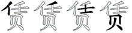 | WTFM₄ |
| 贿 |  | MDE₃ — MDEG₄ |
| 贾 |  | SM₂ — SMU₃ |
| 贼 |  | MADY₄ |
| 贺 |  | EKM₃ — EKMU₄ |
| 费 |  | XJM₃ — XJMU₄ |
| 贸 |  | QYV₃ — QYVM₄ |
| 贷 |  | WAYL₄ |
| 贵 |  | KHGM₄ |
| 贴 |  | MHKG₄ |
| 贱 |  | MGA₃ — MGAY₄ |
| 贱 |  | MGA₃ — MGAY₄ |
| 贰 |  | AFM₃ — AFMY₄ |
| 贯 |  | XM₂ — XMU₃ |
| 贮 |  | MPG₃ — MPGG₄ |
| 购 |  | MQC₃ — MQCY₄ |
| 贬 |  | MTP₃ — MTPY₄ |
| 贫 |  | WVM₃ — WVMU₄ |
| 贫 |  | WVM₃ — WVMU₄ |
| 贪 |  | WYNL₄ |
| 贩 |  | MRC₃ — MRCY₄ |
| 质 |  | RF₂ — RFM₃ — RFMI₄ |
| 货 |  | WXM₃ — WXMU₄ |
| 账 |  | MTA₃ — MTAY₄ |
| 败 |  | MT₂ — MTY₃ |
| 贤 |  | JCM₃ — JCMU₄ |
| 责 |  | GMU₃ |
| 财 |  | MF₂ — MFT₃ — MFTT₄ |
| 贡 |  | AM₂ — AMU₃ |
| 负 |  | QM₂ — QMU₃ |
| 贞 |  | HM₂ — HMU₃ |
| 贝 | 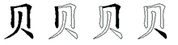 | MHNY₄ |
| 貌 |  | ER₂ — ERQ₃ — ERQN₄ |
| 貉 |  | ETKL₄ |
| 豺 |  | EFT₃ — EFTT₄ |
| 豹 |  | EQY₃ — EQYY₄ |
| 豫 |  | CNHE₄ |
| 豪 |  | YPG₃ — YPGE₄ |
| 豢 |  | UGG₃ — UGGE₄ |
| 象 |  | QKE₃ — QKEU₄ |
| 豌 |  | GKUB₄ |
| 豁 |  | PDH₃ — PDHK₄ |
| 谷 |  | WWK₃ — WWKF₄ |
| 谴 |  | YKHP₄ |
| 谱 |  | YUO₃ — YUOJ₄ |
| 谰 |  | YUS₃ — YUSL₄ |
| 谭 |  | YSJ₃ — YSJH₄ |
| 谬 |  | YNWE₄ |
| 谩 |  | YJL₃ — YJLC₄ |
| 谨 |  | YAK₃ — YAKG₄ |
| 谦 |  | YUV₃ — YUVW₄ |
| 谤 |  | YYU₃ — YYUY₄ |
| 谣 |  | YET₃ — YETB₄ |
| 谢 |  | YTM₃ — YTMF₄ |
| 谜 |  | YOPY₄ |
| 谚 |  | YUT₃ — YUTE₄ |
| 谗 |  | YQK₃ — YQKU₄ |
| 谓 |  | YLE₃ — YLEG₄ |
| 谓 |  | YLE₃ — YLEG₄ |
| 谐 |  | YXX₃ — YXXR₄ |
| 谎 |  | YAY₃ — YAYK₄ |
| 谍 |  | YAN₃ — YANS₄ |
| 谋 |  | YFS₃ — YFSY₄ |
| 谊 |  | YPEG₄ |
| 谈 |  | YOO₃ — YOOY₄ |
| 谆 |  | YYB₃ — YYBG₄ |
| 谅 |  | YYI₃ — YYIY₄ |
| 调 |  | YMF₃ — YMFK₄ |
| 谁 | 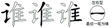 | YWYG₄ |
| 课 |  | YJS₃ — YJSY₄ |
| 诽 |  | YHD₃ — YHDD₄ |
| 读 |  | YFN₃ — YFND₄ |
| 诺 |  | YAD₃ — YADK₄ |
| 诸 |  | YFT₃ — YFTJ₄ |
| 请 |  | YGE₃ — YGEG₄ |
| 诵 |  | YCEH₄ |
| 说 |  | YUK₃ — YUKQ₄ |
| 诲 |  | YTX₃ — YTXY₄ |
| 诱 |  | YTBT₄ |
| 误 |  | YKG₃ — YKGD₄ |
| 语 |  | YGK₃ — YGKG₄ |
| 诬 |  | YAW₃ — YAWW₄ |
| 诫 |  | YAA₃ — YAAH₄ |
| 诧 |  | YPT₃ — YPTA₄ |
| 详 |  | YU₂ — YUH₃ |
| 该 |  | YYNW₄ |
| 诣 |  | YXJ₃ — YXJG₄ |
| 询 |  | YQ₂ — YQJ₃ — YQJG₄ |
| 诡 |  | YQD₃ — YQDB₄ |
| 诞 |  | YTH₃ — YTHP₄ |
| 话 |  | YTD₃ — YTDG₄ |
| 诛 |  | YRIY₄ |
| 诚 |  | YD₂ — YDN₃ — YDNN₄ |
| 诗 |  | YFF₃ — YFFY₄ |
| 试 |  | YA₂ — YAAY₄ |
| 译 |  | YCG₃ — YCGH₄ |
| 词 |  | YNGK₄ |
| 诌 |  | YQV₃ — YQVG₄ |
| 诊 |  | YWE₃ — YWET₄ |
| 诉 |  | YRY₃ — YRYY₄ |
| 诈 |  | YTHL₄ |
| 识 |  | YKW₃ — YKWY₄ |
| 诅 |  | YEG₃ — YEGG₄ |
| 评 |  | YGU₃ — YGUF₄ |
| 证 |  | YG₂ — YGH₃ — YGHG₄ |
| 诀 |  | YNDY₄ |
| 设 |  | YWC₃ — YWCY₄ |
| 讽 |  | YWR₃ — YWRY₄ |
| 讼 |  | YWCL₄ |
| 论 |  | YWX₃ — YWXN₄ |
| 讹 |  | YWXL₄ |
| 许 |  | YTF₃ — YTFH₄ |
| 讶 |  | YAH₃ — YAHT₄ |
| 讳 |  | YFNH₄ |
| 讲 |  | YFJ₃ — YFJH₄ |
| 记 |  | YN₂ — YNN₃ |
| 讯 |  | YNF₃ — YNFH₄ |
| 议 |  | YYR₃ — YYRY₄ |
| 训 |  | YK₂ — YKH₃ |
| 讫 |  | YTN₃ — YTNN₄ |
| 让 |  | YH₂ — YHG₃ |
| 讨 |  | YFY₃ |
| 讥 |  | YWN₃ |
| 认 |  | YW₂ — YWY₃ |
| 认 |  | YW₂ — YWY₃ |
| 讣 |  | YHY₃ |
| 订 |  | YS₂ — YSH₃ |
| 计 |  | YF₂ — YFH₃ |
| 譬 |  | NKUL₄ |
| 警 |  | AQK₃ — AQKY₄ |
| 誓 |  | RRYF₄ |
| 誊 |  | UGY₃ — UGYF₄ |
| 誉 |  | IGWY₄ |
| 詹 |  | QDW₃ — QDWY₄ |
| 言 |  | YYY₃ — YYYY₄ |
| 触 |  | QEJY₄ |
| 解 |  | QEV₃ — QEVG₄ |
| 角 |  | QE₂ — QEJ₃ |
| 觉 |  | IPM₃ — IPMQ₄ |
| 览 |  | JTY₃ — JTYQ₄ |
| 视 |  | PYM₃ — PYMQ₄ |
| 觅 |  | EM₂ — EMQ₃ — EMQB₄ |
| 规 |  | GMQ₃ — GMQN₄ |
| 观 |  | CM₂ — CMQ₃ — CMQN₄ |
| 见 |  | MQ₂ — MQB₃ — MTNV₄ |
| 覆 |  | STT₃ — STTT₄ |
| 要 |  | S₁ — SVF₃ |
| 西 |  | SGHG₄ |
| 襟 |  | PUS₃ — PUSI₄ |
| 襄 |  | YKK₃ — YKKE₄ |
| 褪 |  | PUVP₄ |
| 褥 |  | PUDF₄ |
| 褒 |  | YWK₃ — YWKE₄ |
| 褐 |  | PUJN₄ |
| 褂 |  | PUFH₄ |
| 裹 |  | YJSE₄ |
| 裸 |  | PUJS₄ |
| 裴 |  | DJDE₄ |
| 裳 |  | IPKE₄ |
| 裤 |  | PUO₃ — PUOL₄ |
| 裙 |  | PUVK₄ |
| 裕 |  | PUW₃ — PUWK₄ |
| 裔 |  | YEMK₄ |
| 装 |  | UFY₃ — UFYE₄ |
| 裂 |  | GQJE₄ |
| 裁 |  | FAY₃ — FAYE₄ |
| 袱 |  | PUWD₄ |
| 袭 |  | DXYE₄ |
| 被 |  | PUB₃ — PUBY₄ |
| 袜 |  | PUG₃ — PUGS₄ |
| 袖 |  | PUM₃ — PUMG₄ |
| 袒 |  | PUJG₄ |
| 袍 |  | PUQ₃ — PUQN₄ |
| 袋 |  | WAYE₄ |
| 袄 |  | PUT₃ — PUTD₄ |
| 袁 |  | FKE₃ — FKEU₄ |
| 衷 |  | YKHE₄ |
| 衰 |  | YKGE₄ |
| 衬 |  | PUFY₄ |
| 衫 |  | PUE₃ — PUET₄ |
| 补 |  | PUH₃ — PUHY₄ |
| 衣 |  | YE₂ — YEU₃ |
| 衡 |  | TQD₃ — TQDS₄ |
| 衙 |  | TGKS₄ |
| 街 |  | TFFS₄ |
| 衔 |  | TQG₃ — TQGS₄ |
| 衍 |  | TIG₃ — TIGS₄ |
| 行 |  | TGS₃ — TGSH₄ |
| 衅 |  | TLU₃ — TLUG₄ |
| 血 |  | TLD₃ |
| 蠢 |  | DWJJ₄ |
| 蠕 |  | JFDJ₄ |
| 蟹 |  | QEVJ₄ |
| 螺 |  | JLX₃ — JLXI₄ |
| 螟 |  | JPJ₃ — JPJU₄ |
| 融 |  | GKM₃ — GKMJ₄ |
| 蝶 |  | JAN₃ — JANS₄ |
| 蝴 |  | JDE₃ — JDEG₄ |
| 蝗 | 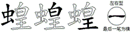 | JRGG₄ |
| 蝎 |  | JJQ₃ — JJQN₄ |
| 蝉 | 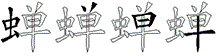 | JUJF₄ |
| 蝇 |  | JK₂ — JKJ₃ — JKJN₄ |
| 蜡 |  | JAJ₃ — JAJG₄ |
| 蜜 |  | PNTJ₄ |
| 蜘 |  | JTDK₄ |
| 蜗 |  | JKM₃ — JKMW₄ |
| 蜕 |  | JUK₃ — JUKQ₄ |
| 蜒 |  | JTHP₄ |
| 蜂 |  | JTD₃ — JTDH₄ |
| 蜀 |  | LQJ₃ — LQJU₄ |
| 蛾 |  | JTR₃ — JTRY₄ |
| 蛹 |  | JCEH₄ |
| 蛰 |  | RVYJ₄ |
| 蛮 |  | YOJ₃ — YOJU₄ |
| 蛤 |  | JW₂ — JWG₃ — JWGK₄ |
| 蛛 |  | JTF₃ — JTFY₄ |
| 蛙 |  | JFF₃ — JFFG₄ |
| 蛔 |  | JLK₃ — JLKG₄ |
| 蛋 |  | NHJ₃ — NHJU₄ |
| 蛊 |  | JLF₃ |
| 蛇 |  | JP₂ — JPX₃ — JPXN₄ |
| 蛆 |  | JEGG₄ |
| 蛀 |  | JYG₃ — JYGG₄ |
| 蚤 |  | CYJ₃ — CYJU₄ |
| 蚜 |  | JAH₃ — JAHT₄ |
| 蚕 |  | GDJ₃ — GDJU₄ |
| 蚌 |  | JDH₃ — JDHH₄ |
| 蚊 |  | JYY₃ |
| 蚂 |  | JCG₃ — JCGG₄ |
| 蚁 |  | JYR₃ — JYRY₄ |
| 蚀 |  | QNJ₃ — QNJY₄ |
| 虾 |  | JGHY₄ |
| 虽 |  | KJ₂ — KJU₃ |
| 虹 |  | JAG₃ |
| 虱 |  | NTJ₃ — NTJI₄ |
| 虫 |  | JHNY₄ |
| 虞 |  | HKG₃ — HKGD₄ |
| 虚 |  | HO₂ — HOD₃ |
| 虑 |  | HN₂ — HNI₃ |
| 虐 |  | HAG₃ — HAGD₄ |
| 虏 |  | HEV₃ |
| 虎 |  | HWV₃ |
| 蘸 |  | ASGO₄ |
| 蘑 |  | AO₂ — AOS₃ — AOSD₄ |
| 藻 |  | AIK₃ — AIKS₄ |
| 藩 |  | AITL₄ |
| 藤 |  | AEU₃ — AEUI₄ |
| 藕 |  | ADIY₄ |
| 藐 |  | AER₃ — AERQ₄ |
| 藏 |  | AAU₃ — AAUH₄ |
| 藉 |  | AFS₃ — AFSJ₄ |
| 薯 |  | ALFJ₄ |
| 薪 |  | AUS₃ — AUSR₄ |
| 薛 |  | ATN₃ — ATNU₄ |
| 薄 |  | AISF₄ |
| 蕾 |  | AFL₃ — AFLF₄ |
| 蕴 |  | AXJ₃ — AXJL₄ |
| 蕊 |  | ANN₃ — ANNN₄ |
| 蕉 |  | AWYO₄ |
| 蔽 |  | AIT₃ — AITU₄ |
| 蔼 |  | AYJ₃ — AYJN₄ |
| 蔷 |  | AFU₃ — AFUK₄ |
| 蔬 |  | ANH₃ — ANHK₄ |
| 蔫 |  | AGH₃ — AGHO₄ |
| 蔡 |  | AWF₃ — AWFI₄ |
| 蔚 |  | ANF₃ — ANFF₄ |
| 蔗 |  | AOA₃ — AOAO₄ |
| 蔓 |  | AJL₃ — AJLC₄ |
| 蔑 |  | ALA₃ — ALAW₄ |
| 蓬 |  | ATDP₄ |
| 蓟 |  | AQG₃ — AQGJ₄ |
| 蓝 |  | AJT₃ — AJTL₄ |
| 蓖 |  | ATL₃ — ATLX₄ |
| 蓑 |  | AYK₃ — AYKE₄ |
| 蓉 |  | APW₃ — APWK₄ |
| 蓄 |  | AYX₃ — AYXL₄ |
| 蒸 |  | ABI₃ — ABIO₄ |
| 蒲 |  | AIS₃ — AISU₄ |
| 蒜 |  | AFI₃ — AFII₄ |
| 蒙 |  | APF₃ — APFE₄ |
| 蒋 |  | AU₂ — AUQF₄ |
| 蒂 |  | AYU₃ — AYUH₄ |
| 葵 |  | AWG₃ — AWGD₄ |
| 葱 |  | AQR₃ — AQRN₄ |
| 葬 |  | AGQ₃ — AGQA₄ |
| 葫 |  | ADEF₄ |
| 董 |  | ATG₃ — ATGF₄ |
| 葡 |  | AQS₃ — AQSU₄ |
| 葛 |  | AJQ₃ — AJQN₄ |
| 著 |  | AFT₃ — AFTJ₄ |
| 落 | 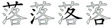 | AITK₄ |
| 萨 |  | ABU₃ — ABUT₄ |
| 萧 |  | AVH₃ — AVHW₄ |
| 营 |  | APK₃ — APKK₄ |
| 萤 |  | APJ₃ — APJU₄ |
| 萝 |  | ALQ₃ — ALQU₄ |
| 萎 |  | ATV₃ — ATVF₄ |
| 萍 |  | AIG₃ — AIGF₄ |
| 萌 |  | AJE₃ — AJEF₄ |
| 萄 |  | AQT₃ — AQTB₄ |
| 菲 |  | AHD₃ — AHDD₄ |
| 菱 | 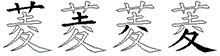 | AFWT₄ |
| 菩 |  | AUK₃ — AUKF₄ |
| 菠 | 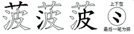 | AIHC₄ |
| 菜 |  | AES₃ — AESU₄ |
| 菏 | 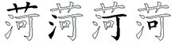 | AISK₄ |
| 菌 |  | ALT₃ — ALTU₄ |
| 菊 |  | AQO₃ — AQOU₄ |
| 菇 |  | AVD₃ — AVDF₄ |
| 莽 |  | ADA₃ — ADAJ₄ |
| 莹 |  | APG₃ — APGY₄ |
| 获 |  | AQTD₄ |
| 莲 |  | ALP₃ — ALPU₄ |
| 莱 | 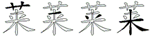 | AGOU₄ |
| 莫 |  | AJD₃ — AJDU₄ |
| 莎 |  | AIIT₄ |
| 莉 |  | ATJ₃ — ATJJ₄ |
| 莆 |  | AS₂ — ASU₃ |
| 荷 |  | AWSK₄ |
| 药 |  | AX₂ — AXQ₃ — AXQY₄ |
| 荫 |  | ABE₃ — ABEF₄ |
| 荧 |  | APO₃ — APOU₄ |
| 荤 |  | APL₃ — APLJ₄ |
| 荣 |  | APS₃ — APSU₄ |
| 荡 |  | AIN₃ — AINR₄ |
| 荡 |  | AIN₃ — AINR₄ |
| 荚 | 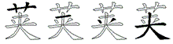 | AGUW₄ |
| 荔 |  | AEE₃ — AEEE₄ |
| 荒 | 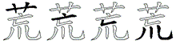 | AYNK₄ |
| 荐 |  | ADH₃ — ADHB₄ |
| 草 |  | AJJ₃ |
| 荆 |  | AGA₃ — AGAJ₄ |
| 茹 |  | AVK₃ — AVKF₄ |
| 茸 |  | ABF₃ |
| 茶 |  | AWS₃ — AWSU₄ |
| 茵 |  | ALD₃ — ALDU₄ |
| 茬 |  | ADHF₄ |
| 茫 |  | AIY₃ — AIYN₄ |
| 茨 |  | AUQ₃ — AUQW₄ |
| 茧 |  | AJU₃ |
| 茎 |  | ACA₃ — ACAF₄ |
| 茅 |  | ACN₃ — ACNT₄ |
| 茄 |  | AEK₃ — AEKF₄ |
| 范 |  | AIB₃ — AIBB₄ |
| 茂 |  | ADU₃ |
| 茁 |  | ABM₃ — ABMJ₄ |
| 苹 |  | AGUF₄ |
| 英 |  | AMD₃ — AMDU₄ |
| 苯 |  | ASG₃ — ASGF₄ |
| 苫 |  | AHKF₄ |
| 苦 |  | AD₂ — ADF₃ |
| 若 |  | ADK₃ — ADKF₄ |
| 苟 |  | AQKL₄ |
| 苞 |  | AQN₃ — AQNB₄ |
| 苛 |  | ASK₃ — ASKF₄ |
| 苗 |  | AL₂ — ALF₃ |
| 苔 |  | ACK₃ — ACKF₄ |
| 苑 |  | AQB₃ — AQBB₄ |
| 苏 |  | AEW₃ — AEWU₄ |
| 苍 |  | AWB₃ — AWBB₄ |
| 苇 |  | AFN₃ — AFNH₄ |
| 芽 |  | AAH₃ — AAHT₄ |
| 芹 |  | ARJ₃ |
| 芳 |  | AY₂ — AYR₃ |
| 花 |  | AWX₃ — AWXB₄ |
| 花 |  | AWX₃ — AWXB₄ |
| 芯 |  | ANU₃ |
| 芭 |  | AC₂ — ACB₃ |
| 芬 |  | AWV₃ — AWVR₄ |
| 芦 |  | AYN₃ — AYNR₄ |
| 芥 |  | AWJ₃ — AWJJ₄ |
| 芝 |  | AP₂ — APU₃ |
| 芜 |  | AFQ₃ — AFQB₄ |
| 芒 |  | AYNB₄ |
| 芍 |  | AQY₃ — AQYU₄ |
| 芋 |  | AGF₃ — AGFJ₄ |
| 节 |  | AB₂ — ABJ₃ |
| 艾 |  | ARU₃ |
| 艺 |  | AN₂ — ANB₃ |
| 艳 |  | DHQ₃ — DHQC₄ |
| 色 |  | QC₂ — QCB₃ |
| 艰 |  | CV₂ — CVY₃ |
| 良 |  | YV₂ — YVI₃ |
| 艘 |  | TUEC₄ |
| 艇 |  | TUT₃ — TUTP₄ |
| 船 |  | TUW₃ — TUWK₄ |
| 舷 |  | TUYX₄ |
| 舶 |  | TUR₃ — TURG₄ |
| 舵 |  | TUP₃ — TUPX₄ |
| 舱 |  | TUWB₄ |
| 舰 |  | TUM₃ — TUMQ₄ |
| 般 |  | TUWC₄ |
| 航 |  | TUY₃ — TUYW₄ |
| 舟 |  | TUI₃ |
| 舞 |  | TGL₃ — TGLG₄ |
| 舜 |  | EPQG₄ |
| 舔 |  | TDGN₄ |
| 舒 |  | WFKH₄ |
| 舍 |  | WFK₃ — WFKF₄ |
| 舌 |  | TDD₃ |
| 舆 |  | EL₂ — ELG₃ — ELGW₄ |
| 舅 |  | ELE₃ — ELER₄ |
| 舀 |  | EEF₃ |
| 臼 |  | ETH₃ — ETHG₄ |
| 臻 |  | GCLL₄ |
| 臻 |  | GCLL₄ |
| 致 |  | GCFL₄ |
| 至 |  | GCF₃ — GCFF₄ |
| 臭 |  | THDU₄ |
| 自 |  | THD₃ |
| 臣 |  | AHN₃ — AHNH₄ |
| 臆 |  | EUJ₃ — EUJN₄ |
| 臃 |  | EYX₃ — EYXY₄ |
| 臂 |  | NKU₃ — NKUE₄ |
| 臀 |  | NAWE₄ |
| 膳 |  | EUU₃ — EUUK₄ |
| 膨 |  | EFK₃ — EFKE₄ |
| 膝 |  | ESW₃ — ESWI₄ |
| 膜 |  | EAJL₄ |
| 膛 |  | EI₂ — EIP₃ — EIPF₄ |
| 膘 |  | ESFI₄ |
| 膏 |  | YPK₃ — YPKE₄ |
| 膊 |  | ESF₃ — ESFY₄ |
| 膀 |  | EYU₃ — EYUY₄ |
| 腿 |  | EVP₃ — EVPY₄ |
| 腾 |  | EUGG₄ |
| 腻 |  | EAF₃ — EAFY₄ |
| 腺 |  | ERI₃ — ERIY₄ |
| 腹 |  | ETJ₃ — ETJT₄ |
| 腰 |  | ESV₃ — ESVG₄ |
| 腮 |  | ELN₃ — ELNY₄ |
| 腥 |  | EJT₃ — EJTG₄ |
| 腕 |  | EPQ₃ — EPQB₄ |
| 腔 |  | EPW₃ — EPWA₄ |
| 腑 |  | EOW₃ — EOWF₄ |
| 腐 |  | OWFW₄ |
| 腋 |  | EYWY₄ |
| 腊 |  | EAJG₄ |
| 腆 |  | EMA₃ — EMAW₄ |
| 腆 |  | EMA₃ — EMAW₄ |
| 脾 |  | ERT₃ — ERTF₄ |
| 脸 |  | EWG₃ — EWGG₄ |
| 脱 |  | EUK₃ — EUKQ₄ |
| 脯 |  | ESY₃ |
| 脚 |  | EFCB₄ |
| 脖 |  | EFP₃ — EFPB₄ |
| 脓 |  | EPEY₄ |
| 脑 |  | EYR₃ — EYRB₄ |
| 脐 |  | EYJ₃ — EYJH₄ |
| 脏 |  | EO₂ — EOF₃ — EOFG₄ |
| 脊 |  | IWE₃ — IWEF₄ |
| 脉 |  | EYN₃ — EYNI₄ |
| 脆 |  | EQD₃ — EQDB₄ |
| 脂 |  | EX₂ — EXJ₃ — EXJG₄ |
| 能 |  | CE₂ — CEX₃ — CEXX₄ |
| 胺 |  | EPV₃ — EPVG₄ |
| 胸 |  | EQ₂ — EQR₃ — EQRB₄ |
| 胶 |  | EU₂ — EUR₃ — EURY₄ |
| 胳 |  | ETK₃ — ETKG₄ |
| 胰 |  | EGX₃ — EGXW₄ |
| 胯 |  | EDF₃ — EDFN₄ |
| 胡 |  | DEG₃ |
| 胞 |  | EQN₃ — EQNN₄ |
| 胜 |  | ETG₃ — ETGG₄ |
| 胚 |  | EDH₃ — EDHG₄ |
| 胖 |  | EUG₃ — EUGH₄ |
| 胎 |  | ECK₃ — ECKG₄ |
| 背 |  | UXE₃ — UXEF₄ |
| 胆 |  | EJ₂ — EJG₃ — EJGG₄ |
| 胃 |  | LEF₃ |
| 胁 |  | EEW₃ — EEWY₄ |
| 胀 |  | ETA₃ — ETAY₄ |
| 肿 |  | EKH₃ — EKHH₄ |
| 肾 |  | JCE₃ — JCEF₄ |
| 肺 |  | EGM₃ — EGMH₄ |
| 育 |  | YCE₃ — YCEF₄ |
| 肯 |  | HE₂ — HEF₃ |
| 肮 |  | EYW₃ — EYWN₄ |
| 肪 |  | EY₂ — EYT₃ |
| 肩 |  | YNED₄ |
| 肥 |  | EC₂ — ECN₃ |
| 肤 |  | EGY₃ |
| 肢 |  | EFC₃ — EFCY₄ |
| 股 |  | EWC₃ — EWCY₄ |
| 肠 |  | ENR₃ — ENRT₄ |
| 肝 |  | EFH₃ |
| 肛 |  | EA₂ — EAG₃ |
| 肚 |  | EF₂ — EFG₃ |
| 肘 |  | EFY₃ |
| 肖 |  | IE₂ — IEF₃ |
| 肌 |  | EWN₃ |
| 肋 |  | EEN₃ |
| 肉 |  | MWW₃ — MWWI₄ |
| 肇 |  | YNTG₄ |
| 肆 |  | DV₂ — DVG₃ — DVGH₄ |
| 肄 |  | XTDG₄ |
| 肃 |  | VH₂ — VHJ₃ — VHJW₄ |
| 聪 |  | BUKN₄ |
| 聚 |  | BCI₃ — BCIU₄ |
| 聘 |  | BMG₃ — BMGN₄ |
| 联 |  | BU₂ — BUD₃ — BUDY₄ |
| 职 |  | BK₂ — BKW₃ — BKWY₄ |
| 聋 | 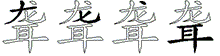 | DXYB₄ |
| 聊 |  | BQT₃ — BQTB₄ |
| 聂 |  | BCC₃ — BCCU₄ |
| 耿 |  | BO₂ — BOY₃ |
| 耽 |  | BPQ₃ — BPQN₄ |
| 耻 |  | BH₂ — BHG₃ |
| 耸 |  | WWB₃ — WWBF₄ |
| 耶 |  | BBH₃ |
| 耳 |  | BGH₃ — BGHG₄ |
| 耪 |  | DIYY₄ |
| 耙 |  | FSC₃ — FSCN₄ |
| 耘 |  | DIFC₄ |
| 耗 |  | FSE₃ — FSEN₄ |
| 耕 |  | DIFJ₄ |
| 耐 | 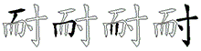 | DMJF₄ |
| 耍 | 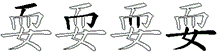 | DMJV₄ |
| 而 |  | DM₂ — DMJJ₄ |
| 者 |  | FTJ₃ — FTJF₄ |
| 考 |  | FTG₃ — FTGN₄ |
| 老 |  | FTX₃ — FTXB₄ |
| 耀 |  | IGQY₄ |
| 翼 |  | NLA₃ — NLAW₄ |
| 翻 |  | TOLN₄ |
| 翱 |  | RDFL₄ |
| 翰 |  | FJW₃ — FJWN₄ |
| 翟 |  | NWYF₄ |
| 翘 |  | ATGN₄ |
| 翔 |  | UNG₃ |
| 翌 |  | NUF₃ |
| 翅 |  | FCN₃ — FCND₄ |
| 翁 |  | WCN₃ — WCNF₄ |
| 羽 |  | NNY₃ — NNYG₄ |
| 羹 |  | UGOD₄ |
| 群 |  | VTKU₄ |
| 羡 |  | UGU₃ — UGUW₄ |
| 羞 |  | UNH₃ — UNHG₄ |
| 羚 |  | UWYL₄ |
| 羔 |  | UGOU₄ |
| 美 |  | UGDU₄ |
| 羌 |  | UNV₃ |
| 羊 |  | UYT₃ — UYTH₄ |
| 署 |  | LFTJ₄ |
| 置 |  | LFHF₄ |
| 罪 |  | LHD₃ — LHDD₄ |
| 罩 |  | LHJ₃ — LHJJ₄ |
| 罢 |  | LFC₃ — LFCU₄ |
| 罚 |  | LY₂ — LYJ₃ — LYJJ₄ |
| 罗 |  | LQ₂ — LQU₃ |
| 罕 |  | PWF₃ — PWFJ₄ |
| 网 |  | MRR₃ — MRRI₄ |
| 罐 | 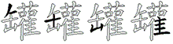 | RMAY₄ |
| 缺 |  | TFB₃ — TFBW₄ |
| 缸 |  | RMAG₄ |
| 缴 |  | XRY₃ — XRYT₄ |
| 缮 |  | XUU₃ — XUUK₄ |
| 缩 |  | XPW₃ — XPWJ₄ |
| 缨 |  | XMM₃ — XMMV₄ |
| 缠 |  | XOJ₃ — XOJF₄ |
| 缝 | 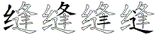 | XTDP₄ |
| 缚 |  | XS₂ — XSF₃ — XSFY₄ |
| 缘 |  | XXE₃ — XXEY₄ |
| 编 |  | XYN₃ — XYNA₄ |
| 缕 |  | XOV₃ — XOVG₄ |
| 缔 |  | XYU₃ — XYUH₄ |
| 缓 |  | XEGC₄ |
| 缎 |  | XTH₃ — XTHC₄ |
| 缉 |  | XKB₃ — XKBG₄ |
| 缆 |  | XJT₃ — XJTQ₄ |
| 缅 |  | XDL₃ — XDLF₄ |
| 缄 |  | XDG₃ — XDGK₄ |
| 缀 |  | XCC₃ — XCCC₄ |
| 绿 |  | XVI₃ — XVIY₄ |
| 绽 |  | XPG₃ — XPGH₄ |
| 综 |  | XP₂ — XPF₃ — XPFI₄ |
| 绸 |  | XMF₃ — XMFK₄ |
| 绷 |  | XEE₃ — XEEG₄ |
| 绵 |  | XR₂ — XRM₃ — XRMH₄ |
| 维 |  | XWY₃ — XWYG₄ |
| 绳 |  | XKJN₄ |
| 绰 |  | XHJ₃ — XHJH₄ |
| 续 |  | XFN₃ — XFND₄ |
| 绪 |  | XFT₃ — XFTJ₄ |
| 绩 |  | XGM₃ — XGMY₄ |
| 继 |  | XO₂ — XON₃ — XONN₄ |
| 绦 |  | XTS₃ — XTSY₄ |
| 绥 |  | XEV₃ — XEVG₄ |
| 绥 |  | XEV₃ — XEVG₄ |
| 绣 |  | XTB₃ — XTBT₄ |
| 绢 |  | XKE₃ — XKEG₄ |
| 统 |  | XYC₃ — XYCQ₄ |
| 绞 |  | XUR₃ — XURY₄ |
| 绝 |  | XQC₃ — XQCN₄ |
| 络 |  | XTK₃ — XTKG₄ |
| 绚 |  | XQJ₃ — XQJG₄ |
| 给 |  | XW₂ — XWG₃ — XWGK₄ |
| 绘 |  | XWF₃ — XWFC₄ |
| 绕 |  | XAT₃ — XATQ₄ |
| 结 |  | XF₂ — XFK₃ — XFKG₄ |
| 绒 |  | XAD₃ — XADT₄ |
| 绑 |  | XDT₃ — XDTB₄ |
| 经 |  | X₁ — XCA₃ — XCAG₄ |
| 绎 |  | XCG₃ — XCGH₄ |
| 绍 |  | XV₂ — XVK₃ — XVKG₄ |
| 绊 |  | XUG₃ — XUGH₄ |
| 终 |  | XTU₃ — XTUY₄ |
| 织 |  | XKW₃ — XKWY₄ |
| 细 |  | XL₂ — XLG₃ |
| 绅 |  | XJH₃ — XJHH₄ |
| 组 |  | XE₂ — XEG₃ — XEGG₄ |
| 练 |  | XAN₃ — XANW₄ |
| 线 |  | XG₂ — XGA₃ — XGAY₄ |
| 纽 |  | XNFG₄ |
| 纺 |  | XY₂ — XYT₃ |
| 纹 |  | XYY₃ |
| 纸 |  | XQA₃ — XQAN₄ |
| 纷 |  | XWV₃ — XWVT₄ |
| 纶 |  | XWX₃ — XWXN₄ |
| 纵 |  | XWW₃ — XWWY₄ |
| 纳 |  | XMW₃ — XMWY₄ |
| 纲 |  | XMR₃ — XMRY₄ |
| 纱 |  | XI₂ — XIT₃ — XITT₄ |
| 纯 |  | XGB₃ — XGBN₄ |
| 纬 |  | XFNH₄ |
| 纫 |  | XVY₃ — XVYY₄ |
| 纪 |  | XN₂ — XNN₃ |
| 级 |  | XB₂ — XBY₃ — XBYY₄ |
| 约 |  | XQ₂ — XQY₃ — XQYY₄ |
| 纤 |  | XTF₃ — XTFH₄ |
| 红 |  | XA₂ — XAG₃ |
| 纠 |  | XNH₃ — XNHH₄ |
| 纂 |  | THDI₄ |
| 繁 |  | TXTI₄ |
| 絮 |  | VKX₃ — VKXI₄ |
| 累 |  | LX₂ — LXI₃ — LXIU₄ |
| 紫 |  | HXX₃ — HXXI₄ |
| 紧 |  | JCX₃ — JCXI₄ |
| 索 |  | FPX₃ — FPXI₄ |
| 素 |  | GXI₃ — GXIU₄ |
| 紊 |  | YXI₃ — YXIU₄ |
| 系 |  | TXI₃ — TXIU₄ |
| 糯 |  | OFDJ₄ |
| 糠 |  | OOVI₄ |
| 糟 |  | OAJJ₄ |
| 糜 |  | OSSO₄ |
| 糙 |  | OTF₃ — OTFP₄ |
| 糖 |  | OOV₃ — OOVK₄ |
| 糕 |  | OUGO₄ |
| 糊 |  | ODE₃ — ODEG₄ |
| 精 |  | OG₂ — OGE₃ — OGEG₄ |
| 粹 |  | OYWF₄ |
| 粳 |  | OGJ₃ — OGJR₄ |
| 粱 |  | IVWO₄ |
| 粮 |  | OYV₃ — OYVY₄ |
| 粪 |  | OAW₃ — OAWU₄ |
| 粥 |  | XOX₃ — XOXN₄ |
| 粤 |  | TLO₃ — TLON₄ |
| 粤 |  | TLO₃ — TLON₄ |
| 粟 |  | SOU₃ |
| 粘 |  | OHKG₄ |
| 粗 |  | OE₂ — OEG₃ — OEGG₄ |
| 粕 |  | OR₂ — ORG₃ |
| 粒 |  | OU₂ — OUG₃ |
| 粉 |  | OWV₃ — OWVT₄ |
| 籽 |  | OB₂ — OBG₃ |
| 类 |  | OD₂ — ODU₃ |
| 米 |  | OYT₃ — OYTY₄ |
| 籍 |  | TFS₃ — TFSJ₄ |
| 簿 |  | TIS₃ — TISF₄ |
| 簧 |  | TAM₃ — TAMW₄ |
| 簇 |  | TYTD₄ |
| 篷 |  | TTDP₄ |
| 篱 |  | TYR₃ — TYRC₄ |
| 篮 |  | TJTL₄ |
| 篮 |  | TJTL₄ |
| 篡 |  | THLL₄ |
| 篙 |  | TYML₄ |
| 篓 |  | TOV₃ — TOVF₄ |
| 篇 |  | TYN₃ — TYNA₄ |
| 篆 |  | TXE₃ — TXEU₄ |
| 箱 |  | TSH₃ — TSHF₄ |
| 箭 |  | TUE₃ — TUEJ₄ |
| 箩 |  | TLQU₄ |
| 管 |  | TPN₃ — TPNF₄ |
| 算 |  | THA₃ — THAJ₄ |
| 箕 |  | TDW₃ — TDWU₄ |
| 箔 |  | TIR₃ — TIRF₄ |
| 箍 |  | TRA₃ — TRAH₄ |
| 简 |  | TUJ₃ — TUJF₄ |
| 签 |  | TWGI₄ |
| 筹 |  | TDTF₄ |
| 筷 |  | TNND₄ |
| 筛 |  | TJGH₄ |
| 策 |  | TSM₃ — TSMB₄ |
| 答 |  | TW₂ — TWGK₄ |
| 筒 |  | TMGK₄ |
| 筑 |  | TAW₃ — TAWY₄ |
| 筐 |  | TAG₃ — TAGF₄ |
| 筏 |  | TWA₃ — TWAU₄ |
| 筋 |  | TEEB₄ |
| 等 |  | TF₂ — TFFU₄ |
| 笼 |  | TDX₃ — TDXY₄ |
| 笺 |  | TGA₃ — TGAU₄ |
| 第 |  | TXH₃ — TXHT₄ |
| 笨 |  | TSG₃ — TSGF₄ |
| 符 |  | TWF₃ — TWFU₄ |
| 笛 |  | TMF₃ |
| 笔 |  | TEB₃ |
| 笑 |  | TTD₃ — TTDU₄ |
| 笋 |  | TVT₃ — TVTR₄ |
| 笆 |  | TCB₃ |
| 竿 |  | TFJ₃ — TFLL₄ |
| 竹 |  | THT₃ — THTH₄ |
| 端 |  | UM₂ — UMD₃ — UMDJ₄ |
| 竭 |  | UJQL₄ |
| 童 |  | UJFF₄ |
| 竣 |  | UCW₃ — UCWT₄ |
| 章 |  | UJJ₃ |
| 竟 |  | UJQ₃ — UJQB₄ |
| 竞 |  | UKQ₃ — UKQB₄ |
| 站 |  | UHKG₄ |
| 竖 |  | JCU₃ — JCUF₄ |
| 立 |  | UU₂ — UUU₃ — UUUU₄ |
| 立 |  | UU₂ — UUU₃ — UUUU₄ |
| 窿 |  | PWBG₄ |
| 窥 |  | PWG₃ — PWGQ₄ |
| 窟 |  | PWN₃ — PWNM₄ |
| 窝 |  | PWK₃ — PWKW₄ |
| 窜 |  | PWKH₄ |
| 窘 |  | PWVK₄ |
| 窗 |  | PWT₃ — PWTQ₄ |
| 窖 |  | PWTK₄ |
| 窒 |  | PWGF₄ |
| 窑 |  | PWRM₄ |
| 窍 |  | PWAN₄ |
| 窄 |  | PWTF₄ |
| 窃 |  | PWAV₄ |
| 突 |  | PWD₃ — PWDU₄ |
| 穿 |  | PWA₃ — PWAT₄ |
| 空 |  | PW₂ — PWA₃ — PWAF₄ |
| 穷 |  | PWE₃ — PWER₄ |
| 究 |  | PWV₃ — PWVB₄ |
| 穴 |  | PWU₃ |
| 穗 |  | TGJN₄ |
| 穆 |  | TRI₃ — TRIE₄ |
| 稿 |  | TYM₃ — TYMK₄ |
| 稽 |  | TDNJ₄ |
| 稼 |  | TPG₃ — TPGE₄ |
| 稻 |  | TEE₃ — TEEG₄ |
| 稳 |  | TQ₂ — TQV₃ — TQVN₄ |
| 稠 |  | TMFK₄ |
| 稚 |  | TWY₃ — TWYG₄ |
| 稗 |  | TRT₃ — TRTF₄ |
| 税 |  | TUK₃ — TUKQ₄ |
| 稍 |  | TIE₃ — TIEG₄ |
| 程 |  | TKGG₄ |
| 稀 |  | TR₂ — TRD₃ — TRDH₄ |
| 秽 |  | TMQ₃ — TMQY₄ |
| 移 |  | TQQ₃ — TQQY₄ |
| 秸 |  | TFKL₄ |
| 称 |  | TQI₃ — TQIY₄ |
| 积 |  | TKW₃ — TKWY₄ |
| 秩 |  | TT₂ — TTGY₄ |
| 秧 |  | TMDY₄ |
| 秦 |  | DWT₃ — DWTU₄ |
| 秤 |  | TGU₃ — TGUF₄ |
| 租 |  | TEG₃ — TEGG₄ |
| 秘 |  | TNT₃ — TNTT₄ |
| 秒 |  | TI₂ — TIT₃ — TITT₄ |
| 科 |  | TUFH₄ |
| 种 |  | TKH₃ — TKHH₄ |
| 秋 |  | TO₂ — TOY₃ |
| 秉 |  | TVD₃ — TGVI₄ |
| 秆 |  | TFH₃ |
| 秃 |  | TWB₃ |
| 私 |  | TCY₃ |
| 秀 |  | TB₂ — TBR₃ |
| 禾 |  | TTT₃ — TTTT₄ |
| 禽 |  | WYRC₄ |
| 离 |  | YRB₃ — YRBC₄ |
| 禹 |  | TKM₃ — TKMY₄ |
| 福 |  | PYG₃ — PYGL₄ |
| 禄 |  | PYV₃ — PYVI₄ |
| 禁 |  | SSF₃ — SSFI₄ |
| 祸 |  | PYKW₄ |
| 祷 |  | PYD₃ — PYDF₄ |
| 祭 |  | WFI₃ — WFIU₄ |
| 票 |  | SF₂ — SFIU₄ |
| 祥 |  | PYU₃ — PYUH₄ |
| 祟 |  | BMF₃ — BMFI₄ |
| 神 |  | PYJ₃ — PYJH₄ |
| 祝 |  | PYK₃ — PYKQ₄ |
| 祖 |  | PYE₃ — PYEG₄ |
| 祈 |  | PYR₃ — PYRH₄ |
| 祁 |  | PYB₃ — PYBH₄ |
| 社 |  | PY₂ — PYF₃ — PYFG₄ |
| 礼 |  | PYNL₄ |
| 示 |  | FI₂ — FIU₃ |
| 礁 |  | DWYO₄ |
| 磺 |  | DAMW₄ |
| 磷 |  | DOQ₃ — DOQG₄ |
| 磨 |  | OSSL₄ |
| 磕 |  | DFC₃ — DFCL₄ |
| 磐 |  | TUWD₄ |
| 磋 |  | DUA₃ — DUAG₄ |
| 磊 |  | DDD₃ — DDDF₄ |
| 磁 |  | DUX₃ — DUXX₄ |
| 碾 |  | DNA₃ — DNAE₄ |
| 碴 |  | DSJ₃ — DSJG₄ |
| 碳 |  | DMD₃ — DMDO₄ |
| 碱 |  | DDG₃ — DDGK₄ |
| 碰 |  | DUO₃ — DUOG₄ |
| 碧 |  | GRD₃ — GRDF₄ |
| 碟 |  | DAN₃ — DANS₄ |
| 碘 |  | DMA₃ — DMAW₄ |
| 碗 |  | DPQ₃ — DPQB₄ |
| 碑 |  | DRT₃ — DRTF₄ |
| 碎 |  | DYW₃ — DYWF₄ |
| 碍 |  | DJG₃ — DJGF₄ |
| 碌 |  | DVI₃ — DVIY₄ |
| 碉 |  | DMF₃ — DMFK₄ |
| 硼 |  | DEEG₄ |
| 确 |  | DQE₃ — DQEH₄ |
| 硬 |  | DGJ₃ — DGJR₄ |
| 硫 |  | DYC₃ — DYCK₄ |
| 硝 |  | DIE₃ — DIEG₄ |
| 硕 |  | DDM₃ — DDMY₄ |
| 硕 |  | DDM₃ — DDMY₄ |
| 硒 |  | DSG₃ |
| 硅 |  | DFFG₄ |
| 础 |  | DBM₃ — DBMH₄ |
| 砾 |  | DTN₃ — DTNI₄ |
| 砸 |  | DAM₃ — DAMH₄ |
| 砷 |  | DJH₃ — DJHH₄ |
| 破 |  | DB₂ — DBY₃ |
| 砰 |  | DGU₃ — DGUF₄ |
| 砧 |  | DHKG₄ |
| 砚 |  | DMQ₃ — DMQN₄ |
| 砖 |  | DFN₃ — DFNY₄ |
| 研 |  | DGA₃ — DGAH₄ |
| 砒 |  | DXX₃ — DXXN₄ |
| 砍 |  | DQW₃ — DQWY₄ |
| 砌 |  | DAV₃ — DAVT₄ |
| 砂 |  | DI₂ — DIT₃ — DITT₄ |
| 码 |  | DCG₃ — DCGG₄ |
| 矿 |  | DO₂ — DOT₃ |
| 矾 |  | DWY₃ — DWYY₄ |
| 矽 |  | DQY₃ |
| 石 |  | DGTG₄ |
| 矮 |  | TDTV₄ |
| 短 |  | TDG₃ — TDGU₄ |
| 矫 |  | TDTJ₄ |
| 矩 |  | TDA₃ — TDAN₄ |
| 知 |  | TD₂ — TDK₃ — TDKG₄ |
| 矣 |  | CT₂ — CTD₃ — CTDU₄ |
| 矢 |  | TDU₃ |
| 矛 |  | CNHT₄ |
| 矗 |  | FHFH₄ |
| 瞻 |  | HQD₃ — HQDY₄ |
| 瞳 |  | HU₂ — HUJ₃ — HUJF₄ |
| 瞬 |  | HEP₃ — HEPG₄ |
| 瞪 |  | HWG₃ — HWGU₄ |
| 瞩 |  | HNT₃ — HNTY₄ |
| 瞧 |  | HWY₃ — HWYO₄ |
| 瞥 |  | ITHL₄ |
| 瞒 |  | HA₂ — HAGW₄ |
| 瞎 |  | HP₂ — HPD₃ — HPDK₄ |
| 瞅 |  | HTO₃ — HTOY₄ |
| 瞄 |  | HAL₃ — HALG₄ |
| 睹 |  | HFT₃ — HFTJ₄ |
| 睬 |  | HES₃ — HESY₄ |
| 睫 |  | HGV₃ — HGVH₄ |
| 睦 |  | HF₂ — HFW₃ — HFWF₄ |
| 睦 |  | HF₂ — HFW₃ — HFWF₄ |
| 督 |  | HICH₄ |
| 睡 |  | HT₂ — HTG₃ — HTGF₄ |
| 睛 |  | HG₂ — HGE₃ — HGEG₄ |
| 睁 |  | HQV₃ — HQVH₄ |
| 着 |  | UH₂ — UHF₃ |
| 眼 |  | HV₂ — HVY₃ |
| 眺 |  | HQI₃ — HQIY₄ |
| 眷 |  | UDHF₄ |
| 眶 |  | HAGG₄ |
| 眯 |  | HOY₃ |
| 眩 |  | HYX₃ — HYXY₄ |
| 眨 |  | HTP₃ — HTPY₄ |
| 眠 |  | HNA₃ — HNAN₄ |
| 真 |  | FHW₃ — FHWU₄ |
| 看 |  | RH₂ — RHF₃ |
| 眉 |  | NHD₃ |
| 省 |  | ITH₃ — ITHF₄ |
| 盾 |  | RFH₃ — RFHD₄ |
| 盼 |  | HWVN₄ |
| 相 |  | SH₂ — SHG₃ |
| 直 |  | FH₂ — FHF₃ |
| 盲 |  | YNH₃ — YNHF₄ |
| 盯 |  | HS₂ — HSH₃ |
| 目 |  | HHH₃ — HHHH₄ |
| 盟 |  | JEL₃ — JELF₄ |
| 盛 |  | DNL₃ — DNLF₄ |
| 盘 |  | TUL₃ — TULF₄ |
| 盗 |  | UQWL₄ |
| 盖 |  | UGL₃ — UGLF₄ |
| 盔 |  | DOL₃ — DOLF₄ |
| 盒 |  | WGKL₄ |
| 监 |  | JTYL₄ |
| 盐 |  | FHL₃ — FHLF₄ |
| 盏 |  | GAL₃ — GALF₄ |
| 盎 |  | MDL₃ — MDLF₄ |
| 益 |  | UWL₃ — UWLF₄ |
| 盈 |  | BCL₃ — BCLF₄ |
| 盆 |  | WVL₃ — WVLF₄ |
| 盅 |  | KHL₃ — KHLF₄ |
| 盂 |  | GFL₃ — GFLF₄ |
| 皿 |  | LHN₃ — LHNG₄ |
| 皱 |  | QVBY₄ |
| 皮 |  | HCI₃ — BTNY₄ |
| 皖 |  | RPF₃ — RPFQ₄ |
| 皑 |  | RMN₃ — RMNN₄ |
| 皋 |  | RDFJ₄ |
| 皆 |  | XXR₃ — XXRF₄ |
| 的 |  | R₁ — RQY₃ — RQYY₄ |
| 皂 |  | RAB₃ |
| 百 |  | DJ₂ — DJF₃ |
| 白 |  | RRR₃ — RRRR₄ |
| 登 |  | WGKU₄ |
| 癸 |  | WGD₃ — WGDU₄ |
| 癣 |  | UQG₃ — UQGU₄ |
| 癌 |  | UKK₃ — UKKM₄ |
| 瘸 |  | UEKW₄ |
| 瘴 |  | UUJK₄ |
| 瘫 |  | UCWY₄ |
| 瘩 |  | UAW₃ — UAWK₄ |
| 瘦 |  | UEH₃ — UEHC₄ |
| 瘤 |  | UQYL₄ |
| 瘟 |  | UJL₃ — UJLD₄ |
| 瘁 |  | UYW₃ — UYWF₄ |
| 痹 |  | ULGJ₄ |
| 痴 |  | UTDK₄ |
| 痰 |  | UOO₃ — UOOI₄ |
| 痪 |  | UQM₃ — UQMD₄ |
| 痢 |  | UTJ₃ — UTJK₄ |
| 痞 |  | UDH₃ — UDHK₄ |
| 痛 |  | UC₂ — UCE₃ — UCEK₄ |
| 痘 |  | UGKU₄ |
| 痕 |  | UVI₃ |
| 痔 |  | UFFI₄ |
| 痒 |  | UUK₃ |
| 痊 |  | UWG₃ — UWGD₄ |
| 痉 |  | UCA₃ — UCAD₄ |
| 痈 |  | UEK₃ |
| 症 |  | UGH₃ — UGHD₄ |
| 病 |  | UGM₃ — UGMW₄ |
| 疾 |  | UTD₃ — UTDI₄ |
| 疽 |  | UEG₃ — UEGD₄ |
| 疼 |  | UTU₃ — UTUI₄ |
| 疹 |  | UWE₃ — UWEE₄ |
| 疵 |  | UHX₃ — UHXV₄ |
| 疲 |  | UBI₃ |
| 疯 |  | UWR₃ — UWRI₄ |
| 疮 |  | UWB₃ — UWBV₄ |
| 疫 |  | UWC₃ — UWCI₄ |
| 疥 |  | UWJ₃ — UWJK₄ |
| 疤 |  | UCV₃ |
| 疡 |  | UNR₃ — UNRE₄ |
| 疟 |  | UAG₃ — UAGD₄ |
| 疚 |  | UQY₃ — UQYI₄ |
| 疙 |  | UTN₃ — UTNV₄ |
| 疗 |  | UB₂ — UBK₃ |
| 疑 |  | XTD₃ — XTDH₄ |
| 疏 |  | NHY₃ — NHYK₄ |
| 疆 |  | XFGG₄ |
| 畸 |  | LDS₃ — LDSK₄ |
| 畴 |  | LDT₃ — LDTF₄ |
| 番 |  | TOL₃ — TOLF₄ |
| 畦 |  | LFF₃ — LFFG₄ |
| 略 |  | LT₂ — LTK₃ — LTKG₄ |
| 畜 |  | YXL₃ — YXLF₄ |
| 留 |  | QYVL₄ |
| 畔 |  | LUG₃ — LUGH₄ |
| 畏 |  | LGE₃ — LGEU₄ |
| 界 |  | LW₂ — LWJ₃ — LWJJ₄ |
| 畅 |  | JHN₃ — JHNR₄ |
| 画 |  | GL₂ — GLB₃ — GLBJ₄ |
| 甸 |  | QL₂ — QLD₃ |
| 男 |  | LE₂ — LER₃ |
| 电 |  | JN₂ — JNV₃ |
| 申 |  | JHK₃ |
| 甲 |  | LHNH₄ |
| 由 |  | MH₂ — MHNG₄ |
| 田 |  | LL₂ — LLL₃ — LLLL₄ |
| 甭 |  | DHE₃ — DHEJ₄ |
| 甫 |  | SGHY₄ |
| 甩 |  | ENV₃ |
| 用 |  | ET₂ — ETN₃ — ETNH₄ |
| 甥 |  | TGLE₄ |
| 生 |  | TGD₃ |
| 甜 |  | TDF₃ — TDFG₄ |
| 甚 |  | DWNB₄ |
| 甘 |  | FGHG₄ |
| 甄 |  | SFGY₄ |
| 瓷 |  | UQLL₄ |
| 瓶 |  | UAGY₄ |
| 瓮 |  | WCG₃ — WCGY₄ |
| 瓦 |  | GNN₃ — GNNY₄ |
| 瓤 |  | YKKY₄ |
| 瓣 |  | URC₃ — URCU₄ |
| 瓢 |  | SFIY₄ |
| 瓜 |  | RCY₃ — RCYI₄ |
| 璃 |  | GYR₃ — GYRC₄ |
| 瑶 |  | GET₃ — GETB₄ |
| 瑰 |  | GRQ₃ — GRQC₄ |
| 瑟 |  | GGN₃ — GGNT₄ |
| 瑞 |  | GMD₃ — GMDJ₄ |
| 瑚 |  | GDE₃ — GDEG₄ |
| 琼 | 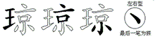 | GYKI₄ |
| 琶 |  | GGC₃ — GGCB₄ |
| 琵 |  | GGX₃ — GGXX₄ |
| 琵 |  | GGX₃ — GGXX₄ |
| 琴 |  | GGW₃ — GGWN₄ |
| 琴 |  | GGW₃ — GGWN₄ |
| 琳 |  | GSS₃ — GSSY₄ |
| 琢 |  | GGE₃ — GGEY₄ |
| 琐 |  | GIM₃ — GIMY₄ |
| 琉 |  | GYC₃ — GYCK₄ |
| 理 |  | GJ₂ — GJF₃ — GJFG₄ |
| 琅 |  | GYV₃ — GYVY₄ |
| 球 |  | GGI₃ — GGIY₄ |
| 班 |  | GYT₃ — GYTG₄ |
| 珠 |  | GTF₃ — GTFY₄ |
| 珐 |  | GFC₃ — GFCY₄ |
| 珍 |  | GW₂ — GWE₃ — GWET₄ |
| 珊 |  | GMM₃ — GMMG₄ |
| 玻 |  | GBY₃ — GHCY₄ |
| 玲 |  | GWY₃ — GWYC₄ |
| 现 |  | GM₂ — GMQN₄ |
| 环 |  | GDH₃ — GDHY₄ |
| 玫 |  | GTY₃ |
| 玩 |  | GFQ₃ — GFQN₄ |
| 玛 |  | GCG₃ — GCGG₄ |
| 玖 |  | GQY₃ — GQYY₄ |
| 王 |  | GGG₃ — GGGG₄ |
| 玉 |  | GY₂ — GYI₃ |
| 率 |  | YX₂ — YXIF₄ |
| 玄 |  | YXU₃ |
| 獭 |  | QTS₃ — QTSM₄ |
| 猿 |  | QTF₃ — QTFE₄ |
| 猾 |  | QTME₄ |
| 猴 |  | QTW₃ — QTWD₄ |
| 献 |  | FMU₃ — FMUD₄ |
| 猫 |  | QTA₃ — QTAL₄ |
| 猪 |  | QTFJ₄ |
| 猩 |  | QTJG₄ |
| 猜 |  | QTGE₄ |
| 猛 |  | QTBL₄ |
| 猎 |  | QTAJ₄ |
| 狼 |  | QTYV₄ |
| 狸 |  | QTJF₄ |
| 狱 |  | QTY₃ — QTYD₄ |
| 狰 |  | QTQH₄ |
| 狮 |  | QTJH₄ |
| 狭 |  | QTGW₄ |
| 独 |  | QTJ₃ — QTJY₄ |
| 狡 |  | QTU₃ — QTUR₄ |
| 狠 |  | QTV₃ — QTVY₄ |
| 狞 |  | QTP₃ — QTPS₄ |
| 狙 |  | QTE₃ — QTEG₄ |
| 狗 |  | QTQ₃ — QTQK₄ |
| 狐 |  | QTR₃ — QTRY₄ |
| 狈 |  | QTM₃ — QTMY₄ |
| 狄 |  | QTO₃ — QTOY₄ |
| 狂 |  | QTGG₄ |
| 犹 |  | QTDY₄ |
| 状 |  | UDY₃ |
| 犯 |  | QTB₃ — QTBN₄ |
| 犬 |  | DGTL₄ |
| 犊 |  | CFN₃ — CFND₄ |
| 犁 |  | TJTG₄ |
| 犀 |  | NIT₃ — NITG₄ |
| 牺 |  | CS₂ — CSG₃ |
| 特 |  | CFFY₄ |
| 牵 |  | DPT₃ — DPTG₄ |
| 牲 |  | CTG₃ — CTGG₄ |
| 物 |  | CQ₂ — CQR₃ — CQRT₄ |
| 牧 |  | CTY₃ |
| 牢 |  | PTG₃ — PTGJ₄ |
| 牡 |  | CFG₃ |
| 牟 |  | CTGJ₄ |
| 牛 |  | TGK₃ |
| 牙 |  | AH₂ — AHT₃ — AHTE₄ |
| 牌 |  | THGF₄ |
| 版 |  | THGC₄ |
| 片 |  | THG₃ — THGN₄ |
| 爽 |  | DRR₃ — DRRR₄ |
| 爹 |  | WRQ₃ — WRQQ₄ |
| 爸 |  | WRC₃ — WRCB₄ |
| 爷 |  | WRB₃ — WRBJ₄ |
| 父 |  | WRU₃ |
| 爵 |  | ELV₃ — ELVF₄ |
| 爱 |  | EPD₃ — EPDC₄ |
| 爬 |  | RHYC₄ |
| 爪 |  | RHYI₄ |
| 爆 |  | OJA₃ — OJAI₄ |
| 燥 |  | OK₂ — OKK₃ — OKKS₄ |
| 燕 |  | AKU₃ — AKUO₄ |
| 燎 |  | ODUI₄ |
| 燃 |  | OQD₃ — OQDO₄ |
| 熬 |  | GQTO₄ |
| 熟 |  | YBV₃ — YBVO₄ |
| 熙 |  | GHKO₄ |
| 熔 |  | OPW₃ — OPWK₄ |
| 熏 | 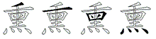 | TGLO₄ |
| 熊 |  | CEXO₄ |
| 熄 |  | OTHN₄ |
| 煽 |  | OYNN₄ |
| 煮 |  | FTJO₄ |
| 照 |  | JVKO₄ |
| 煤 |  | OFS₃ — OFSY₄ |
| 煞 |  | QVT₃ — QVTO₄ |
| 煎 |  | UEJO₄ |
| 煌 |  | ORGG₄ |
| 然 |  | QD₂ — QDO₃ — QDOU₄ |
| 焰 |  | OQE₃ — OQEG₄ |
| 焦 |  | WYO₃ — WYOU₄ |
| 焚 |  | SSO₃ — SSOU₄ |
| 焙 |  | OUKG₄ |
| 焕 |  | OQM₃ — OQMD₄ |
| 焊 |  | OJF₃ — OJFH₄ |
| 焉 |  | GHG₃ — GHGO₄ |
| 烽 |  | OTD₃ — OTDH₄ |
| 烹 |  | YBO₃ — YBOU₄ |
| 烷 |  | OPF₃ — OPFQ₄ |
| 烯 |  | ORD₃ — ORDH₄ |
| 热 |  | RVYO₄ |
| 烬 |  | ONY₃ — ONYU₄ |
| 烫 |  | INRO₄ |
| 烩 |  | OWFC₄ |
| 烧 |  | OAT₃ — OATQ₄ |
| 烧 |  | OAT₃ — OATQ₄ |
| 烦 |  | ODM₃ — ODMY₄ |
| 烤 |  | OFT₃ — OFTN₄ |
| 烟 |  | OLD₃ — OLDY₄ |
| 烛 |  | OJ₂ — OJY₃ |
| 烙 |  | OTK₃ — OTKG₄ |
| 烘 |  | OAWY₄ |
| 烈 |  | GQJO₄ |
| 烃 |  | OCA₃ — OCAG₄ |
| 烂 |  | OUD₃ — OUDG₄ |
| 烁 |  | OTN₃ — OTNI₄ |
| 炽 |  | OKW₃ — OKWY₄ |
| 炼 |  | OGNW₄ |
| 炸 |  | OTH₃ — OTHF₄ |
| 炳 |  | OGM₃ — OGMW₄ |
| 炯 |  | OMK₃ — OMKG₄ |
| 炮 |  | OQN₃ — OQNN₄ |
| 炭 |  | MDO₃ — MDOU₄ |
| 炬 |  | OAN₃ — OANG₄ |
| 炙 |  | QO₂ — QOU₃ |
| 炕 |  | OYW₃ — OYWN₄ |
| 炔 |  | ONW₃ — ONWY₄ |
| 炒 |  | OIT₃ — OITT₄ |
| 炎 |  | OO₂ — OOU₃ |
| 炊 |  | OQW₃ — OQWY₄ |
| 炉 |  | OYN₃ — OYNT₄ |
| 灿 |  | OM₂ — OMH₃ |
| 灾 |  | PO₂ — POU₃ |
| 灼 |  | OQY₃ — OQYY₄ |
| 灸 |  | QYO₃ — QYOU₄ |
| 灶 |  | OFG₃ |
| 灵 |  | VO₂ — VOU₃ |
| 灰 |  | DOU₃ |
| 灯 |  | OSH₃ |
| 灭 |  | GOI₃ |
| 火 |  | OOO₃ — OOOO₄ |
| 灌 |  | IAK₃ — IAKY₄ |
| 瀑 |  | IJA₃ — IJAI₄ |
| 濒 |  | IHHM₄ |
| 濒 |  | IHHM₄ |
| 激 |  | IRY₃ — IRYT₄ |
| 澳 |  | ITM₃ — ITMD₄ |
| 澡 |  | IKK₃ — IKKS₄ |
| 澜 |  | IUS₃ — IUSL₄ |
| 澎 |  | IFKE₄ |
| 澈 |  | IYCT₄ |
| 澄 |  | IWGU₄ |
| 潮 |  | IFJ₃ — IFJE₄ |
| 潭 |  | ISJ₃ — ISJH₄ |
| 潦 |  | IDUI₄ |
| 潞 |  | IKHK₄ |
| 潜 |  | IGGJ₄ |
| 潘 |  | ITO₃ — ITOL₄ |
| 潍 |  | IXW₃ — IXWY₄ |
| 漾 |  | IUGI₄ |
| 漳 |  | IUJ₃ — IUJH₄ |
| 漱 |  | IGKW₄ |
| 漫 |  | IJLC₄ |
| 漠 |  | IAJ₃ — IAJD₄ |
| 演 |  | IPGW₄ |
| 漓 |  | IYR₃ — IYRC₄ |
| 漏 |  | INF₃ — INFY₄ |
| 漏 |  | INF₃ — INFY₄ |
| 漆 |  | ISW₃ — ISWI₄ |
| 漂 |  | ISF₃ — ISFI₄ |
| 滴 |  | IYU₃ — IYUD₄ |
| 滩 |  | ICW₃ — ICWY₄ |
| 滨 |  | IPR₃ — IPRW₄ |
| 滦 |  | IYOS₄ |
| 滥 |  | IJT₃ — IJTL₄ |
| 滤 |  | IHN₃ — IHNY₄ |
| 满 |  | IAGW₄ |
| 滞 |  | IGK₃ — IGKH₄ |
| 滚 |  | IUC₃ — IUCE₄ |
| 滔 |  | IEE₃ — IEEG₄ |
| 滓 |  | IPU₃ — IPUH₄ |
| 滑 |  | IME₃ — IMEG₄ |
| 滋 |  | IUX₃ — IUXX₄ |
| 滇 |  | IFHW₄ |
| 滁 |  | IBW₃ — IBWS₄ |
| 溺 |  | IXU₃ — IXUU₄ |
| 溶 |  | IPWK₄ |
| 溯 |  | IUB₃ — IUBE₄ |
| 溪 |  | IEX₃ — IEXD₄ |
| 溢 |  | IUW₃ — IUWL₄ |
| 溜 |  | IQYL₄ |
| 溜 |  | IQYL₄ |
| 源 |  | IDR₃ — IDRI₄ |
| 溉 |  | IVA₃ — IVAQ₄ |
| 溅 |  | IMGA₄ |
| 溃 |  | IK₂ — IKH₃ — IKHM₄ |
| 湿 |  | IJO₃ — IJOG₄ |
| 湾 |  | IYO₃ — IYOX₄ |
| 湛 |  | IDW₃ — IDWN₄ |
| 湘 |  | ISHG₄ |
| 湖 |  | IDE₃ — IDEG₄ |
| 湍 |  | IMD₃ — IMDJ₄ |
| 湃 |  | IRDF₄ |
| 渺 |  | IHIT₄ |
| 游 |  | IYTB₄ |
| 渴 |  | IJQ₃ — IJQN₄ |
| 港 |  | IAWN₄ |
| 渭 |  | ILE₃ — ILEG₄ |
| 温 |  | IJL₃ — IJLG₄ |
| 渤 |  | IFP₃ — IFPE₄ |
| 渣 |  | ISJG₄ |
| 渡 |  | IO₂ — IOA₃ — IOAC₄ |
| 渠 |  | IANS₄ |
| 渝 |  | IWGJ₄ |
| 渗 |  | ICD₃ — ICDE₄ |
| 渔 |  | IQGG₄ |
| 渐 |  | ILR₃ — ILRH₄ |
| 渍 |  | IGM₃ — IGMY₄ |
| 渊 |  | IOJH₄ |
| 清 |  | IGE₃ — IGEG₄ |
| 添 |  | IGD₃ — IGDN₄ |
| 淹 |  | IDJ₃ — IDJN₄ |
| 混 |  | IJX₃ — IJXX₄ |
| 淳 |  | IYB₃ — IYBG₄ |
| 深 |  | IPWS₄ |
| 淮 |  | IWY₃ — IWYG₄ |
| 淬 |  | IYWF₄ |
| 淫 |  | IET₃ — IETF₄ |
| 淤 |  | IYWU₄ |
| 淡 |  | IOO₃ — IOOY₄ |
| 淘 |  | IQT₃ — IQTB₄ |
| 淖 |  | IHJ₃ — IHJH₄ |
| 淑 |  | IHI₃ — IHIC₄ |
| 淌 |  | IIM₃ — IIMK₄ |
| 淋 |  | ISS₃ — ISSY₄ |
| 淆 |  | IRD₃ — IRDE₄ |
| 淄 |  | IVL₃ — IVLG₄ |
| 淀 |  | IPGH₄ |
| 涸 |  | ILD₃ — ILDG₄ |
| 涵 |  | IBI₃ — IBIB₄ |
| 液 |  | IYW₃ — IYWY₄ |
| 涯 |  | IDF₃ — IDFF₄ |
| 涪 |  | IUK₃ — IUKG₄ |
| 涩 |  | IVY₃ — IVYH₄ |
| 涨 |  | IX₂ — IXT₃ — IXTY₄ |
| 涧 |  | IUJG₄ |
| 润 |  | IUGG₄ |
| 涤 |  | ITS₃ — ITSY₄ |
| 涣 |  | IQM₃ — IQMD₄ |
| 涡 |  | IKM₃ — IKMW₄ |
| 涟 |  | ILP₃ — ILPY₄ |
| 涝 |  | IAP₃ — IAPE₄ |
| 涛 |  | IDT₃ — IDTF₄ |
| 涕 |  | IUXT₄ |
| 涎 |  | ITHP₄ |
| 涌 |  | ICE₃ — ICEH₄ |
| 涉 |  | IHH₃ — IHHT₄ |
| 消 |  | IIE₃ — IIEG₄ |
| 涅 |  | IJFG₄ |
| 涂 |  | IWTY₄ |
| 浸 |  | IVP₃ — IVPC₄ |
| 海 |  | ITX₃ — ITXY₄ |
| 浴 |  | IWW₃ — IWWK₄ |
| 浮 |  | IEB₃ — IEBG₄ |
| 浪 |  | IYV₃ — IYVY₄ |
| 浩 |  | ITFK₄ |
| 浦 |  | IS₂ — ISY₃ |
| 浚 |  | ICWT₄ |
| 浙 |  | IRR₃ — IRRH₄ |
| 浓 |  | IPE₃ — IPEY₄ |
| 浑 |  | IPL₃ — IPLH₄ |
| 济 |  | IY₂ — IYJ₃ — IYJH₄ |
| 测 |  | IMJ₃ — IMJH₄ |
| 浊 |  | IJ₂ — IJY₃ |
| 浇 |  | IAT₃ — IATQ₄ |
| 浆 |  | UQI₃ — UQIU₄ |
| 浅 |  | IGA₃ — IGAY₄ |
| 流 |  | IYC₃ — IYCK₄ |
| 派 |  | IRE₃ — IREY₄ |
| 洽 |  | IWG₃ — IWGK₄ |
| 洼 |  | IFFG₄ |
| 活 |  | ITD₃ — ITDG₄ |
| 洲 |  | IYT₃ — IYTH₄ |
| 洱 |  | IBG₃ |
| 洪 |  | IAW₃ — IAWY₄ |
| 津 |  | IVGH₄ |
| 洛 |  | ITK₃ — ITKG₄ |
| 洗 |  | ITF₃ — ITFQ₄ |
| 洒 |  | ISG₃ |
| 洋 |  | IU₂ — IUH₃ |
| 洁 |  | IFK₃ — IFKG₄ |
| 泽 |  | ICG₃ — ICGH₄ |
| 泼 |  | INTY₄ |
| 泻 |  | IPG₃ — IPGG₄ |
| 泵 |  | DIU₃ |
| 泳 |  | IYNI₄ |
| 泰 |  | DWIU₄ |
| 泪 |  | IHG₃ |
| 注 |  | IYG₃ — IYGG₄ |
| 泥 |  | INX₃ — INXN₄ |
| 泣 |  | IUG₃ |
| 波 |  | IB₂ — IBY₃ — IHCY₄ |
| 泡 |  | IQN₃ — IQNN₄ |
| 泞 |  | IPS₃ — IPSH₄ |
| 泛 |  | ITP₃ — ITPY₄ |
| 法 |  | IFC₃ — IFCY₄ |
| 泌 |  | INT₃ — INTT₄ |
| 泊 |  | IRG₃ |
| 泉 |  | RI₂ — RIU₃ |
| 泅 |  | ILW₃ — ILWY₄ |
| 泄 |  | IANN₄ |
| 沿 |  | IWK₃ — IWKG₄ |
| 沾 |  | IHK₃ — IHKG₄ |
| 沽 |  | IDG₃ |
| 沼 |  | IVK₃ — IVKG₄ |
| 治 |  | ICK₃ — ICKG₄ |
| 油 |  | IM₂ — IMG₃ |
| 沸 |  | IXJ₃ — IXJH₄ |
| 河 |  | ISK₃ — ISKG₄ |
| 沮 |  | IEG₃ — IEGG₄ |
| 沫 |  | IGS₃ — IGSY₄ |
| 沪 |  | IYN₃ — IYNT₄ |
| 沧 |  | IWB₃ — IWBN₄ |
| 沦 |  | IWX₃ — IWXN₄ |
| 沥 |  | IDET₄ |
| 沥 |  | IDET₄ |
| 沤 |  | IAR₃ — IARY₄ |
| 没 |  | IW₂ — IWC₃ — IWCY₄ |
| 沟 |  | IQ₂ — IQC₃ — IQCY₄ |
| 沛 |  | IGMH₄ |
| 沙 |  | IIT₃ — IITT₄ |
| 沏 |  | IAV₃ — IAVT₄ |
| 沈 |  | IPQ₃ — IPQN₄ |
| 沃 |  | ITDY₄ |
| 沂 |  | IRH₃ |
| 沁 |  | IN₂ — INY₃ |
| 汾 |  | IWV₃ — IWVT₄ |
| 汽 |  | IR₂ — IRN₃ |
| 汹 |  | IRB₃ — IRBH₄ |
| 汲 |  | IBYY₄ |
| 汰 |  | IDY₃ — IDYY₄ |
| 汪 |  | IGG₃ |
| 汤 |  | INR₃ — INRT₄ |
| 污 |  | IFN₃ — IFNN₄ |
| 池 |  | IBN₃ |
| 江 |  | IA₂ — IAG₃ |
| 汞 |  | AIU₃ |
| 汝 |  | IVG₃ |
| 汛 |  | INFH₄ |
| 汗 |  | IF₂ — IFH₃ |
| 汕 |  | IMH₃ |
| 汐 |  | IQY₃ |
| 汉 |  | IC₂ — ICY₃ |
| 汇 |  | IAN₃ |
| 求 |  | GI₂ — GIY₃ — GIYI₄ |
| 汁 |  | IFH₃ — IFLL₄ |
| 汀 |  | ISH₃ |
| 永 |  | YNI₃ — YNII₄ |
| 水 |  | II₂ — III₃ — IIII₄ |
| 氰 |  | RGE₃ — RGED₄ |
| 氯 |  | RVI₃ — RVII₄ |
| 氨 |  | RNPV₄ |
| 氧 |  | RUK₃ — RNUJ₄ |
| 氦 |  | RYNW₄ |
| 氢 |  | RCA₃ — RCAD₄ |
| 氟 |  | RNXJ₄ |
| 氛 |  | RWV₃ — RWVE₄ |
| 氖 |  | RBE₃ — RNBR₄ |
| 气 |  | RTG₃ — RTGN₄ |
| 氓 |  | YNNA₄ |
| 民 |  | N₁ — NAV₃ |
| 氏 |  | QA₂ — QAV₃ |
| 毯 |  | EOO₃ — EOOI₄ |
| 毫 |  | YPE₃ — YPEB₄ |
| 毡 |  | EH₂ — EHK₃ — EHKD₄ |
| 毛 |  | ETGN₄ |
| 毙 |  | XXGX₄ |
| 毗 |  | LXX₃ — LXXN₄ |
| 毖 |  | XXNT₄ |
| 毕 |  | XXF₃ — XXFJ₄ |
| 比 |  | XX₂ — XXN₃ |
| 毒 |  | GXU₃ |
| 每 |  | TX₂ — TXU₃ |
| 母 | 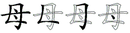 | XNNY₄ |
| 毋 |  | NND₃ — NNDE₄ |
| 毅 |  | UEW₃ — UEWC₄ |
| 毁 |  | EAW₃ — EAWC₄ |
| 殿 |  | NAW₃ — NAWC₄ |
| 殷 |  | RVN₃ — RVNC₄ |
| 段 |  | WDWC₄ |
| 殴 |  | ARW₃ — ARWC₄ |
| 殖 |  | GQF₃ — GQFH₄ |
| 残 |  | GQG₃ — GQGA₄ |
| 殊 |  | GQT₃ — GQTF₄ |
| 殉 |  | GQQ₃ — GQQJ₄ |
| 殆 |  | GQC₃ — GQCK₄ |
| 殃 |  | GQM₃ — GQMD₄ |
| 歼 |  | GQTL₄ |
| 死 |  | GQX₃ — GQXV₄ |
| 歹 |  | GQI₃ |
| 歪 |  | DHG₃ — DHGH₄ |
| 歧 |  | HFC₃ — HFCY₄ |
| 武 |  | GAH₃ — GAHY₄ |
| 正 |  | GHD₃ |
| 止 |  | HHG₃ — HHGG₄ |
| 歌 |  | SKS₃ — SKSW₄ |
| 歉 |  | UVJL₄ |
| 歇 |  | JQWW₄ |
| 款 |  | FFI₃ — FFIW₄ |
| 欺 |  | DWQ₃ — DWQW₄ |
| 欲 |  | WWKW₄ |
| 欧 |  | ARQ₃ — ARQW₄ |
| 欣 |  | RQW₃ — RQWY₄ |
| 欢 |  | CQW₃ — CQWY₄ |
| 次 |  | UQ₂ — UQW₃ — UQWY₄ |
| 欠 |  | QW₂ — QWU₃ |
| 檬 |  | SAP₃ — SAPE₄ |
| 檬 |  | SAP₃ — SAPE₄ |
| 檄 |  | SRY₃ — SRYT₄ |
| 檀 |  | SYL₃ — SYLG₄ |
| 橱 |  | SDGF₄ |
| 橡 |  | SQK₃ — SQKE₄ |
| 橙 |  | SWGU₄ |
| 橇 |  | SEEE₄ |
| 樱 |  | SMM₃ — SMMV₄ |
| 模 |  | SA₂ — SAJ₃ — SAJD₄ |
| 樟 |  | SUJ₃ — SUJH₄ |
| 樊 |  | SRRD₄ |
| 槽 |  | SGM₃ — SGMJ₄ |
| 槛 |  | SJT₃ — SJTL₄ |
| 槐 |  | SRQ₃ — SRQC₄ |
| 榷 |  | SPWY₄ |
| 榴 |  | SQY₃ — SQYL₄ |
| 榨 |  | SPW₃ — SPWF₄ |
| 榜 |  | SYU₃ — SYUY₄ |
| 榔 |  | SYV₃ — SYVB₄ |
| 榆 |  | SWGJ₄ |
| 概 |  | SVA₃ — SVAQ₄ |
| 楼 |  | SOV₃ — SOVG₄ |
| 楷 |  | SX₂ — SXX₃ — SXXR₄ |
| 楞 |  | SLY₃ — SLYT₄ |
| 楚 |  | SSN₃ — SSNH₄ |
| 楔 |  | SDHD₄ |
| 椿 |  | SDWJ₄ |
| 椽 |  | SXE₃ — SXEY₄ |
| 椰 |  | SBB₃ — SBBH₄ |
| 椭 |  | SBD₃ — SBDE₄ |
| 椒 |  | SHI₃ — SHIC₄ |
| 椎 |  | SWY₃ — SWYG₄ |
| 植 | 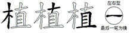 | SFHG₄ |
| 椅 |  | SDS₃ — SDSK₄ |
| 棺 |  | SPN₃ — SPNG₄ |
| 棵 |  | SJS₃ — SJSY₄ |
| 棱 |  | SFW₃ — SFWT₄ |
| 森 |  | SSS₃ — SSSU₄ |
| 棠 |  | IPKS₄ |
| 棚 |  | SEE₃ — SEEG₄ |
| 棘 |  | SMS₃ — SMSM₄ |
| 棕 |  | SPF₃ — SPFI₄ |
| 棒 |  | SDWG₄ |
| 棋 |  | SDW₃ — SDWY₄ |
| 棉 |  | SRM₃ — SRMH₄ |
| 检 |  | SWG₃ — SWGG₄ |
| 梳 |  | SYC₃ — SYCK₄ |
| 械 |  | SAA₃ — SAAH₄ |
| 梯 |  | SUX₃ — SUXT₄ |
| 梯 |  | SUX₃ — SUXT₄ |
| 梭 |  | SCW₃ — SCWT₄ |
| 梨 |  | TJS₃ — TJSU₄ |
| 梧 |  | SGK₃ — SGKG₄ |
| 梦 |  | SSQ₃ — SSQU₄ |
| 梢 |  | SIE₃ — SIEG₄ |
| 梗 |  | SGJR₄ |
| 梆 |  | SDT₃ — SDTB₄ |
| 梅 |  | STX₃ — STXY₄ |
| 梁 |  | IVW₃ — IVWS₄ |
| 桶 |  | SCE₃ — SCEH₄ |
| 桩 |  | SOF₃ — SOFG₄ |
| 桨 |  | UQS₃ — UQSU₄ |
| 桥 |  | STD₃ — STDJ₄ |
| 档 |  | SI₂ — SIV₃ — SIVG₄ |
| 桔 |  | SFK₃ — SFKG₄ |
| 桓 |  | SGJL₄ |
| 桑 |  | CCCS₄ |
| 桐 | 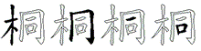 | SMGK₄ |
| 桌 |  | HJS₃ — HJSU₄ |
| 案 |  | PVS₃ — PVSU₄ |
| 框 |  | SAGG₄ |
| 桅 |  | SQD₃ — SQDB₄ |
| 桃 |  | SQI₃ — SQIY₄ |
| 桂 |  | SFF₃ — SFFG₄ |
| 栽 |  | FAS₃ — FASI₄ |
| 格 |  | STK₃ — STKG₄ |
| 根 |  | SV₂ — SVY₃ |
| 核 |  | SYN₃ — SYNW₄ |
| 样 |  | SU₂ — SUH₃ |
| 株 |  | STF₃ — STFY₄ |
| 校 |  | SUR₃ — SURY₄ |
| 栗 |  | SSU₃ |
| 栖 |  | SSG₃ |
| 栓 |  | SWGL₄ |
| 树 |  | SCF₃ — SCFY₄ |
| 栏 |  | SUD₃ — SUDG₄ |
| 栋 |  | SAI₃ — SAIY₄ |
| 栈 |  | SGA₃ — SGAY₄ |
| 标 |  | SFI₃ — SFIY₄ |
| 栅 |  | SMMG₄ |
| 柿 |  | SYM₃ — SYMH₄ |
| 柴 |  | HXS₃ — HXSU₄ |
| 柳 |  | SQT₃ — SQTB₄ |
| 柱 |  | SYG₃ — SYGG₄ |
| 柯 |  | SSK₃ — SSKG₄ |
| 柬 |  | SL₂ — SLD₃ — GLII₄ |
| 查 |  | SJ₂ — SJG₃ — SJGF₄ |
| 柠 |  | SPS₃ — SPSH₄ |
| 柞 |  | STH₃ — STHF₄ |
| 柜 |  | SAN₃ — SANG₄ |
| 柔 |  | CNHS₄ |
| 染 |  | IVS₃ — IVSU₄ |
| 柒 |  | IAS₃ — IASU₄ |
| 柑 |  | SFG₃ |
| 某 |  | FS₂ — FSU₃ |
| 柏 |  | SRG₃ |
| 柄 |  | SGMW₄ |
| 枷 |  | SEK₃ — SEKG₄ |
| 架 |  | EKS₃ — EKSU₄ |
| 枯 |  | SDG₃ |
| 枫 |  | SWR₃ — SWRY₄ |
| 枪 |  | SWB₃ — SWBN₄ |
| 枣 |  | GMIU₄ |
| 枢 |  | SAR₃ — SARY₄ |
| 枝 |  | SFC₃ — SFCY₄ |
| 果 |  | JS₂ — JSI₃ |
| 枚 |  | ST₂ — STY₃ |
| 林 |  | SS₂ — SSY₃ |
| 枕 |  | SP₂ — SPQ₃ — SPQN₄ |
| 析 |  | SR₂ — SRH₃ |
| 枉 |  | SGG₃ |
| 构 |  | SQ₂ — SQC₃ — SQCY₄ |
| 极 |  | SBY₃ — SBYY₄ |
| 极 |  | SBY₃ — SBYY₄ |
| 板 |  | SRC₃ — SRCY₄ |
| 松 |  | SWC₃ — SWCY₄ |
| 杰 |  | SO₂ — SOU₃ |
| 杯 |  | SDH₃ — SDHY₄ |
| 杭 |  | SYW₃ — SYWN₄ |
| 杨 |  | SNR₃ — SNRT₄ |
| 来 |  | GU₂ — GUS₃ — GUSI₄ |
| 条 |  | TS₂ — TSU₃ |
| 杠 |  | SAG₃ |
| 束 |  | SKI₃ — GKIL₄ |
| 杜 |  | SFG₃ |
| 杖 |  | SDY₃ — SDYY₄ |
| 村 |  | SFY₃ |
| 材 |  | SFT₃ — SFTT₄ |
| 杏 |  | SKF₃ |
| 李 |  | SB₂ — SBF₃ |
| 杉 |  | SE₂ — SET₃ |
| 杆 |  | SFH₃ |
| 权 |  | SC₂ — SCY₃ |
| 杂 |  | VS₂ — VSU₃ |
| 杀 |  | RSU₃ |
| 朽 |  | SGNL₄ |
| 机 |  | SW₂ — SWN₃ |
| 朵 |  | WSU₃ |
| 朴 |  | SHY₃ |
| 朱 |  | RII₃ |
| 术 |  | SY₂ — SYI₃ |
| 札 |  | SN₂ — SNN₃ |
| 本 |  | SG₂ — SGD₃ |
| 末 |  | GS₂ — GSI₃ |
| 未 |  | FII₃ — FGGY₄ |
| 木 |  | SSSS₄ |
| 期 |  | DWE₃ — DWEG₄ |
| 朝 |  | FJE₃ — FJEG₄ |
| 望 |  | YNEG₄ |
| 朗 |  | YVE₃ — YVEG₄ |
| 朔 |  | UBTE₄ |
| 服 |  | EB₂ — EBC₃ — EBCY₄ |
| 朋 |  | EE₂ — EEG₃ |
| 有 |  | E₁ — DEF₃ |
| 月 |  | EEE₃ — EEEE₄ |
| 最 |  | JB₂ — JBC₃ — JBCU₄ |
| 替 |  | GGJ₃ — GGJF₄ |
| 曾 |  | ULJ₃ — ULJF₄ |
| 曼 |  | JLC₃ — JLCU₄ |
| 曹 |  | GMAJ₄ |
| 更 |  | GJR₃ — GJRI₄ |
| 曳 |  | JNT₃ — JNTE₄ |
| 曲 |  | MA₂ — MAD₃ |
| 曰 |  | JHNG₄ |
| 曝 |  | JJA₃ — JJAI₄ |
| 曙 |  | JL₂ — JLFJ₄ |
| 暴 |  | JAW₃ — JAWI₄ |
| 暮 |  | AJDJ₄ |
| 暗 |  | JU₂ — JUJ₃ — JUJG₄ |
| 暖 |  | JEGC₄ |
| 暖 |  | JEGC₄ |
| 暑 |  | JFT₃ — JFTJ₄ |
| 暇 |  | JNH₃ — JNHC₄ |
| 暂 |  | LRJ₃ — LRJF₄ |
| 晾 |  | JYIY₄ |
| 智 |  | TDKJ₄ |
| 晶 |  | JJJ₃ — JJJF₄ |
| 晴 |  | JGE₃ — JGEG₄ |
| 晰 |  | JSR₃ — JSRH₄ |
| 景 |  | JYI₃ — JYIU₄ |
| 普 |  | UO₂ — UOJ₃ — UOJF₄ |
| 晨 |  | JD₂ — JDF₃ — JDFE₄ |
| 晦 |  | JTX₃ — JTXY₄ |
| 晤 |  | JGK₃ — JGKG₄ |
| 晚 |  | JQ₂ — JQKQ₄ |
| 晕 |  | JPL₃ — JPLJ₄ |
| 晓 |  | JA₂ — JAT₃ — JATQ₄ |
| 晒 |  | JSG₃ |
| 晌 |  | JTM₃ — JTMK₄ |
| 晋 |  | GOJ₃ — GOJF₄ |
| 晃 |  | JI₂ — JIG₃ — JIGQ₄ |
| 显 |  | JO₂ — JOF₃ |
| 昼 |  | NYJ₃ — NYJG₄ |
| 是 |  | J₁ — JGHU₄ |
| 昭 |  | JVK₃ — JVKG₄ |
| 昨 |  | JTH₃ — JTHF₄ |
| 昧 |  | JFY₃ |
| 春 |  | DWJ₃ — DWJF₄ |
| 映 |  | JMD₃ — JMDY₄ |
| 星 |  | JTG₃ — JTGF₄ |
| 昔 |  | AJF₃ |
| 易 |  | JQR₃ — JQRR₄ |
| 昏 | 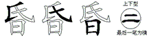 | QAJF₄ |
| 明 |  | JE₂ — JEG₃ |
| 昌 |  | JJ₂ — JJF₃ |
| 昆 |  | JX₂ — JXX₃ — JXXB₄ |
| 昂 |  | JQB₃ — JQBJ₄ |
| 旺 |  | JGG₃ |
| 旷 |  | JOT₃ |
| 时 |  | JF₂ — JFY₃ — JFLL₄ |
| 旱 |  | JFJ₃ |
| 旭 |  | VJ₂ — VJD₃ |
| 旬 |  | QJ₂ — QJD₃ |
| 早 |  | JH₂ — JHNH₄ |
| 旨 |  | XJ₂ — XJF₃ |
| 旧 |  | HJ₂ — HJG₃ |
| 旦 |  | JGF₃ |
| 日 |  | JJJJ₄ |
| 既 |  | VA₂ — VAQ₃ — VAQN₄ |
| 无 |  | FQ₂ — FQV₃ — GDNV₄ |
| 旗 |  | YTDW₄ |
| 族 |  | YTT₃ — YTTD₄ |
| 旋 |  | YTNH₄ |
| 旅 |  | YTE₃ — YTEY₄ |
| 旁 |  | YUP₃ — YUPY₄ |
| 施 |  | YTB₃ — YTBN₄ |
| 方 |  | YY₂ — YYGT₄ |
| 新 |  | USR₃ — USRH₄ |
| 斯 |  | DWR₃ — DWRH₄ |
| 断 |  | ON₂ — ONR₃ — ONRH₄ |
| 斩 |  | LR₂ — LRH₃ |
| 斧 |  | WRR₃ — WRRJ₄ |
| 斥 |  | RYI₃ |
| 斤 |  | RTT₃ — RTTH₄ |
| 斡 |  | FJWF₄ |
| 斟 |  | DWNF₄ |
| 斜 |  | WGSF₄ |
| 料 |  | OUF₃ — OUFH₄ |
| 斗 |  | UF₂ — UFK₃ |
| 斑 |  | GYG₃ — GYGG₄ |
| 斌 |  | YGA₃ — YGAY₄ |
| 斋 |  | YDM₃ — YDMJ₄ |
| 文 |  | YYGY₄ |
| 敷 |  | SYTY₄ |
| 整 |  | SKT₃ — SKTH₄ |
| 敲 |  | YKMC₄ |
| 数 |  | OV₂ — OVT₃ — OVTY₄ |
| 敬 |  | AQKT₄ |
| 敦 |  | YBT₃ — YBTY₄ |
| 散 |  | AETY₄ |
| 敢 |  | NB₂ — NBT₃ — NBTY₄ |
| 敞 |  | IMKT₄ |
| 敝 |  | ITY₃ |
| 敛 |  | WGIT₄ |
| 教 |  | FTBT₄ |
| 敖 |  | GQTY₄ |
| 救 |  | FIYT₄ |
| 敏 |  | TXT₃ — TXTY₄ |
| 敌 |  | TDT₃ — TDTY₄ |
| 效 |  | URT₃ — URTY₄ |
| 故 |  | DT₂ — DTY₃ |
| 政 |  | GHT₃ — GHTY₄ |
| 放 |  | YT₂ — YTY₃ |
| 攻 |  | AT₂ — ATY₃ |
| 改 |  | NT₂ — NTY₃ |
| 收 |  | NH₂ — NHT₃ — NHTY₄ |
| 支 |  | FC₂ — FCU₃ |
| 攫 |  | RHH₃ — RHHC₄ |
| 攫 |  | RHH₃ — RHHC₄ |
| 攘 |  | RYK₃ — RYKE₄ |
| 攒 |  | RTFM₄ |
| 攀 |  | SRR₃ — SRRR₄ |
| 擦 |  | RPWI₄ |
| 擞 |  | ROVT₄ |
| 擒 |  | RWYL₄ |
| 擎 |  | AQKR₄ |
| 操 | 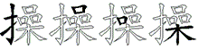 | RKKS₄ |
| 擅 |  | RYL₃ — RYLG₄ |
| 擂 |  | RFL₃ — RFLG₄ |
| 撼 |  | RDGN₄ |
| 撵 |  | RGG₃ — RGGL₄ |
| 撰 |  | RNNW₄ |
| 撮 |  | RJB₃ — RJBC₄ |
| 播 |  | RTO₃ — RTOL₄ |
| 撬 |  | REE₃ — REEE₄ |
| 撩 |  | RDU₃ — RDUI₄ |
| 撤 |  | RYC₃ — RYCT₄ |
| 撞 |  | RUJ₃ — RUJF₄ |
| 撕 |  | RDWR₄ |
| 撒 |  | RAE₃ — RAET₄ |
| 撑 |  | RIP₃ — RIPR₄ |
| 撇 |  | RITY₄ |
| 撅 |  | RDUW₄ |
| 撂 |  | RLT₃ — RLTK₄ |
| 摹 |  | AJDR₄ |
| 摸 |  | RAJD₄ |
| 摩 |  | OSSR₄ |
| 摧 |  | RMW₃ — RMWY₄ |
| 摘 |  | RYUD₄ |
| 摔 |  | RYX₃ — RYXF₄ |
| 摊 |  | RCW₃ — RCWY₄ |
| 摈 |  | RPR₃ — RPRW₄ |
| 摇 |  | RET₃ — RETB₄ |
| 摆 |  | RLF₃ — RLFC₄ |
| 摄 |  | RBCC₄ |
| 搽 | 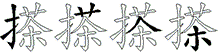 | RAWS₄ |
| 携 |  | RWYB₄ |
| 搭 | 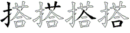 | RAWK₄ |
| 搬 |  | RTU₃ — RTUC₄ |
| 搪 |  | ROVK₄ |
| 搞 |  | RY₂ — RYM₃ — RYMK₄ |
| 搜 |  | REHC₄ |
| 搔 |  | RCYJ₄ |
| 搓 | 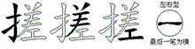 | RUAG₄ |
| 搐 |  | RYXL₄ |
| 搏 |  | RSF₃ — RSFY₄ |
| 搅 |  | RIPQ₄ |
| 搂 |  | ROV₃ — ROVG₄ |
| 搁 |  | RUT₃ — RUTK₄ |
| 搀 |  | RQKU₄ |
| 揽 |  | RJT₃ — RJTQ₄ |
| 援 |  | REG₃ — REGC₄ |
| 揭 |  | RJQ₃ — RJQN₄ |
| 揪 | 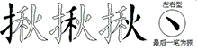 | RTOY₄ |
| 揩 |  | RXXR₄ |
| 揣 |  | RMD₃ — RMDJ₄ |
| 握 |  | RNG₃ — RNGF₄ |
| 揖 |  | RKB₃ — RKBG₄ |
| 插 |  | RTFE₄ |
| 提 |  | RJ₂ — RJGH₄ |
| 描 |  | RAL₃ — RALG₄ |
| 揍 | 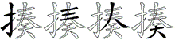 | RDWD₄ |
| 揍 |  | RDWD₄ |
| 揉 | 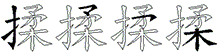 | RCNS₄ |
| 掺 |  | RCD₃ — RCDE₄ |
| 掸 |  | RUJL₄ |
| 掷 |  | RUDB₄ |
| 掳 |  | RHE₃ — RHET₄ |
| 措 |  | RAJ₃ — RAJG₄ |
| 掩 |  | RDJ₃ — RDJN₄ |
| 推 | 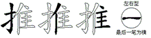 | RWYG₄ |
| 控 |  | RPW₃ — RPWA₄ |
| 接 |  | RUV₃ — RUVG₄ |
| 掣 |  | RMHR₄ |
| 探 | 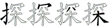 | RPWS₄ |
| 掠 | 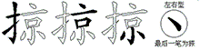 | RYKI₄ |
| 掘 |  | RNB₃ — RNBM₄ |
| 掖 |  | RYWY₄ |
| 排 |  | RHD₃ — RHDD₄ |
| 掐 |  | RQE₃ — RQEG₄ |
| 掏 |  | RQT₃ — RQTB₄ |
| 掌 | 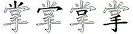 | IPKR₄ |
| 授 |  | REP₃ — REPC₄ |
| 掇 |  | RCC₃ — RCCC₄ |
| 掂 |  | ROH₃ — ROHK₄ |
| 掀 |  | RRQ₃ — RRQW₄ |
| 捻 |  | RWYN₄ |
| 捷 |  | RGV₃ — RGVH₄ |
| 捶 | 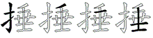 | RTGF₄ |
| 据 |  | RND₃ — RNDG₄ |
| 捧 |  | RDW₃ — RDWG₄ |
| 捣 |  | RQM₃ — RQMH₄ |
| 换 |  | RQ₂ — RQMD₄ |
| 捡 |  | RWG₃ — RWGG₄ |
| 损 |  | RKM₃ — RKMY₄ |
| 捞 |  | RAP₃ — RAPE₄ |
| 捕 |  | RSY₃ |
| 捐 |  | RKE₃ — RKEG₄ |
| 捏 |  | RJF₃ — RJFG₄ |
| 捎 |  | RIE₃ — RIEG₄ |
| 捌 | 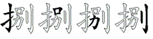 | RKEJ₄ |
| 捉 |  | RKH₃ — RKHY₄ |
| 捆 |  | RLS₃ — RLSY₄ |
| 捅 |  | RCE₃ — RCEH₄ |
| 捂 | 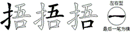 | RGKG₄ |
| 挽 |  | RQKQ₄ |
| 振 |  | RDFE₄ |
| 挫 |  | RWW₃ — RWWF₄ |
| 挪 |  | RVFB₄ |
| 挨 |  | RCT₃ — RCTD₄ |
| 挥 |  | RPL₃ — RPLH₄ |
| 挤 |  | RYJ₃ — RYJH₄ |
| 挣 |  | RQV₃ — RQVH₄ |
| 挡 |  | RIV₃ — RIVG₄ |
| 挠 |  | RAT₃ — RATQ₄ |
| 挟 |  | RGU₃ — RGUD₄ |
| 挞 |  | RDP₃ — RDPY₄ |
| 挝 |  | RFP₃ — RFPY₄ |
| 挛 |  | YOR₃ — YORJ₄ |
| 挚 |  | RVYR₄ |
| 挖 |  | RPWN₄ |
| 挑 |  | RQI₃ — RQIY₄ |
| 挎 |  | RDF₃ — RDFN₄ |
| 按 |  | RPV₃ — RPVG₄ |
| 指 |  | RX₂ — RXJ₃ — RXJG₄ |
| 挂 |  | RFFG₄ |
| 持 |  | RFF₃ — RFFY₄ |
| 拿 |  | WGLL₄ |
| 拾 |  | RWGK₄ |
| 拽 |  | RJN₃ — RJNT₄ |
| 拼 |  | RUA₃ — RUAH₄ |
| 拷 |  | RFT₃ — RFTN₄ |
| 拴 |  | RWGL₄ |
| 拳 |  | UGR₃ — UGRJ₄ |
| 拱 |  | RAW₃ — RAWY₄ |
| 拯 |  | RBI₃ — RBIG₄ |
| 拭 |  | RAA₃ — RAAY₄ |
| 括 |  | RTD₃ — RTDG₄ |
| 择 |  | RCG₃ — RCGH₄ |
| 拨 |  | RNT₃ — RNTY₄ |
| 拧 |  | RPS₃ — RPSH₄ |
| 拦 |  | RUD₃ — RUDG₄ |
| 拥 |  | RE₂ — REH₃ |
| 拣 |  | RGNW₄ |
| 拢 |  | RDX₃ — RDXY₄ |
| 拟 |  | RNY₃ — RNYW₄ |
| 拜 |  | RGDH₄ |
| 招 |  | RVK₃ — RVKG₄ |
| 拙 |  | RBM₃ — RBMH₄ |
| 拘 |  | RQK₃ — RQKG₄ |
| 拖 |  | RTB₃ — RTBN₄ |
| 拔 |  | RDC₃ — RDCY₄ |
| 拓 |  | RD₂ — RDG₃ |
| 拒 |  | RAN₃ — RANG₄ |
| 拐 | 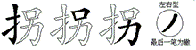 | RKEN₄ |
| 拎 |  | RWLL₄ |
| 拍 |  | RRG₃ |
| 拌 |  | RUGH₄ |
| 拉 |  | RU₂ — RUG₃ |
| 拈 |  | RHK₃ — RHKG₄ |
| 拇 |  | RXY₃ |
| 拆 |  | RRY₃ — RRYY₄ |
| 担 |  | RJG₃ — RJGG₄ |
| 拄 |  | RYG₃ — RYGG₄ |
| 拂 |  | RXJH₄ |
| 抿 |  | RNA₃ — RNAN₄ |
| 押 |  | RL₂ — RLH₃ |
| 抹 |  | RGS₃ — RGSY₄ |
| 抵 |  | RQA₃ — RQAY₄ |
| 抱 |  | RQN₃ — RQNN₄ |
| 抬 |  | RCK₃ — RCKG₄ |
| 披 |  | RBY₃ |
| 抨 |  | RGUF₄ |
| 报 |  | RB₂ — RBC₃ — RBCY₄ |
| 护 |  | RYN₃ — RYNT₄ |
| 抢 |  | RWB₃ — RWBN₄ |
| 抡 |  | RWX₃ — RWXN₄ |
| 抠 |  | RAR₃ — RARY₄ |
| 抛 |  | RVE₃ — RVET₄ |
| 抚 |  | RFQ₃ — RFQN₄ |
| 折 |  | RR₂ — RRH₃ |
| 抗 |  | RYW₃ — RYWN₄ |
| 抖 |  | RUF₃ — RUFH₄ |
| 投 |  | RWC₃ — RWCY₄ |
| 抓 |  | RRHY₄ |
| 抒 |  | RCNH₄ |
| 抑 |  | RQB₃ — RQBH₄ |
| 把 |  | RCN₃ |
| 抉 |  | RNW₃ — RNWY₄ |
| 抄 |  | RIT₃ — RITT₄ |
| 技 |  | RFC₃ — RFCY₄ |
| 承 |  | BD₂ — BDI₃ — BDII₄ |
| 找 |  | RA₂ — RAY₃ |
| 批 |  | RXX₃ — RXXN₄ |
| 扶 |  | RGY₃ |
| 扳 |  | RRC₃ — RRCY₄ |
| 扰 |  | RDN₃ — RDNY₄ |
| 扯 |  | RHG₃ |
| 扮 |  | RWVT₄ |
| 扭 |  | RNH₃ — RNHG₄ |
| 扬 |  | RNR₃ — RNRT₄ |
| 扫 |  | RV₂ — RVG₃ |
| 扩 |  | RO₂ — ROT₃ |
| 执 |  | RVY₃ — RVYY₄ |
| 扦 |  | RTFH₄ |
| 扣 |  | RK₂ — RKG₃ |
| 扛 |  | RAG₃ |
| 托 |  | RTA₃ — RTAN₄ |
| 扔 |  | RBN₃ |
| 打 |  | RS₂ — RSH₃ |
| 扒 |  | RWY₃ |
| 扑 |  | RHY₃ |
| 扎 |  | RNN₃ |
| 才 |  | FT₂ — FTE₃ — GHTE₄ |
| 手 |  | RT₂ — RTGH₄ |
| 扇 |  | YNND₄ |
| 扁 |  | YNMA₄ |
| 所 |  | RN₂ — RNRH₄ |
| 房 |  | YNY₃ — YNYE₄ |
| 户 |  | YNE₃ |
| 戴 |  | FALW₄ |
| 戳 |  | NWYA₄ |
| 戮 |  | NWE₃ — NWEA₄ |
| 截 |  | FAWY₄ |
| 戚 |  | DHII₄ |
| 战 |  | HKA₃ — HKAY₄ |
| 或 |  | AK₂ — AKGD₄ |
| 戒 |  | AAI₃ |
| 我 |  | Q₁ — TRN₃ — TRNY₄ |
| 成 |  | DN₂ — DNV₃ |
| 戏 |  | CA₂ — CAY₃ |
| 戎 |  | ADI₃ |
| 戍 |  | AWI₃ |
| 戌 |  | DGI₃ |
| 戊 |  | DGTY₄ |
| 戈 |  | AGNY₄ |
| 懦 |  | NFD₃ — NFDJ₄ |
| 懒 |  | NS₂ — NSK₃ — NSKM₄ |
| 懊 |  | NTM₃ — NTMD₄ |
| 懈 |  | NQ₂ — NQE₃ — NQEG₄ |
| 懂 |  | NAT₃ — NATF₄ |
| 憾 |  | NDGN₄ |
| 憨 |  | NBTN₄ |
| 憎 |  | NUL₃ — NULJ₄ |
| 慷 |  | NOVI₄ |
| 慰 |  | NFI₃ — NFIN₄ |
| 慨 |  | NVA₃ — NVAQ₄ |
| 慧 |  | DHD₃ — DHDN₄ |
| 慢 |  | NJ₂ — NJL₃ — NJLC₄ |
| 慕 |  | AJDN₄ |
| 慑 |  | NBC₃ — NBCC₄ |
| 慎 |  | NFH₃ — NFHW₄ |
| 慌 |  | NAY₃ — NAYK₄ |
| 愿 |  | DRIN₄ |
| 愧 |  | NRQ₃ — NRQC₄ |
| 愤 |  | NFA₃ — NFAM₄ |
| 感 |  | DGKN₄ |
| 愚 |  | JMHN₄ |
| 意 |  | UJN₃ — UJNU₄ |
| 愉 |  | NWG₃ — NWGJ₄ |
| 愈 |  | WGE₃ — WGEN₄ |
| 愁 | 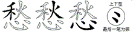 | TONL₄ |
| 惺 |  | NJT₃ — NJTG₄ |
| 惹 |  | ADKN₄ |
| 惶 |  | NRGG₄ |
| 想 |  | SHN₃ — SHNU₄ |
| 惰 |  | NDA₃ — NDAE₄ |
| 惯 |  | NXM₃ — NXMY₄ |
| 惮 |  | NUJ₃ — NUJF₄ |
| 惫 |  | TLN₃ — TLNU₄ |
| 惩 |  | TGHN₄ |
| 惨 |  | NCD₃ — NCDE₄ |
| 惧 |  | NHW₃ — NHWY₄ |
| 惦 |  | NOH₃ — NOHK₄ |
| 惠 |  | GJH₃ — GJHN₄ |
| 惟 |  | NWY₃ — NWYG₄ |
| 惜 |  | NAJG₄ |
| 惕 |  | NJQ₃ — NJQR₄ |
| 惑 |  | AKGN₄ |
| 惋 |  | NPQB₄ |
| 惊 |  | NYIY₄ |
| 情 |  | NGE₃ — NGEG₄ |
| 悼 |  | NHJH₄ |
| 悸 |  | NTB₃ — NTBG₄ |
| 悲 |  | HDH₃ — HDHN₄ |
| 悯 |  | NUY₃ — NUYY₄ |
| 悬 |  | EGCN₄ |
| 您 |  | WQIN₄ |
| 悦 |  | NUK₃ — NUKQ₄ |
| 患 |  | KKHN₄ |
| 悠 |  | WHTN₄ |
| 悟 |  | NGKG₄ |
| 悔 |  | NTX₃ — NTXY₄ |
| 悍 |  | NJF₃ — NJFH₄ |
| 悉 |  | TON₃ — TONU₄ |
| 悄 |  | NIE₃ — NIEG₄ |
| 恿 | 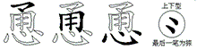 | CENU₄ |
| 恼 |  | NYR₃ — NYRB₄ |
| 恳 |  | VN₂ — VNU₃ |
| 息 |  | THN₃ — THNU₄ |
| 恭 | 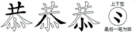 | AWNU₄ |
| 恬 |  | NTD₃ — NTDG₄ |
| 恩 |  | LDN₃ — LDNU₄ |
| 恨 |  | NV₂ — NVY₃ |
| 恤 |  | NTL₃ — NTLG₄ |
| 恢 |  | NDO₃ — NDOY₄ |
| 恕 |  | VKN₃ — VKNU₄ |
| 恒 |  | NGJ₃ — NGJG₄ |
| 恐 |  | AWY₃ — AWYN₄ |
| 恍 |  | NIG₃ — NIGQ₄ |
| 恋 |  | YON₃ — YONU₄ |
| 恃 |  | NFF₃ — NFFY₄ |
| 总 |  | UKN₃ — UKNU₄ |
| 怯 |  | NFCL₄ |
| 怪 |  | NC₂ — NCF₃ — NCFG₄ |
| 怨 |  | QBN₃ — QBNU₄ |
| 性 |  | NTG₃ — NTGG₄ |
| 急 |  | QVN₃ — QVNU₄ |
| 怠 |  | CKN₃ — CKNU₄ |
| 思 |  | LN₂ — LNU₃ |
| 怜 |  | NWYC₄ |
| 怖 |  | NDM₃ — NDMH₄ |
| 怕 |  | NR₂ — NRG₃ |
| 怔 |  | NGH₃ — NGHG₄ |
| 怒 |  | VCN₃ — VCNU₄ |
| 怎 |  | THFN₄ |
| 怂 |  | WWNU₄ |
| 态 |  | DYN₃ — DYNU₄ |
| 怀 |  | NDH₃ — NDHY₄ |
| 忿 |  | WVNU₄ |
| 忽 |  | QRN₃ — QRNU₄ |
| 忻 |  | NRH₃ |
| 念 |  | WYNN₄ |
| 忱 |  | NP₂ — NPQ₃ — NPQN₄ |
| 快 |  | NNW₃ — NNWY₄ |
| 忧 |  | NDN₃ — NDNY₄ |
| 忠 |  | KHN₃ — KHNU₄ |
| 忙 |  | NYN₃ — NYNN₄ |
| 忘 |  | YNNU₄ |
| 志 |  | FN₂ — FNU₃ |
| 忍 |  | VYN₃ — VYNU₄ |
| 忌 |  | NNU₃ |
| 忆 |  | NNN₃ |
| 必 |  | NTE₃ |
| 心 |  | NY₂ — NYNY₄ |
| 徽 |  | TMGL₄ |
| 德 |  | TFL₃ — TFLN₄ |
| 微 |  | TMG₃ — TMGT₄ |
| 循 |  | TRF₃ — TRFH₄ |
| 御 |  | TTG₃ — TTGB₄ |
| 徘 |  | TDJD₄ |
| 徘 |  | TDJD₄ |
| 得 |  | TJ₂ — TJG₃ — TJGF₄ |
| 徒 |  | TFHY₄ |
| 徐 |  | TWG₃ — TWGS₄ |
| 律 |  | TVG₃ — TVGH₄ |
| 徊 |  | TLK₃ — TLKG₄ |
| 很 |  | TVY₃ |
| 待 |  | TFFY₄ |
| 径 |  | TCA₃ — TCAG₄ |
| 征 |  | TGH₃ — TGHG₄ |
| 往 |  | TYG₃ — TYGG₄ |
| 彼 |  | TBY₃ — THCY₄ |
| 彻 |  | TAVT₄ |
| 役 |  | TWC₃ — TWCY₄ |
| 影 |  | JY₂ — JYIE₄ |
| 彰 |  | UJE₃ — UJET₄ |
| 彭 |  | FKUE₄ |
| 彬 |  | SSE₃ — SSET₄ |
| 彪 |  | HWE₃ — HWEE₄ |
| 彩 |  | ESE₃ — ESET₄ |
| 彦 |  | YUDE₄ |
| 彤 |  | MYE₃ — MYET₄ |
| 形 |  | GAE₃ — GAET₄ |
| 彝 |  | XOXA₄ |
| 录 |  | VI₂ — VIU₃ |
| 当 |  | IV₂ — IVF₃ |
| 归 |  | JV₂ — JVG₃ |
| 强 |  | XK₂ — XKJ₃ — XKJY₄ |
| 弹 |  | XUJ₃ — XUJF₄ |
| 弱 |  | XU₂ — XUX₃ — XUXU₄ |
| 弯 |  | YOX₃ — YOXB₄ |
| 弧 |  | XRC₃ — XRCY₄ |
| 弦 |  | XYX₃ — XYXY₄ |
| 弥 |  | XQI₃ — XQIY₄ |
| 张 |  | XTA₃ — XTAY₄ |
| 弟 |  | UXH₃ — UXHT₄ |
| 弛 |  | XBN₃ |
| 弘 |  | XC₂ — XCY₃ |
| 弗 |  | XJK₃ |
| 引 |  | XH₂ — XHH₃ |
| 式 |  | AA₂ — AAY₃ — AAYI₄ |
| 弊 |  | ITA₃ — ITAJ₄ |
| 弄 |  | GAJ₃ |
| 弄 |  | GAJ₃ |
| 弃 |  | YCA₃ — YCAJ₄ |
| 异 |  | NA₂ — NAJ₃ |
| 开 |  | GA₂ — GAK₃ |
| 建 |  | VG₂ — VGP₃ — VGPK₄ |
| 廷 |  | TFPD₄ |
| 延 |  | THNP₄ |
| 廖 |  | ONWE₄ |
| 廓 |  | OYB₃ — OYBB₄ |
| 廊 |  | OYVB₄ |
| 廉 |  | OUV₃ — OUVW₄ |
| 庸 |  | OVE₃ — OVEH₄ |
| 康 |  | OVI₃ — OVII₄ |
| 庶 |  | OAO₃ — OAOI₄ |
| 庭 |  | OT₂ — OTFP₄ |
| 座 |  | OWW₃ — OWWF₄ |
| 度 |  | OAC₃ — OACI₄ |
| 废 |  | ONT₃ — ONTY₄ |
| 庞 |  | ODX₃ — ODXY₄ |
| 府 |  | OW₂ — OWF₃ — OWFI₄ |
| 庚 |  | OVW₃ — OVWI₄ |
| 庙 |  | OMD₃ |
| 店 |  | OHK₃ — OHKD₄ |
| 底 |  | OQ₂ — OQA₃ — OQAY₄ |
| 应 |  | OI₂ — OIG₃ — OIGD₄ |
| 库 |  | OL₂ — OLK₃ |
| 庐 |  | OYNE₄ |
| 序 |  | OC₂ — OCNH₄ |
| 床 |  | OS₂ — OSI₃ |
| 庇 |  | OXX₃ — OXXV₄ |
| 庆 |  | ODI₃ |
| 庄 |  | OF₂ — OFD₃ |
| 广 |  | OY₂ — OYG₃ — OYGT₄ |
| 幽 |  | MX₂ — MXX₃ — MXXI₄ |
| 幼 |  | XEN₃ |
| 幻 |  | XNN₃ |
| 幸 |  | FUF₃ — FUFJ₄ |
| 并 |  | UA₂ — UAJ₃ |
| 年 |  | TG₂ — TGJ₃ — RHFK₄ |
| 平 |  | GUF₃ — GUFK₄ |
| 干 |  | FGGH₄ |
| 幢 |  | MHU₃ — MHUF₄ |
| 幕 |  | AJDH₄ |
| 幌 |  | MHJQ₄ |
| 幅 |  | MHG₃ — MHGL₄ |
| 幂 |  | PJD₃ — PJDH₄ |
| 帽 |  | MHJ₃ — MHJH₄ |
| 常 |  | IPK₃ — IPKH₄ |
| 帮 |  | DTBL₄ |
| 席 |  | OA₂ — OAM₃ — OAMH₄ |
| 帧 |  | MHH₃ — MHHM₄ |
| 带 |  | GKP₃ — GKPH₄ |
| 帝 | 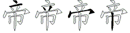 | YUPH₄ |
| 帜 |  | MHKW₄ |
| 帛 |  | RMH₃ — RMHJ₄ |
| 帚 |  | VPM₃ — VPMH₄ |
| 帘 |  | PWM₃ — PWMH₄ |
| 帖 |  | MHHK₄ |
| 帕 |  | MHR₃ — MHRG₄ |
| 帐 |  | MHT₃ — MHTY₄ |
| 希 |  | RDM₃ — RDMH₄ |
| 师 |  | JGM₃ — JGMH₄ |
| 帆 |  | MHW₃ — MHWY₄ |
| 帅 |  | JMH₃ — JMHH₄ |
| 布 |  | DMH₃ — DMHJ₄ |
| 市 |  | YM₂ — YMHJ₄ |
| 市 |  | YM₂ — YMHJ₄ |
| 币 |  | TMH₃ — TMHK₄ |
| 巾 |  | MHK₃ |
| 巷 |  | AWN₃ — AWNB₄ |
| 巴 |  | CNH₃ — CNHN₄ |
| 巳 |  | NNGN₄ |
| 已 |  | NN₂ — NNNN₄ |
| 己 |  | NNG₃ — NNGN₄ |
| 差 |  | UAF₃ |
| 巫 |  | AWW₃ — AWWI₄ |
| 巩 |  | AWYY₄ |
| 巨 |  | AND₃ — GNNV₄ |
| 巧 |  | AGNN₄ |
| 左 |  | DA₂ — DAF₃ |
| 工 |  | A₁ — AAA₃ — AAAA₄ |
| 巢 |  | VJS₃ — VJSU₄ |
| 巡 |  | VPV₃ |
| 州 |  | YTYH₄ |
| 川 |  | KTHH₄ |
| 嵌 |  | MFQ₃ — MFQW₄ |
| 崭 |  | ML₂ — MLR₃ — MLRJ₄ |
| 崩 |  | MEE₃ — MEEF₄ |
| 崖 |  | MDFF₄ |
| 崔 |  | MWY₃ — MWYF₄ |
| 崎 |  | MDS₃ — MDSK₄ |
| 崇 |  | MPF₃ — MPFI₄ |
| 峻 |  | MC₂ — MCW₃ — MCWT₄ |
| 峰 |  | MTD₃ — MTDH₄ |
| 峭 |  | MI₂ — MIE₃ — MIEG₄ |
| 峪 |  | MWWK₄ |
| 峨 |  | MTR₃ — MTRY₄ |
| 峦 |  | YOM₃ — YOMJ₄ |
| 峡 |  | MGU₃ — MGUD₄ |
| 峙 |  | MFF₃ — MFFY₄ |
| 岿 |  | MJV₃ — MJVF₄ |
| 岸 |  | MDFJ₄ |
| 岳 |  | RMJ₃ |
| 岭 |  | MWYC₄ |
| 岭 |  | MWYC₄ |
| 岩 |  | MDF₃ |
| 岛 |  | QMK₃ |
| 岗 |  | MMR₃ — MMRU₄ |
| 岂 |  | MN₂ — MNB₃ |
| 岁 |  | MQU₃ |
| 屿 |  | MGN₃ — MGNG₄ |
| 屹 |  | MTN₃ — MTNN₄ |
| 山 |  | MMM₃ — MMMM₄ |
| 屯 |  | GBN₃ — GBNV₄ |
| 屯 |  | GBN₃ — GBNV₄ |
| 履 |  | NTT₃ — NTTT₄ |
| 屡 |  | NO₂ — NOV₃ — NOVD₄ |
| 屠 |  | NFT₃ — NFTJ₄ |
| 属 |  | NTK₃ — NTKY₄ |
| 展 |  | NAE₃ — NAEI₄ |
| 屑 |  | NIED₄ |
| 屏 |  | NUA₃ — NUAK₄ |
| 屎 |  | NOI₃ |
| 屋 |  | NGC₃ — NGCF₄ |
| 届 |  | NM₂ — NMD₃ |
| 屉 |  | NAN₃ — NANV₄ |
| 屈 |  | NBM₃ — NBMK₄ |
| 居 |  | ND₂ — NDD₃ |
| 层 |  | NFC₃ — NFCI₄ |
| 屁 |  | NXX₃ — NXXV₄ |
| 局 |  | NNK₃ — NNKD₄ |
| 尿 |  | NI₂ — NII₃ |
| 尾 |  | NE₂ — NEV₃ |
| 尽 |  | NYU₃ — NYUU₄ |
| 尼 |  | NX₂ — NXV₃ |
| 尺 |  | NYI₃ |
| 尹 |  | VTE₃ |
| 尸 |  | NNGT₄ |
| 就 |  | YI₂ — YID₃ — YIDY₄ |
| 尧 |  | ATGQ₄ |
| 尤 |  | DNY₃ — DNYI₄ |
| 尝 |  | IPF₃ — IPFC₄ |
| 尚 |  | IMK₃ — IMKF₄ |
| 尘 |  | IFF₃ |
| 尖 |  | ID₂ — IDU₃ |
| 尔 |  | QI₂ — QIU₃ |
| 少 |  | IT₂ — ITE₃ |
| 小 |  | IH₂ — IHT₃ — IHTY₄ |
| 尊 |  | USG₃ — USGF₄ |
| 尉 |  | NFIF₄ |
| 将 |  | UQF₃ — UQFY₄ |
| 射 |  | TMD₃ — TMDF₄ |
| 封 |  | FFFY₄ |
| 寿 |  | DTF₃ — DTFU₄ |
| 导 |  | NF₂ — NFU₃ |
| 寻 |  | VF₂ — VFU₃ |
| 寺 |  | FF₂ — FFU₃ |
| 对 |  | CF₂ — CFY₃ |
| 寸 |  | FGL₃ — FGHY₄ |
| 寨 |  | PAWS₄ |
| 寥 |  | PNW₃ — PNWE₄ |
| 寡 |  | PDE₃ — PDEV₄ |
| 察 |  | PWFI₄ |
| 寞 |  | PAJ₃ — PAJD₄ |
| 寝 |  | PUVC₄ |
| 寓 |  | PJM₃ — PJMY₄ |
| 寒 |  | PAW₃ — PAWU₄ |
| 寐 |  | PUFU₄ |
| 富 |  | PGK₃ — PGKL₄ |
| 寇 |  | PFQC₄ |
| 密 |  | PNT₃ — PNTM₄ |
| 寅 |  | PGM₃ — PGMW₄ |
| 寄 |  | PDS₃ — PDSK₄ |
| 寂 |  | PH₂ — PHI₃ — PHIC₄ |
| 宿 |  | PWDJ₄ |
| 宾 |  | PR₂ — PRW₃ — PRWU₄ |
| 宽 |  | PAM₃ — PAMQ₄ |
| 容 |  | PWW₃ — PWWK₄ |
| 家 |  | PG₂ — PGE₃ — PGEU₄ |
| 宵 |  | PI₂ — PIE₃ — PIEF₄ |
| 宴 |  | PJV₃ — PJVF₄ |
| 害 |  | PD₂ — PDHK₄ |
| 宰 |  | PUJ₃ |
| 宫 |  | PK₂ — PKK₃ — PKKF₄ |
| 宪 |  | PTF₃ — PTFQ₄ |
| 宦 |  | PAH₃ — PAHH₄ |
| 室 |  | PGC₃ — PGCF₄ |
| 宣 |  | PGJ₃ — PGJG₄ |
| 客 |  | PT₂ — PTK₃ — PTKF₄ |
| 审 |  | PJ₂ — PJH₃ — PJHJ₄ |
| 宠 |  | PDX₃ — PDXY₄ |
| 实 |  | PU₂ — PUD₃ — PUDU₄ |
| 宝 |  | PGY₃ — PGYU₄ |
| 宜 |  | PEG₃ — PEGF₄ |
| 宛 |  | PQ₂ — PQB₃ — PQBB₄ |
| 定 |  | PGH₃ — PGHU₄ |
| 宙 |  | PM₂ — PMF₃ |
| 官 |  | PN₂ — PNF₃ |
| 宗 |  | PFI₃ — PFIU₄ |
| 宏 |  | PDC₃ — PDCU₄ |
| 完 |  | PFQ₃ — PFQB₄ |
| 宋 |  | PSU₃ |
| 安 |  | PV₂ — PVF₃ |
| 守 |  | PF₂ — PFU₃ |
| 宇 |  | PGF₃ — PGFJ₄ |
| 宅 |  | PTA₃ — PTAB₄ |
| 它 |  | PX₂ — PXB₃ |
| 宁 |  | PS₂ — PSJ₃ |
| 孽 |  | ATNB₄ |
| 孺 |  | BFD₃ — BFDJ₄ |
| 孵 |  | QTYB₄ |
| 孰 |  | YKBY₄ |
| 孪 |  | YOB₃ — YOBF₄ |
| 孩 |  | BYN₃ — BYNW₄ |
| 学 |  | IPB₃ — IPBF₄ |
| 孤 |  | BR₂ — BRC₃ — BRCY₄ |
| 季 |  | TBF₃ |
| 孟 |  | BLF₃ |
| 孝 |  | FTB₃ — FTBF₄ |
| 孜 |  | BTY₃ |
| 孙 |  | BI₂ — BIY₃ |
| 存 |  | DHB₃ — DHBD₄ |
| 字 |  | PB₂ — PBF₃ |
| 孕 |  | BBF₃ |
| 孔 |  | BNN₃ |
| 子 |  | BB₂ — BBB₃ — BBBB₄ |
| 嫩 |  | VSK₃ — VSKT₄ |
| 嫡 |  | VYU₃ — VYUD₄ |
| 嫌 |  | VU₂ — VUV₃ — VUVW₄ |
| 嫉 |  | VUT₃ — VUTD₄ |
| 嫂 |  | VEH₃ — VEHC₄ |
| 嫁 |  | VPG₃ — VPGE₄ |
| 媳 |  | VTH₃ — VTHN₄ |
| 媚 |  | VNH₃ — VNHG₄ |
| 媒 |  | VFS₃ — VFSY₄ |
| 婿 |  | VNHE₄ |
| 婶 |  | VPJ₃ — VPJH₄ |
| 婴 |  | MMV₃ — MMVF₄ |
| 婪 |  | SSV₃ — SSVF₄ |
| 婚 |  | VQ₂ — VQA₃ — VQAJ₄ |
| 婉 |  | VPQ₃ — VPQB₄ |
| 婆 |  | IBV₃ — IBVF₄ |
| 娶 |  | BCV₃ — BCVF₄ |
| 娱 |  | VKGD₄ |
| 娩 |  | VQK₃ — VQKQ₄ |
| 娥 |  | VTR₃ — VTRY₄ |
| 娠 |  | VDF₃ — VDFE₄ |
| 娟 |  | VKE₃ — VKEG₄ |
| 娜 |  | VNG₃ — VNGB₄ |
| 娘 |  | VYV₃ — VYVY₄ |
| 娇 |  | VTDJ₄ |
| 娄 |  | OVF₃ |
| 娃 |  | VFFG₄ |
| 威 |  | DGV₃ — DGVD₄ |
| 姿 |  | UQWV₄ |
| 姻 |  | VL₂ — VLD₃ — VLDY₄ |
| 姬 |  | VAH₃ — VAHH₄ |
| 姨 |  | VGX₃ — VGXW₄ |
| 姨 |  | VGX₃ — VGXW₄ |
| 姥 |  | VFT₃ — VFTX₄ |
| 姥 |  | VFT₃ — VFTX₄ |
| 姜 |  | UGVF₄ |
| 姚 |  | VQI₃ — VQIY₄ |
| 委 |  | TV₂ — TVF₃ |
| 姓 |  | VTG₃ — VTGG₄ |
| 姑 |  | VD₂ — VDG₃ |
| 姐 |  | VE₂ — VEG₃ — VEGG₄ |
| 始 |  | VCK₃ — VCKG₄ |
| 姆 |  | VX₂ — VXY₃ |
| 妻 |  | GV₂ — GVH₃ — GVHV₄ |
| 妹 |  | VFY₃ |
| 妮 |  | VNX₃ — VNXN₄ |
| 妨 |  | VY₂ — VYT₃ |
| 妥 |  | EV₂ — EVF₃ |
| 妙 |  | VIT₃ — VITT₄ |
| 妖 |  | VTD₃ — VTDY₄ |
| 妓 |  | VFC₃ — VFCY₄ |
| 妒 |  | VYNT₄ |
| 妊 |  | VTF₃ — VTFG₄ |
| 妈 |  | VC₂ — VCG₃ — VCGG₄ |
| 妇 |  | VV₂ — VVG₃ |
| 妆 |  | UV₂ — UVG₃ |
| 妄 |  | YNVF₄ |
| 如 |  | VK₂ — VKG₃ |
| 好 |  | VB₂ — VBG₃ |
| 她 |  | VBN₃ |
| 奸 |  | VFH₃ |
| 奶 |  | VBT₃ |
| 奴 |  | VCY₃ |
| 女 |  | VVV₃ — VVVV₄ |
| 奢 |  | DFT₃ — DFTJ₄ |
| 奠 |  | USLL₄ |
| 套 |  | DDU₃ |
| 奖 |  | UQD₃ — UQDU₄ |
| 奔 |  | DFA₃ — DFAJ₄ |
| 契 |  | DHV₃ — DHVD₄ |
| 奏 |  | DWGD₄ |
| 奎 |  | DFF₃ — DFFF₄ |
| 奋 |  | DLF₃ |
| 奉 |  | DWG₃ — DWGJ₄ |
| 奈 |  | DFI₃ — DFIU₄ |
| 奇 |  | DSKF₄ |
| 奄 |  | DJN₃ — DJNB₄ |
| 夺 |  | DF₂ — DFU₃ |
| 夹 |  | GUD₃ — GUDI₄ |
| 夸 |  | DFNB₄ |
| 夷 |  | GXW₃ — GXWI₄ |
| 头 |  | UD₂ — UDI₃ |
| 失 |  | TGI₃ |
| 夯 |  | DEB₃ |
| 央 |  | MD₂ — MDI₃ |
| 太 |  | DY₂ — DYI₃ |
| 天 |  | GD₂ — GDI₃ |
| 大 |  | DD₂ — DDDD₄ |
| 够 |  | QKQQ₄ |
| 夜 |  | YWT₃ — YWTY₄ |
| 多 |  | QQ₂ — QQU₃ |
| 外 |  | QH₂ — QHY₃ |
| 夕 |  | QTNY₄ |
| 夏 |  | DHT₃ — DHTU₄ |
| 夏 |  | DHT₃ — DHTU₄ |
| 复 |  | TJT₃ — TJTU₄ |
| 备 |  | TL₂ — TLF₃ |
| 处 |  | TH₂ — THI₃ — QYHI₄ |
| 壹 |  | FPG₃ — FPGU₄ |
| 壶 |  | FPO₃ — FPOF₄ |
| 壳 |  | FPW₃ — FPWB₄ |
| 声 |  | FNR₃ |
| 壮 |  | UFG₃ |
| 壬 |  | TFD₃ |
| 士 |  | FGHL₄ |
| 壤 |  | FYK₃ — FYKE₄ |
| 壕 |  | FYP₃ — FYPE₄ |
| 壁 |  | NKUF₄ |
| 墩 |  | FYB₃ — FYBT₄ |
| 墨 |  | LFOF₄ |
| 墟 |  | FHO₃ — FHOG₄ |
| 增 |  | FU₂ — FUL₃ — FULJ₄ |
| 墙 |  | FFUK₄ |
| 墓 |  | AJDF₄ |
| 墒 |  | FYUK₄ |
| 墅 |  | JFCF₄ |
| 境 |  | FUJ₃ — FUJQ₄ |
| 填 |  | FFH₃ — FFHW₄ |
| 塞 |  | PAWF₄ |
| 塘 |  | FOV₃ — FOVK₄ |
| 塔 |  | FAW₃ — FAWK₄ |
| 塑 |  | UBT₃ — UBTF₄ |
| 塌 |  | FJN₃ — FJNG₄ |
| 堵 |  | FFT₃ — FFTJ₄ |
| 堰 |  | FAJV₄ |
| 堪 |  | FDW₃ — FDWN₄ |
| 堤 |  | FJGH₄ |
| 堡 |  | WKSF₄ |
| 堕 |  | BDEF₄ |
| 堑 |  | LRF₃ — LRFF₄ |
| 堆 |  | FWY₃ — FWYG₄ |
| 堂 |  | IPKF₄ |
| 基 |  | DWF₃ — DWFF₄ |
| 培 |  | FUK₃ — FUKG₄ |
| 埠 |  | FTN₃ — FTNF₄ |
| 域 |  | FA₂ — FAKG₄ |
| 埔 |  | FSY₃ |
| 城 |  | FD₂ — FDN₃ — FDNN₄ |
| 埋 |  | FJF₃ — FJFG₄ |
| 埃 |  | FCT₃ — FCTD₄ |
| 埂 |  | FGJR₄ |
| 垮 |  | FDFN₄ |
| 垫 |  | RVYF₄ |
| 垦 |  | VFF₃ |
| 垣 |  | FGJ₃ — FGJG₄ |
| 垣 |  | FGJ₃ — FGJG₄ |
| 垢 |  | FR₂ — FRG₃ — FRGK₄ |
| 垛 |  | FWS₃ — FWSY₄ |
| 垒 |  | CCCF₄ |
| 型 |  | GAJF₄ |
| 垄 |  | DXYF₄ |
| 垃 |  | FUG₃ |
| 垂 |  | TGAF₄ |
| 坷 |  | FSK₃ — FSKG₄ |
| 坯 |  | FGTG₄ |
| 坪 |  | FGU₃ — FGUF₄ |
| 坦 |  | FJG₃ — FJGG₄ |
| 坤 |  | FJHH₄ |
| 坡 |  | FB₂ — FBY₃ |
| 坠 |  | BWFF₄ |
| 坟 |  | FYY₃ |
| 坞 |  | FTNG₄ |
| 坝 |  | FMY₃ |
| 坛 |  | FFC₃ — FFCY₄ |
| 坚 |  | JC₂ — JCF₃ — JCFF₄ |
| 块 |  | FNW₃ — FNWY₄ |
| 坑 |  | FYW₃ — FYWN₄ |
| 坐 |  | WWF₃ — WWFD₄ |
| 坏 |  | FDH₃ — FDHY₄ |
| 坎 |  | FQW₃ — FQWY₄ |
| 坍 |  | FMYG₄ |
| 坊 |  | FY₂ — FYT₃ |
| 坊 |  | FY₂ — FYT₃ |
| 均 |  | FQU₃ — FQUG₄ |
| 址 |  | FHG₃ |
| 圾 |  | FBYY₄ |
| 场 |  | FNRT₄ |
| 地 |  | F₁ — FBN₃ |
| 圭 |  | FFF₃ |
| 圣 |  | CFF₃ |
| 土 |  | FFFF₄ |
| 圈 |  | LUGB₄ |
| 圆 |  | LKM₃ — LKMI₄ |
| 圃 |  | LSI₃ — LSLL₄ |
| 图 |  | LTU₃ — LTUI₄ |
| 国 |  | L₁ — LGY₃ — LGYI₄ |
| 固 |  | LDD₃ |
| 围 |  | LFNH₄ |
| 囱 |  | TLQ₃ — TLQI₄ |
| 困 |  | LS₂ — LSI₃ |
| 园 |  | LFQ₃ — LFQV₄ |
| 囤 |  | LGB₃ — LGBN₄ |
| 团 |  | LF₂ — LFT₃ — LFTE₄ |
| 因 |  | LD₂ — LDI₃ |
| 回 |  | LK₂ — LKD₃ |
| 四 |  | LH₂ — LHNG₄ |
| 囚 |  | LWI₃ |
| 囊 |  | GKH₃ — GKHE₄ |
| 嚼 |  | KEL₃ — KELF₄ |
| 嚷 |  | KYK₃ — KYKE₄ |
| 嚣 |  | KKDL₄ |
| 嚏 |  | KFPH₄ |
| 嚎 |  | KYP₃ — KYPE₄ |
| 噶 |  | KAJ₃ — KAJN₄ |
| 噬 |  | KTA₃ — KTAW₄ |
| 噪 |  | KKKS₄ |
| 器 |  | KKD₃ — KKDK₄ |
| 噎 |  | KFP₃ — KFPU₄ |
| 嘿 |  | KLF₃ — KLFO₄ |
| 嘻 |  | KFK₃ — KFKK₄ |
| 嘶 |  | KDW₃ — KDWR₄ |
| 嘴 |  | KHX₃ — KHXE₄ |
| 嘲 |  | KFJ₃ — KFJE₄ |
| 嘱 |  | KNT₃ — KNTY₄ |
| 嘛 |  | KO₂ — KOS₃ — KOSS₄ |
| 嘘 |  | KHO₃ — KHOG₄ |
| 嘎 |  | KDH₃ — KDHA₄ |
| 嘉 |  | FKUL₄ |
| 嗽 |  | KGKW₄ |
| 嗣 |  | KMA₃ — KMAK₄ |
| 嗡 |  | KWC₃ — KWCN₄ |
| 嗜 |  | KFTJ₄ |
| 嗓 |  | KCC₃ — KCCS₄ |
| 嗅 |  | KTHD₄ |
| 喻 |  | KWGJ₄ |
| 喷 |  | KFA₃ — KFAM₄ |
| 喳 |  | KSJ₃ — KSJG₄ |
| 喧 |  | KP₂ — KPG₃ — KPGG₄ |
| 喝 |  | KJQ₃ — KJQN₄ |
| 喜 |  | FKU₃ — FKUK₄ |
| 喘 |  | KMD₃ — KMDJ₄ |
| 喊 |  | KDGK₄ |
| 喉 |  | KWND₄ |
| 喇 |  | KGKJ₄ |
| 善 |  | UUKF₄ |
| 喂 |  | KL₂ — KLG₃ — KLGE₄ |
| 喀 |  | KPT₃ — KPTK₄ |
| 啼 |  | KYU₃ — KYUH₄ |
| 啸 |  | KV₂ — KVH₃ — KVHW₄ |
| 啮 |  | KHWL₄ |
| 啪 |  | KRR₃ — KRRG₄ |
| 啦 |  | KRU₃ — KRUG₄ |
| 啥 |  | KWFK₄ |
| 啤 |  | KRT₃ — KRTF₄ |
| 啡 |  | KDJD₄ |
| 商 |  | YUM₃ — YUMK₄ |
| 啄 |  | KGE₃ — KGEY₄ |
| 啃 |  | KHE₃ — KHEG₄ |
| 唾 |  | KTG₃ — KTGF₄ |
| 唱 |  | KJJ₃ — KJJG₄ |
| 唯 |  | KWYG₄ |
| 售 |  | WYK₃ — WYKF₄ |
| 唬 |  | KHWN₄ |
| 唤 |  | KQM₃ — KQMD₄ |
| 唐 |  | OVH₃ — OVHK₄ |
| 唉 |  | KCT₃ — KCTD₄ |
| 唇 |  | DFEK₄ |
| 唆 |  | KCW₃ — KCWT₄ |
| 唁 |  | KY₂ — KYG₃ |
| 哼 |  | KYB₃ — KYBH₄ |
| 哺 |  | KSY₃ |
| 哲 |  | RRK₃ — RRKF₄ |
| 哮 |  | KFT₃ — KFTB₄ |
| 哭 |  | KKDU₄ |
| 哪 |  | KVFB₄ |
| 哩 |  | KJF₃ — KJFG₄ |
| 哨 |  | KIE₃ — KIEG₄ |
| 哦 |  | KTR₃ — KTRY₄ |
| 哥 |  | SKSK₄ |
| 哟 |  | KX₂ — KXQ₃ — KXQY₄ |
| 哗 |  | KWX₃ — KWXF₄ |
| 哑 |  | KGO₃ — KGOG₄ |
| 哎 |  | KAR₃ — KARY₄ |
| 响 |  | KTM₃ — KTMK₄ |
| 哉 |  | FAK₃ — FAKD₄ |
| 哈 |  | KWG₃ — KWGK₄ |
| 哇 |  | KFF₃ — KFFG₄ |
| 哆 |  | KQQ₃ — KQQY₄ |
| 哄 |  | KAW₃ — KAWY₄ |
| 品 |  | KKK₃ — KKKF₄ |
| 哀 |  | YEU₃ — YKEU₄ |
| 咽 |  | KLD₃ — KLDY₄ |
| 咸 |  | DGK₃ — DGKD₄ |
| 咳 |  | KYNW₄ |
| 咱 |  | KTH₃ — KTHG₄ |
| 咯 |  | KTK₃ — KTKG₄ |
| 咬 |  | KU₂ — KUR₃ — KURY₄ |
| 咨 |  | UQWK₄ |
| 咨 |  | UQWK₄ |
| 咙 |  | KDX₃ — KDXY₄ |
| 咖 |  | KEK₃ — KEKG₄ |
| 咕 |  | KDG₃ |
| 咒 |  | KKW₃ — KKWB₄ |
| 咐 |  | KWF₃ — KWFY₄ |
| 咏 |  | KYN₃ — KYNI₄ |
| 咏 |  | KYN₃ — KYNI₄ |
| 咎 |  | THK₃ — THKF₄ |
| 和 |  | T₁ — TKG₃ |
| 咋 |  | KTHF₄ |
| 咆 |  | KQN₃ — KQNN₄ |
| 咀 |  | KEG₃ — KEGG₄ |
| 命 |  | WGKB₄ |
| 呼 |  | KTU₃ — KTUF₄ |
| 呻 |  | KJH₃ — KJHH₄ |
| 呸 |  | KDHG₄ |
| 呵 |  | KSK₃ — KSKG₄ |
| 味 |  | KFY₃ — KFIY₄ |
| 周 |  | MFK₃ — MFKD₄ |
| 周 |  | MFK₃ — MFKD₄ |
| 呢 |  | KNX₃ — KNXN₄ |
| 呢 |  | KNX₃ — KNXN₄ |
| 呜 |  | KTNG₄ |
| 呛 |  | KWB₃ — KWBN₄ |
| 员 |  | KM₂ — KMU₃ |
| 呕 |  | KARL₄ |
| 呐 |  | KMW₃ — KMWY₄ |
| 告 |  | TFKF₄ |
| 呈 |  | KGF₃ |
| 呆 |  | KS₂ — KSU₃ |
| 呀 |  | KA₂ — KAH₃ — KAHT₄ |
| 吾 |  | GKF₃ |
| 吼 |  | KBN₃ — KBNN₄ |
| 吻 |  | KQR₃ — KQRT₄ |
| 吹 |  | KQW₃ — KQWY₄ |
| 吸 |  | KBY₃ — KBYY₄ |
| 吵 |  | KI₂ — KIT₃ — KITT₄ |
| 吴 |  | KGD₃ — KGDU₄ |
| 吱 |  | KFC₃ — KFCY₄ |
| 启 |  | YNK₃ — YNKD₄ |
| 吮 |  | KCQ₃ — KCQN₄ |
| 吭 |  | KYW₃ — KYWN₄ |
| 听 |  | KR₂ — KRH₃ |
| 含 |  | WYNK₄ |
| 吩 |  | KWV₃ — KWVT₄ |
| 吨 |  | KGB₃ — KGBN₄ |
| 吧 |  | KC₂ — KCN₃ |
| 否 |  | GTHK₄ |
| 吠 |  | KDY₃ |
| 吟 |  | KWYN₄ |
| 吞 |  | GDK₃ — GDKF₄ |
| 吝 |  | YKF₃ |
| 君 |  | VTK₃ — VTKF₄ |
| 吗 |  | KCG₃ — KCGG₄ |
| 吕 |  | KK₂ — KKF₃ |
| 吓 |  | KGH₃ — KGHY₄ |
| 向 |  | TMK₃ — TMKD₄ |
| 吐 |  | KFG₃ |
| 吏 |  | GKR₃ — GKRI₄ |
| 后 |  | RG₂ — RGK₃ — RGKD₄ |
| 名 |  | QK₂ — QKF₃ |
| 同 |  | M₁ — MGK₃ — MGKD₄ |
| 吊 |  | KMH₃ — KMHJ₄ |
| 吉 |  | FK₂ — FKF₃ |
| 各 |  | TK₂ — TKF₃ |
| 吃 |  | KT₂ — KTN₃ — KTNN₄ |
| 吃 |  | KT₂ — KTN₃ — KTNN₄ |
| 吁 |  | KGGH₄ |
| 叼 |  | KNG₃ — KNGG₄ |
| 叹 |  | KCY₃ |
| 司 |  | NGK₃ — NGKD₄ |
| 号 |  | KG₂ — KGN₃ — KGNB₄ |
| 叶 |  | KF₂ — KFH₃ |
| 右 |  | DK₂ — DKF₃ |
| 史 |  | KRI₃ |
| 台 |  | CK₂ — CKF₃ |
| 可 |  | SK₂ — SKD₃ |
| 可 |  | SK₂ — SKD₃ |
| 叮 |  | KSH₃ |
| 叭 |  | KWY₃ |
| 召 |  | VKF₃ |
| 叫 |  | KN₂ — KNH₃ — KNHH₄ |
| 只 |  | KW₂ — KWU₃ |
| 另 |  | KE₂ — KER₃ |
| 句 |  | QKD₃ |
| 古 |  | DGH₃ — DGHG₄ |
| 口 |  | KKKK₄ |
| 叠 |  | CCCG₄ |
| 叛 |  | UGRC₄ |
| 叙 |  | WGSC₄ |
| 变 |  | YOC₃ — YOCU₄ |
| 受 |  | EPC₃ — EPCU₄ |
| 取 |  | BC₂ — BCY₃ |
| 叔 |  | HI₂ — HIC₃ — HICY₄ |
| 发 |  | V₁ — NTC₃ — NTCY₄ |
| 反 |  | RC₂ — RCI₃ |
| 双 |  | CC₂ — CCY₃ |
| 友 |  | DC₂ — DCU₃ |
| 及 |  | BY₂ — BYI₃ |
| 叉 |  | CY₂ — CYI₃ |
| 又 |  | CCC₃ — CCCC₄ |
| 参 |  | CD₂ — CDE₃ — CDER₄ |
| 叁 |  | CDD₃ — CDDF₄ |
| 县 |  | EGC₃ — EGCU₄ |
| 去 |  | FCU₃ |
| 厩 |  | DVA₃ — DVAQ₄ |
| 厨 |  | DGKF₄ |
| 厦 |  | DDH₃ — DDHT₄ |
| 厢 |  | DSH₃ — DSHD₄ |
| 原 |  | DR₂ — DRI₃ — DRII₄ |
| 厚 |  | DJB₃ — DJBD₄ |
| 厘 |  | DJFD₄ |
| 厕 |  | DMJ₃ — DMJK₄ |
| 厌 |  | DDI₃ |
| 压 |  | DFY₃ — DFYI₄ |
| 厉 |  | DGQ₃ — DGQE₄ |
| 历 |  | DE₂ — DEE₃ |
| 厅 |  | DS₂ — DSK₃ |
| 厄 |  | DBV₃ |
| 卿 |  | QTVB₄ |
| 卸 |  | RHBH₄ |
| 卷 |  | UGB₃ — UGBB₄ |
| 卵 |  | QYTY₄ |
| 却 |  | FCB₃ — FCBH₄ |
| 即 |  | VBH₃ |
| 危 |  | QDB₃ — QDBB₄ |
| 印 |  | QGB₃ — QGBH₄ |
| 卯 |  | QTBH₄ |
| 卫 |  | BG₂ — BGD₃ — NHGD₄ |
| 卧 |  | GHNH₄ |
| 卤 |  | HL₂ — HLR₃ — HLRU₄ |
| 卢 |  | HNE₃ |
| 卡 |  | HHU₃ |
| 占 |  | HK₂ — HKF₃ |
| 卜 |  | HHY₃ |
| 博 |  | FSF₃ — FSFY₄ |
| 南 |  | FM₂ — FMUF₄ |
| 卖 |  | FNUD₄ |
| 单 |  | UJFJ₄ |
| 卓 |  | HJJ₃ |
| 卒 |  | YWW₃ — YWWF₄ |
| 卑 |  | RTF₃ — RTFJ₄ |
| 协 |  | FE₂ — FEW₃ — FEWY₄ |
| 华 |  | WXF₃ — WXFJ₄ |
| 半 |  | UG₂ — UGK₃ |
| 卉 |  | FAJ₃ |
| 午 |  | TFJ₃ |
| 升 |  | TAK₃ |
| 千 |  | TFK₃ |
| 十 |  | FG₂ — FGH₃ |
| 匿 |  | AAD₃ — AADK₄ |
| 医 |  | ATD₃ — ATDI₄ |
| 区 |  | AR₂ — ARI₃ |
| 匹 |  | AQ₂ — AQV₃ |
| 匪 |  | ADJD₄ |
| 匣 |  | ALK₃ |
| 匡 |  | AGD₃ |
| 匠 |  | ARK₃ |
| 匝 |  | AMH₃ — AMHK₄ |
| 匙 |  | JGHX₄ |
| 北 |  | UX₂ — UXN₃ |
| 化 |  | WX₂ — WXN₃ |
| 匈 |  | QRB₃ — QRBK₄ |
| 匆 |  | QRY₃ — QRYI₄ |
| 包 |  | QN₂ — QNV₃ |
| 匀 |  | QU₂ — QUD₃ |
| 勿 |  | QR₂ — QRE₃ |
| 勾 |  | QCI₃ |
| 勺 |  | QYI₃ — QYLL₄ |
| 勤 |  | AKG₃ — AKGE₄ |
| 募 |  | AJDE₄ |
| 勘 |  | DWNE₄ |
| 勒 |  | AFE₃ — AFET₄ |
| 勋 |  | KME₃ — KMET₄ |
| 勉 |  | QKQE₄ |
| 勇 |  | CEE₃ — CEER₄ |
| 勃 |  | FPB₃ — FPBE₄ |
| 势 |  | RVYE₄ |
| 劳 |  | APE₃ — APER₄ |
| 劲 |  | CAE₃ — CAET₄ |
| 劲 |  | CAE₃ — CAET₄ |
| 励 |  | DDNE₄ |
| 劫 |  | FCEL₄ |
| 努 |  | VCE₃ — VCER₄ |
| 助 |  | EGE₃ — EGET₄ |
| 动 |  | FCE₃ — FCET₄ |
| 劣 |  | ITER₄ |
| 务 |  | TE₂ — TER₃ |
| 加 |  | EK₂ — EKG₃ |
| 功 |  | AE₂ — AET₃ |
| 办 |  | EW₂ — EWI₃ |
| 劝 |  | CET₃ |
| 力 |  | EN₂ — ENT₃ |
| 劈 |  | NKLL₄ |
| 剿 |  | VJSJ₄ |
| 割 |  | PDHJ₄ |
| 副 |  | GKL₃ — GKLJ₄ |
| 剪 |  | UEJV₄ |
| 剩 |  | TUXJ₄ |
| 剧 |  | NDJ₃ — NDJH₄ |
| 剥 |  | VIJ₃ — VIJH₄ |
| 剖 |  | UKJ₃ — UKJH₄ |
| 剔 |  | JQRJ₄ |
| 剑 |  | WGI₃ — WGIJ₄ |
| 剐 |  | KMWJ₄ |
| 前 |  | UE₂ — UEJ₃ — UEJJ₄ |
| 削 |  | IEJ₃ — IEJH₄ |
| 剃 |  | UXHJ₄ |
| 剂 |  | YJJH₄ |
| 剁 |  | WSJ₃ — WSJH₄ |
| 刽 |  | WFCJ₄ |
| 刻 |  | YNT₃ — YNTJ₄ |
| 刺 |  | SMJ₃ — SMJH₄ |
| 刹 |  | RSJ₃ — RSJH₄ |
| 券 |  | UGV₃ — UGVR₄ |
| 刷 |  | NMH₃ — NMHJ₄ |
| 制 |  | TGM₃ — TGMJ₄ |
| 到 |  | GC₂ — GCFJ₄ |
| 别 |  | KEJ₃ — KEJH₄ |
| 利 |  | TJH₃ |
| 刨 |  | QNJH₄ |
| 判 |  | UGJH₄ |
| 删 |  | MMGJ₄ |
| 初 |  | PUV₃ — PUVT₄ |
| 创 |  | WBJ₃ — WBJH₄ |
| 刚 |  | MRJ₃ — MRJH₄ |
| 则 |  | MJ₂ — MJH₃ |
| 刘 |  | YJ₂ — YJH₃ |
| 列 |  | GQJ₃ — GQJH₄ |
| 划 |  | AJ₂ — AJH₃ |
| 刑 |  | GAJH₄ |
| 刊 |  | FJ₂ — FJH₃ |
| 切 |  | AV₂ — AVT₃ |
| 分 |  | WV₂ — WVR₃ |
| 刃 |  | VYI₃ — VYLL₄ |
| 刁 |  | NGD₃ |
| 刀 |  | VNT₃ |
| 凿 |  | OUFB₄ |
| 函 |  | BIB₃ — BIBK₄ |
| 击 |  | GB₂ — GBK₃ |
| 出 |  | BM₂ — BMK₃ |
| 凹 |  | HNH₃ — HNHG₄ |
| 凸 |  | HGH₃ — HGHG₄ |
| 凶 |  | RBK₃ |
| 凳 |  | WGKW₄ |
| 凰 |  | WRGD₄ |
| 凯 |  | MNW₃ — MNWN₄ |
| 凭 |  | WTFW₄ |
| 凤 |  | WCI₃ |
| 凡 |  | WYI₃ |
| 几 |  | WTN₃ |
| 凝 |  | UXT₃ — UXTH₄ |
| 凛 |  | UYL₃ — UYLI₄ |
| 凑 |  | UDW₃ — UDWD₄ |
| 减 |  | UDG₃ — UDGK₄ |
| 凌 |  | UFW₃ — UFWT₄ |
| 凋 |  | UMF₃ — UMFK₄ |
| 凉 |  | UYKI₄ |
| 准 |  | UWYG₄ |
| 凄 |  | UGVV₄ |
| 净 |  | UQV₃ — UQVH₄ |
| 冻 |  | UAI₃ — UAIY₄ |
| 冷 |  | UWY₃ — UWYC₄ |
| 冶 |  | UCK₃ — UCKG₄ |
| 况 |  | UKQN₄ |
| 决 |  | UNW₃ — UNWY₄ |
| 冲 |  | UKH₃ — UKHH₄ |
| 冰 |  | UI₂ — UIY₃ |
| 冯 |  | UCG₃ — UCGG₄ |
| 冬 |  | TU₂ — TUU₃ |
| 冤 |  | PQK₃ — PQKY₄ |
| 冠 |  | PFQF₄ |
| 农 |  | PE₂ — PEI₃ |
| 军 |  | PL₂ — PLJ₃ |
| 写 |  | PGN₃ — PGNG₄ |
| 冗 |  | PWB₃ |
| 冕 |  | JQK₃ — JQKQ₄ |
| 冒 |  | JHF₃ |
| 再 |  | GMF₃ — GMFD₄ |
| 册 |  | MM₂ — MMGD₄ |
| 冉 |  | MFD₃ |
| 冈 |  | MR₂ — MRI₃ |
| 内 |  | MW₂ — MWI₃ |
| 冀 |  | UXL₃ — UXLW₄ |
| 兽 |  | ULG₃ — ULGK₄ |
| 兼 |  | UVJ₃ — UVJW₄ |
| 养 |  | UGJ₃ — UGJJ₄ |
| 兹 |  | UXX₃ — UXXU₄ |
| 典 |  | MAW₃ — MAWU₄ |
| 具 |  | HW₂ — HWU₃ |
| 其 |  | DW₂ — DWU₃ |
| 兵 |  | RW₂ — RWU₃ |
| 兴 |  | IGW₃ — IGWU₄ |
| 关 |  | UDU₃ |
| 共 |  | AW₂ — AWU₃ |
| 兰 |  | UFF₃ |
| 六 |  | UY₂ — UYGY₄ |
| 公 |  | WC₂ — WCU₃ |
| 八 |  | WT₂ — WTY₃ |
| 全 |  | WG₂ — WGF₃ |
| 入 |  | TY₂ — TYI₃ |
| 兢 |  | DQD₃ — DQDQ₄ |
| 兜 |  | RQNQ₄ |
| 党 |  | IP₂ — IPKQ₄ |
| 兔 |  | QKQY₄ |
| 兑 |  | UKQL₄ |
| 免 |  | QKQ₃ — QKQB₄ |
| 克 |  | DQ₂ — DQB₃ |
| 光 |  | IG₂ — IGQ₃ — IGQB₄ |
| 先 |  | TFQ₃ — TFQB₄ |
| 兆 |  | IQV₃ |
| 充 |  | YC₂ — YCQ₃ — YCQB₄ |
| 兄 |  | KQ₂ — KQB₃ |
| 元 |  | FQB₃ |
| 允 |  | CQB₃ |
| 儿 |  | QT₂ — QTN₃ |
| 儡 |  | WLL₃ — WLLL₄ |
| 儒 |  | WFD₃ — WFDJ₄ |
| 僻 |  | WNK₃ — WNKU₄ |
| 僵 |  | WGL₃ — WGLG₄ |
| 僳 |  | WSO₃ — WSOY₄ |
| 僧 |  | WUL₃ — WULJ₄ |
| 僚 |  | WDU₃ — WDUI₄ |
| 像 |  | WQK₃ — WQKE₄ |
| 傻 |  | WTL₃ — WTLT₄ |
| 傲 |  | WGQT₄ |
| 催 |  | WMW₃ — WMWY₄ |
| 储 |  | WYF₃ — WYFJ₄ |
| 傣 |  | WDW₃ — WDWI₄ |
| 傍 |  | WYU₃ — WYUY₄ |
| 傅 |  | WSF₃ — WSFY₄ |
| 傀 |  | WRQC₄ |
| 偿 |  | WI₂ — WIP₃ — WIPC₄ |
| 偷 |  | WWGJ₄ |
| 偶 |  | WJM₃ — WJMY₄ |
| 健 |  | WVG₃ — WVGP₄ |
| 停 |  | WYP₃ — WYPS₄ |
| 做 |  | WDT₃ — WDTY₄ |
| 偏 |  | WYNA₄ |
| 假 |  | WNH₃ — WNHC₄ |
| 倾 |  | WXD₃ — WXDM₄ |
| 值 |  | WFHG₄ |
| 债 |  | WGM₃ — WGMY₄ |
| 倪 |  | WEQ₃ — WEQN₄ |
| 倦 |  | WUDB₄ |
| 倡 |  | WJJG₄ |
| 借 |  | WAJ₃ — WAJG₄ |
| 倚 |  | WDS₃ — WDSK₄ |
| 候 |  | WHN₃ — WHND₄ |
| 倘 |  | WIM₃ — WIMK₄ |
| 倔 |  | WNB₃ — WNBM₄ |
| 倒 |  | WGC₃ — WGCJ₄ |
| 倍 |  | WUK₃ — WUKG₄ |
| 俺 |  | WDJN₄ |
| 俱 |  | WHW₃ — WHWY₄ |
| 俯 |  | WOW₃ — WOWF₄ |
| 修 |  | WHT₃ — WHTE₄ |
| 俭 |  | WWGI₄ |
| 俩 |  | WGMW₄ |
| 信 |  | WY₂ — WYG₃ |
| 俞 |  | WGEJ₄ |
| 保 |  | WK₂ — WKS₃ — WKSY₄ |
| 俘 |  | WEB₃ — WEBG₄ |
| 俗 |  | WWWK₄ |
| 俐 |  | WTJ₃ — WTJH₄ |
| 俏 |  | WIE₃ — WIEG₄ |
| 俊 |  | WCW₃ — WCWT₄ |
| 俄 |  | WTR₃ — WTRY₄ |
| 促 |  | WKH₃ — WKHY₄ |
| 便 |  | WGJ₃ — WGJR₄ |
| 侵 |  | WVP₃ — WVPC₄ |
| 侯 |  | WNT₃ — WNTD₄ |
| 侮 |  | WTX₃ — WTXY₄ |
| 侩 |  | WWFC₄ |
| 侨 |  | WTD₃ — WTDJ₄ |
| 侧 |  | WMJ₃ — WMJH₄ |
| 侦 |  | WHM₃ — WHMY₄ |
| 侥 |  | WAT₃ — WATQ₄ |
| 侣 |  | WKK₃ — WKKG₄ |
| 侠 |  | WGU₃ — WGUD₄ |
| 依 |  | WYE₃ — WYEY₄ |
| 供 |  | WAW₃ — WAWY₄ |
| 侗 |  | WMG₃ — WMGK₄ |
| 侍 |  | WFFY₄ |
| 例 |  | WGQ₃ — WGQJ₄ |
| 侄 |  | WGCF₄ |
| 使 |  | WGK₃ — WGKR₄ |
| 佳 |  | WFF₃ — WFFG₄ |
| 佰 |  | WDJ₃ — WDJG₄ |
| 佯 |  | WUH₃ |
| 佬 |  | WFT₃ — WFTX₄ |
| 佩 |  | WWGH₄ |
| 佣 |  | WE₂ — WEH₃ |
| 你 |  | WQ₂ — WQI₃ — WQIY₄ |
| 作 |  | WTHF₄ |
| 佛 |  | WXJ₃ — WXJH₄ |
| 余 |  | WTU₃ — WGSU₄ |
| 何 |  | WSK₃ — WSKG₄ |
| 体 |  | WSG₃ — WSGG₄ |
| 佑 |  | WDK₃ — WDKG₄ |
| 佐 |  | WDA₃ — WDAG₄ |
| 住 |  | WYGG₄ |
| 低 |  | WQA₃ — WQAY₄ |
| 位 |  | WUG₃ |
| 但 |  | WJG₃ — WJGG₄ |
| 佃 |  | WL₂ — WLG₃ |
| 似 |  | WNY₃ — WNYW₄ |
| 伺 |  | WNG₃ — WNGK₄ |
| 伶 |  | WWYC₄ |
| 伴 |  | WUGH₄ |
| 估 |  | WD₂ — WDG₃ |
| 伯 |  | WRG₃ |
| 伪 |  | WYEL₄ |
| 伦 |  | WWX₃ — WWXN₄ |
| 伤 |  | WTE₃ — WTET₄ |
| 传 |  | WFN₃ — WFNY₄ |
| 伟 |  | WFNH₄ |
| 伞 |  | WUF₃ — WUFJ₄ |
| 会 |  | WFC₃ — WFCU₄ |
| 伙 |  | WO₂ — WOY₃ |
| 优 |  | WDN₃ — WDNY₄ |
| 众 |  | WWW₃ — WWWU₄ |
| 休 |  | WS₂ — WSY₃ |
| 伐 |  | WAY₃ |
| 伏 |  | WDY₃ |
| 伎 |  | WFCY₄ |
| 伍 |  | WGG₃ |
| 伊 |  | WVT₃ — WVTT₄ |
| 企 |  | WHF₃ |
| 份 |  | WWV₃ — WWVT₄ |
| 任 |  | WTF₃ — WTFG₄ |
| 价 |  | WWJ₃ — WWJH₄ |
| 件 |  | WTG₃ — WTGH₄ |
| 仲 |  | WKHH₄ |
| 仰 |  | WQB₃ — WQBH₄ |
| 们 |  | WU₂ — WUN₃ |
| 仪 |  | WYR₃ — WYRY₄ |
| 以 |  | C₁ — NYWY₄ |
| 令 |  | WYC₃ — WYCU₄ |
| 代 |  | WA₂ — WAYY₄ |
| 仟 |  | WTFL₄ |
| 仙 |  | WM₂ — WMH₃ |
| 付 |  | WFY₃ |
| 仗 |  | WDYY₄ |
| 他 |  | WB₂ — WBN₃ |
| 仕 |  | WFG₃ — WFLL₄ |
| 仔 |  | WBG₃ |
| 仓 |  | WBB₃ |
| 仑 |  | WXR₃ |
| 从 |  | WW₂ — WWY₃ |
| 仍 |  | WBT₃ |
| 介 |  | WJ₂ — WJJ₃ |
| 今 |  | WYN₃ — WYNB₄ |
| 仇 |  | WVN₃ |
| 仆 |  | WHY₃ |
| 仅 |  | WCY₃ |
| 仁 |  | WFG₃ |
| 什 |  | WF₂ — WFH₃ |
| 亿 |  | WN₂ — WNN₃ |
| 人 |  | W₁ — WWWW₄ |
| 亲 |  | US₂ — USU₃ |
| 亮 |  | YP₂ — YPW₃ — YPWB₄ |
| 亭 |  | YPS₃ — YPSJ₄ |
| 京 |  | YIU₃ — YKIU₄ |
| 享 |  | YB₂ — YBF₃ — YKBF₄ |
| 亩 |  | YL₂ — YLF₃ |
| 亨 |  | YBJ₃ — YKBJ₄ |
| 产 |  | U₁ — UTE₃ — YUDR₄ |
| 亦 |  | YO₂ — YOU₃ |
| 亥 |  | YNTW₄ |
| 交 |  | UR₂ — URU₃ |
| 亢 |  | YWB₃ |
| 亡 |  | YNV₃ |
| 些 |  | HXF₃ — HXFF₄ |
| 亚 |  | GO₂ — GOD₃ |
| 井 |  | FJK₃ |
| 五 |  | GG₂ — GGH₃ — GGHG₄ |
| 互 |  | GX₂ — GXD₃ |
| 云 |  | FCU₃ — FCLL₄ |
| 亏 |  | FNB₃ |
| 于 |  | GF₂ — GFK₃ — GGHK₄ |
| 二 |  | FGG₃ |
| 事 |  | GK₂ — GKV₃ — GKVH₄ |
| 争 |  | QV₂ — QVH₃ — QVHJ₄ |
| 予 |  | CN₂ — CNHJ₄ |
| 乾 |  | FJT₃ — FJTN₄ |
| 乳 |  | EBN₃ — EBNN₄ |
| 乱 |  | TDN₃ — TDNN₄ |
| 买 |  | NUDU₄ |
| 书 |  | NNH₃ — NNHY₄ |
| 乡 |  | XT₂ — XTE₃ |
| 习 |  | NU₂ — NUD₃ |
| 也 |  | BN₂ — BNHN₄ |
| 乞 |  | TNB₃ |
| 九 |  | VT₂ — VTN₃ |
| 乙 |  | NNL₃ — NNLL₄ |
| 乘 |  | TUX₃ — TUXV₄ |
| 乖 |  | TFU₃ — TFUX₄ |
| 乔 |  | TDJ₃ — TDJJ₄ |
| 乓 |  | RYU₃ |
| 乒 |  | RTR₃ |
| 乐 |  | TN₂ — TNI₃ — TNII₄ |
| 乏 |  | TP₂ — TPU₃ |
| 乎 |  | TUHK₄ |
| 乍 |  | THF₃ — THFF₄ |
| 乌 |  | TNN₃ — TNNG₄ |
| 之 |  | PP₂ — PPP₃ — PPPP₄ |
| 义 |  | YR₂ — YRI₃ |
| 么 |  | TC₂ — TCU₃ |
| 久 |  | QY₂ — QYI₃ |
| 乃 |  | BTN₃ |
| 举 |  | IGWG₄ |
| 举 |  | IGWG₄ |
| 丽 |  | GMY₃ — GMYY₄ |
| 主 |  | Y₁ — YGD₃ |
| 为 |  | O₁ — YEY₃ — YEYI₄ |
| 丹 |  | MY₂ — MYD₃ |
| 丸 |  | VYI₃ |
| 临 |  | JTYJ₄ |
| 串 |  | KKH₃ — KKHK₄ |
| 中 |  | K₁ — KHK₃ |
| 丫 |  | UHK₃ |
| 个 |  | WH₂ — WHJ₃ |
| 丧 |  | FUE₃ — FUEU₄ |
| 严 |  | GOT₃ — GOTE₄ |
| 两 |  | GMWW₄ |
| 丢 |  | TFC₃ — TFCU₄ |
| 丝 |  | XXG₃ — XXGF₄ |
| 东 |  | AI₂ — AII₃ — GNII₄ |
| 丛 |  | WWG₃ — WWGF₄ |
| 业 |  | OH₂ — OHH₃ — OHHG₄ |
| 丙 |  | GMW₃ — GMWI₄ |
| 丘 |  | RTH₃ — RTHG₄ |
| 世 |  | ANV₃ |
| 且 |  | EG₂ — EGD₃ |
| 专 |  | FNY₃ — FNYI₄ |
| 丑 |  | NHG₃ — NHGG₄ |
| 与 |  | GN₂ — GNG₃ — GNGD₄ |
| 不 |  | I₁ — DHI₃ — GTHY₄ |
| 下 |  | GH₂ — GHI₃ |
| 上 |  | H₁ — HHGG₄ |
| 三 |  | DG₂ — DGG₃ — DGGG₄ |
| 丈 |  | DYI₃ |
| 万 |  | GQ₂ — GQE₃ |
| 七 |  | AG₂ — AGN₃ |
| 丁 |  | SGH₃ |
| 一 |  | G₁ — GGL₃ — GGLL₄ |
